# Day 1 homework

## Homework list
<ol>
<h3><li>Videos for Day 1 (if not already done)</li></h3>
<h3><li>Videos for Day 2</li></h3>
<h3><li>Vimtutor</h3>
<ul>
<li>Lessons 1 and 2</li>
<li>Advanced students should do lessons 3,4,5</li>
</ul>
</li>
<h3><li>Library QC (see below)</h3></li>
</ol>

## Library QC homework
In class, we talked about how to read FastQC reports in the context of determining if there are overarching problems with a sequencing library.

Here, your job is to look at some FastQC reports to determine if a library looks good or whether it has problems (and what those problems might be). For each library, briefly answer the following questions: 

1.	Does this library pass general QC? 

2.	If not:
    - What QC metric(s) show problems with the library?
    - What might be the biological or technological source of the problem(s)?

### Library 1

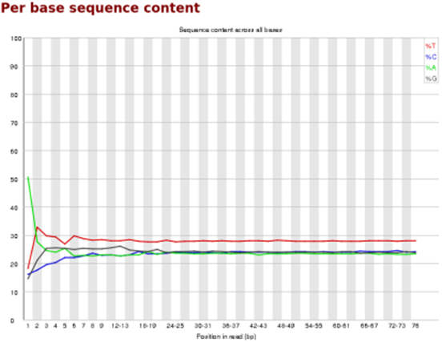

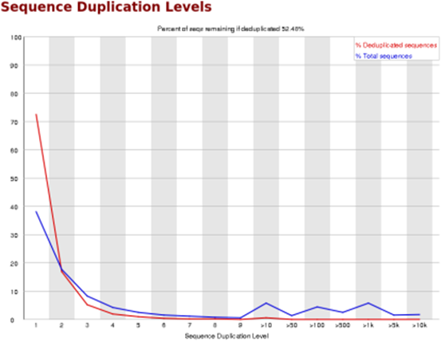

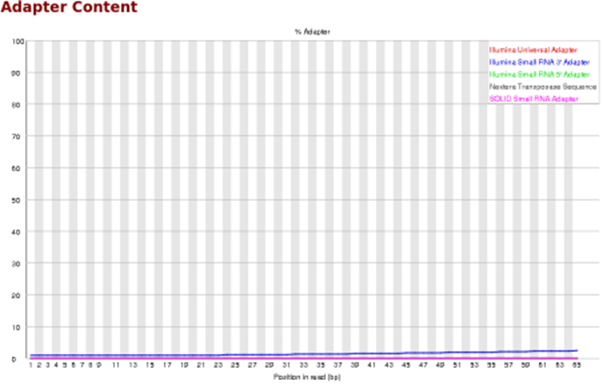

### Library 2

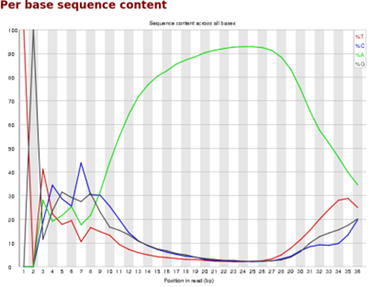

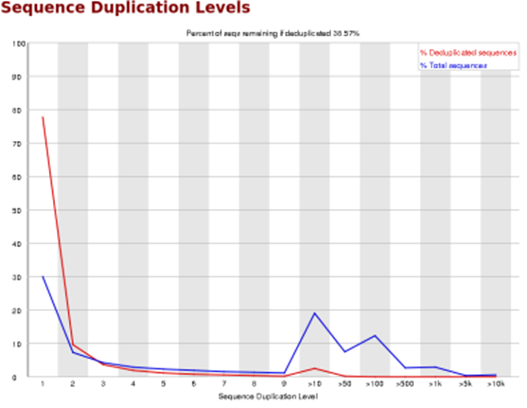

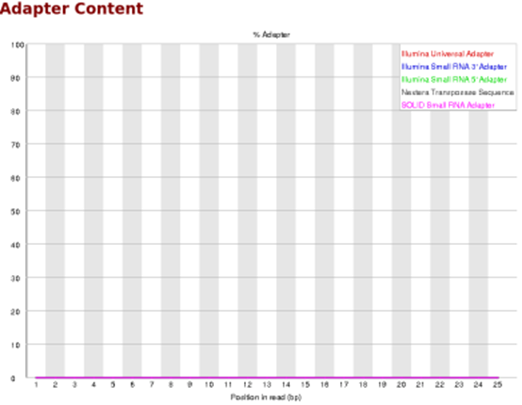

### Library 3

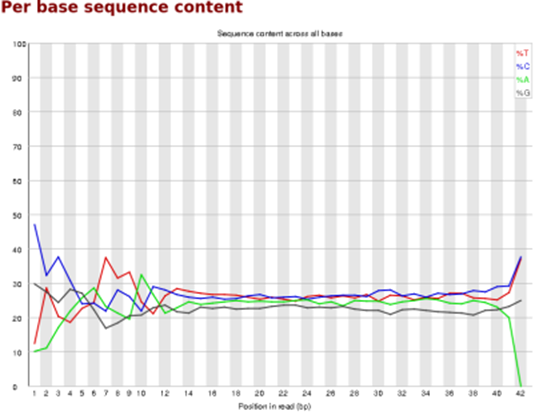

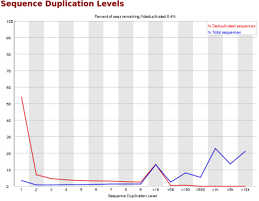

### Library 4

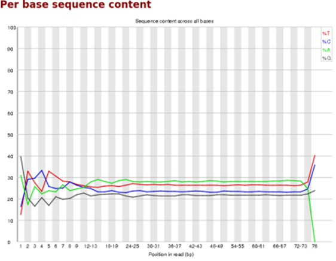

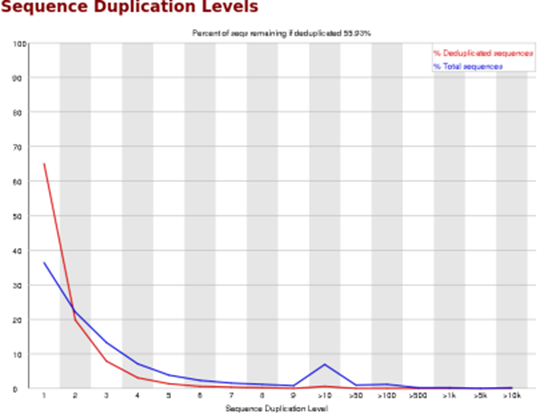

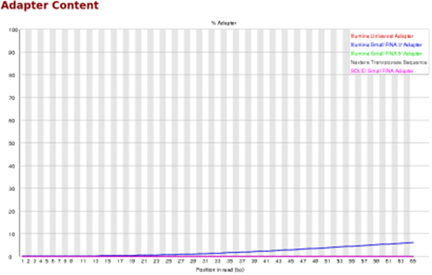

### Library 5

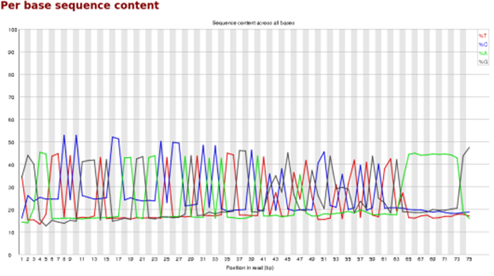

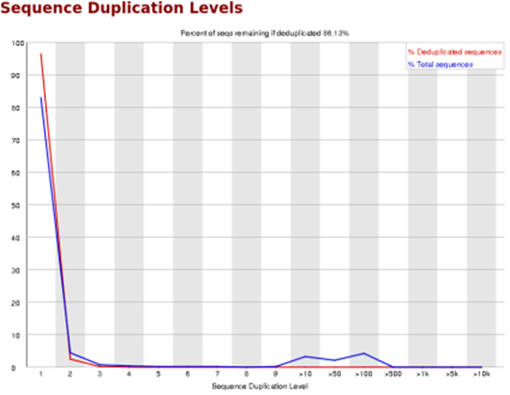

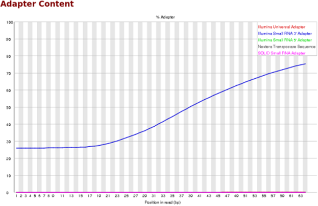