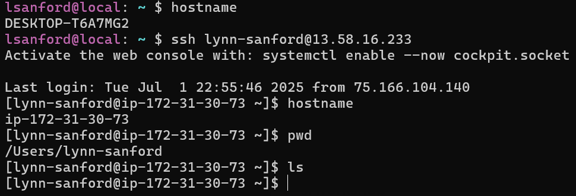
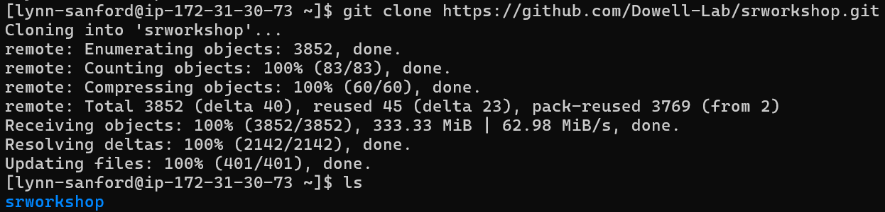

# Git, GitHub, and basic Bash worksheet
Author: Lynn Sanford, 2023

## What is Git?
Git is a version control software. Think of it like a long-standing and well-developed execution of something like the history in Google Docs, where you can see when and where and who changed something in a document. It allows you to keep track of and document your changes to files, keep different versions of files at the same time, and revert changes if necessary.

We'll go more into the functionality of git later in the workshop. What we’ll focus on today is…

## GitHub
GitHub is a web-based implementation of git that provides cloud storage for git projects (called repositories or repos). It also facilitates multiple people working with a git repository at the same time. Again, think of it kind of like a series of files and folders in Google Drive, but much easier to integrate with the command-line and scripting tools that we use in this class and more broadly in bioinformatics.

Some of our class materials are on a class website, which isn’t super easily accessed on the back end. It could be updated regularly throughout the class to add new material, but it’s harder for every one of our teachers and TAs to fix typos or amend data files on the fly.

Unlike the website, anyone who has 'edit' access (i.e. anyone in the DnA Lab) to the class GitHub repository can change a file in it at any time. For that reason, **the GitHub repository will be the primary source for class materials**. This worksheet will take you through the structure of the GitHub repo and how to interface with it.

<ol>
<h3><li>
In another tab/window, go to the <a href="https://github.com/Dowell-Lab/srworkshop/", target="_blank">GitHub repository</a>
</h3>

There’s a lot here, but the main thing to notice is that the repository is laid out in a way that’s familiar. It looks like the filesystem on your computer. You can also navigate through the folders and subfolders (also called directories and subdirectories) like you would on your computer. Take a minute to explore.

Note that when you start going into subdirectories, an explorer sidebar pops up on the left and a **path** appears on the top. You can click on the path to navigate to higher (parent) directories, but also pay attention to its structure. It’ll be similar on the command line.

</li>
<h3><li>Within a terminal, log onto the AWS (if you can)</h3>

Open your terminal program.

If you successfully got onto the AWS previously, do so again with the command `ssh <github_username>@<aws_ip>`.

>**Note**: Remember that pointed brackets show that the description inside needs to be replaced by your actual information. There should be no pointed brackets in the final command.

If you’re still troubleshooting getting onto the AWS, it’s fine to do this worksheet on your local computer within your terminal.
</li>
<h3><li>Do some basic looking around on the command line</h3>

In your terminal, whether on your computer or the AWS, type `hostname` and see what it outputs. The output will be different depending on which system you’re on.

Type `pwd`. This shows you what directory you’re currently in.

Type `ls`. This lists the contents of your current directory. Since you’ve created no files or folders, it should be empty, so nothing should display.

</li>
<h3><li>Clone the GitHub class repo</h3>

Navigate back to the top of the repo in your browser, or click the link above again.

Click on the green button that says “<> Code”, make sure the dropdown has “HTTPS” highlighted, and copy the link it gives you. This is the easiest way to clone a repository that you don’t have permissions to edit.

Navigate back to your terminal and type `git clone`, then paste the link and hit enter.

>Note: If you’re using the Ubuntu WSL app on a Windows 10 machine, you cannot paste with Ctrl-V. By default pasting is through a right-click.

This command will then clone (create a copy of) the srworkshop repository in your current working directory.

</li>
<h3><li>Navigate around the repository</h3>

Use the command `cd` (change directory) to navigate into the repository. If you’re going into subdirectories, type the name of the subdirectory. You can always list directory contents with `ls`. If you want to go back to the previous parent directory (one higher in the directory structure), use two dots (`cd ..`). Just one dot (`.`) indicates your current directory, so `cd .` doesn't move you anywhere.

You’ll notice that directories are shown in color, usually blue, text files are in white, and other types of files may be other colors. Your color scheme may look different than mine.

If you get lost and you need to go back to your home directory, type `cd ~`. The tilda can always be used as a shortcut for your home directory.

As you investigate, make use of the `pwd` command. Go back and forth between the paths that you see on the command line and the paths that you see when exploring the same repo in the browser.

</li>
<h3><li>Tab complete</h3>

Go back to your home directory, then type `cd s` and hit Enter. What do you see? Now type `cd s` and before hitting Enter, hit Tab. What happens?

This is a beautiful feature of Unix/Linux systems called Tab complete. **Tab complete is your friend**. The more you get comfortable with it, the less time it will take you to navigate around filesystems.

Tab complete will go to the next unique position in a string. So in your home directory, you only have one directory, `srworkshop`, and Tab complete will automatically fill it in.

Navigate into `srworkshop` again, and type `cd d`, then hit Tab. This completes until it hits a character with multiple options. If you hit Tab twice, a list of all options is displayed that start with what you’ve already typed. Then input which characters you want, and you can hit Tab again.

</li>
<h3><li>Copy a file from the repository</h3>
When starting out using the command line, you may get confused about what computer you are currently running commands on. The prompt that you get at the beginning of a line should help you, i.e. the

But we’re going to make it one step easier.

You may notice that while my command prompt is a brownish color, yours is most likely white. Let’s change that – it’ll make the next few days easier on you.

In the repository, under day01/scripts/, there’s a file called `.bash_profile`. You will not be able to see this file with only the `ls` command - the `.` at the beginning of the filename indicates it’s a hidden file. You can see it by typing `ls –al` (more on that tomorrow).

In order to get a colored command prompt, you need to copy this file to your home directory on the AWS. For this you use the `rsync` command, which has the syntax:

`rsync <source_directory> <destination_directory>`

You can use this command in a number of ways:
<ul>
<li>With absolute paths for both source and destination (your current working directory is irrelevant)

<ul><li>
Note: these are functionally equivalent, since <code>~</code> is a shortcut for your home directory
</li></ul>
</li>
<li>From the <code>~/srworkshop/day01/scripts/</code> directory:
<ul>
<li>Absolute path:

</li>
<li>Relative path (your home directory is 3 parent directories above this):

</li>
</ul>
</li>
<li>From your home directory (remember <code>.</code> indicates your current directory):

</li>
</ul>
It's fine if this seems confusing. You will have much more opportunity to practice with navigation and copying/moving files in the next couple of days.
</li>
<h3><li>Logout and log back on</h3>

Now you have a copy of the `.bash_profile` file in your AWS home directory. The next time you log on, Bash automatically loads configurations from this file, and your prompt color will automatically change. Let’s try that now.

Either `logout` or `exit` will log you out of the AWS. Once you run that command, you will be back on your personal computer. Use the `hostname` command to verify.

Now, log back onto the AWS. The easiest way to do this is by using the 'up' key on your keyboard. 'Up' and 'down' scroll through your command history. Hit 'up' until you find your version of the `ssh <github_username>@<aws_ip>` command and hit enter. This will log you back onto the AWS, and now you should see a brown prompt, indicating you are now back on the super computer.

Once you’re familiar enough with Vim to edit files (later today), you can come back and edit the `.bash_profile` file if you’d like to change the prompt color from brown to something else. Instructions for doing this are at the end of the worksheet.
</li>
<h3><li>Pull from the repository</h3>

When content on the remote repo (the one hosted on Github) changes, you’ll need to update the copy on your computer or on the AWS. To do this, make sure you’re somewhere in the repo (`cd` into `srworkshop/`) and type `git pull`. If nothing has changed, it will tell you you’re up to date. If something has changed, it’ll let you know what has.

You will regularly pull over the two weeks of the course.
</li>
<h3><li>Logout of the AWS</h3>

When you’re done with your session on a super computer, log out before you close the window, just as you did above.
</li>
</ol>

## Extra: Change the prompt color

The `.bash_profile` file contains instructions for initiation of your instance on the AWS super computer. For your personal computer or a different super computer, you may need to edit a `.bashrc` file instead, but ignore that for the AWS.

Opening the `.bash_profile` file that I’ve provided to you shows the following:

Each of these lines does something different, but the one at the bottom is the one that specifies how your command prompt looks. The text color for the `username@hostname` portion of the prompt is encoded by the 33 toward the beginning of the line, and the text color for the current working directory is encoded by the 34 a little farther in. You can change the colors to whatever you want by editing the number based on the following table.

