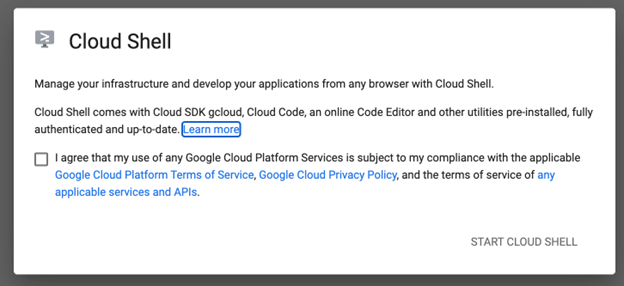
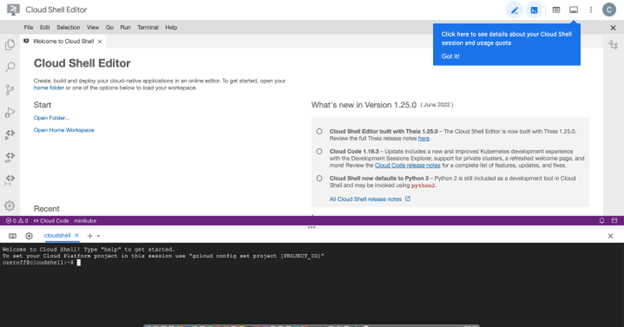
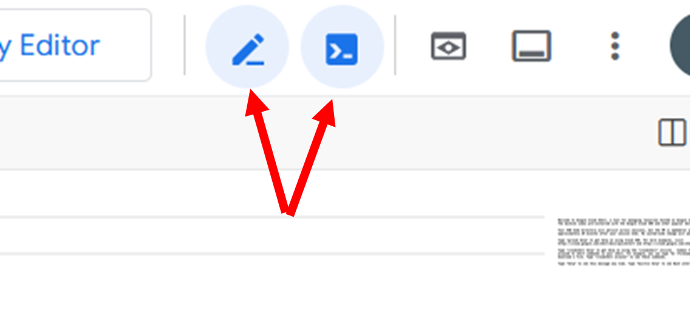
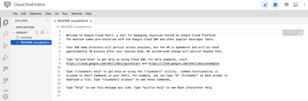
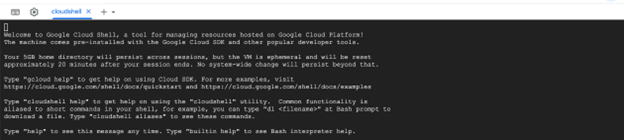

# Logging onto Google Shell
Author: Chris Ozeroff, 2022\
Edited: Lynn Sanford, 2024

<h3>Navigate to <a href="https://shell.cloud.google.com", target="_blank">Google Shell</a></h3>

You should then see this pop-up:

Click agree, and start Google Shell:

Use the upper right hand corner to close or open both the Cloud Shell Editor and the Terminal.

You can view and edit files from the cloud shell editor:

Or the terminal:

For going through Vimtutor, you should close the editor and only work within the terminal.

