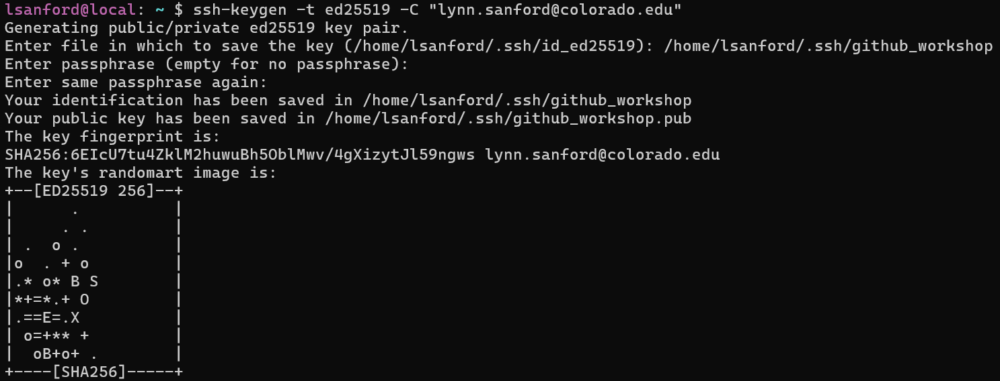

# SSH keys and the AWS supercomputer
Author: Lynn Sanford, 2023

## What is a supercomputer?
Super computers have much more memory and processing power than your local computer, which is required for most bioinformatics analysis. For your actual analysis, you’ll either use a super computer run by your campus or a cloud-based computing system like Amazon Web Services (AWS). For this class, our computing is set up through AWS and resembles the BioFrontiers Fiji supercomputer.

This worksheet will take you through the security process of logging onto our class AWS instance.

## Key-based security
We have set up the AWS to allow access through GitHub usernames. A secure way of connecting your computer to the AWS is through an SSH private/public key pair.

To generate one, first open a terminal application on your computer. On Mac or Linux this is just called 'Terminal'. On Windows, you should have installed Windows Subsystem for Linux, accessed through the Ubuntu application.

Once you have a terminal window open, follow the instructions according to your operating system (Mac OS below, Windows [here](#windows)):

## Mac instructions
In your terminal, paste the following command, using the email address associated with your github account (keep the double quotes):\
`ssh-keygen -t ed25519 -C "your_email@example.com"`

>**Note:** If you get an error that ed25519 is not supported, use:\
`ssh-keygen -t rsa -b 4096 -C "your_email@example.com"`

You will be asked where to generate the files that contain the key, then for a password if you want to password-protect the files. Unless you have done this before, use the default location and no passwords by just hitting Enter in response to each question (three times total).

If everything works, there will be a random image generated.



After you get this key generated, you need to add it to the ssh agent that connects your computer to others. Run the following command:\
`eval "$(ssh-agent -s)"`\
This will give you a pid. The number isn’t important for us.

Now you need to make a config file. By the end of today, you’ll know how to edit a file, but for now follow these commands:

Type `vim ~/.ssh/config`. This will open a file in the VIM text editor (more on that later today). There should be a line of `~` marks down the left side of the window. Hit the `i` key to begin editing and type or copy/paste the following:
```
Host github.com
  AddKeysToAgent yes
  IdentityFile ~/.ssh/id_ed25519
```
When you’re done typing, hit Esc, then type `:wq` (starting with the colon).

Now you’re back on the command line. Run the following:\
`ssh-add --apple-use-keychain ~/.ssh/id_ed25519`
>Unless you created an rsa key, in which case it’ll be the following:\
`ssh-add --apple-use-keychain ~/.ssh/id_rsa`

Finally, follow <a href="https://docs.github.com/en/authentication/connecting-to-github-with-ssh/adding-a-new-ssh-key-to-your-github-account?platform=mac">these instructions</a> from GitHub. Skip past the background/prerequisites to Step 1 under 'Adding a new SSH key to your account'. Your key type is 'authentication'.

>**Note:** If the command line copy function isn’t installed, type `cat ~/.ssh/id_ed25519.pub` and manually copy the output line to your clipboard, then continue to follow the instructions.

You may need to wait ~5 minutes for the AWS to sync credentials information before logging on. Then log into the AWS by navigating back to your terminal and typing `ssh <github_username>@<aws_ip>`, where `<github_username>` is replaced by YOUR username and `<aws_ip>` is replaced by the IP address written on the board (i.e. For me it might be `ssh lynn-sanford@192.158.1.38`)

>**Note:** We'll need you to fill in your own information frequently during the course. Common notation for this is to place the description for the thing you'll need to replace within pointed brackets (which also need to be replaced).

The first time you log on, it’ll ask if you want to authenticate. Type yes, hit Enter, and you’re good to go!
If you get a credentials error AND you’ve waited at least five minutes, more troubleshooting might be required.


## <a id="windows">Windows instructions</a>

**IMPORTANT:** Copying in the WSL Ubuntu app is done as normal with Ctrl-C, but if you have Windows 10, you cannot paste with Ctrl-V. Pasting is done with a right-click instead. Windows 11 versions of Ubuntu paste as normal.

In your terminal, paste the following command, using the email address associated with your github account (keep the double quotes):\
`ssh-keygen -t ed25519 -C "your_email@example.com"`
>**Note:** If you get an error that ed25519 is not supported, use:\
`ssh-keygen -t rsa -b 4096 -C "your_email@example.com"`

You will be asked where to generate the files that contain the key, then for a password if you want to password-protect the files. Unless you have done this before, use the default location and no passwords by just hitting Enter in response to each question (three times total).

If everything works, there will be a random image generated.


After you get this key generated, you need to add it to the ssh agent that connects your computer to others. Run the following commands:
```
eval "$(ssh-agent -s)"
ssh-add ~/.ssh/id_ed25519
```
>Unless you created an rsa key, in which case the second line will be:\
`ssh-add ~/.ssh/id_rsa`

Finally, follow <a href="https://docs.github.com/en/authentication/connecting-to-github-with-ssh/adding-a-new-ssh-key-to-your-github-account?platform=windows">these instructions</a> from GitHub. Skip past the background/prerequisites to Step 1 under 'Adding a new SSH key to your account'. Your key type is 'authentication'.

>**Note:** If the command line copy function isn’t installed, type `cat ~/.ssh/id_ed25519.pub` and manually copy the output line to your clipboard, then continue to follow the instructions.

You may need to wait ~5 minutes for the AWS to sync credentials information before logging on. Then log into the AWS by navigating back to your terminal and typing `ssh <github_username>@<aws_ip>`, where `<github_username>` is replaced by YOUR username and `<aws_ip>` is replaced by the IP address written on the board (i.e. For me it might be `ssh lynn-sanford@192.158.1.38`)

>**Note:** We'll need you to fill in your own information frequently during the course. Common notation for this is to place the description for the thing you'll need to replace within pointed brackets (which also need to be replaced).

The first time you log on, it’ll ask if you want to authenticate. Type yes, hit Enter, and you’re good to go!
If you get a credentials error AND you’ve waited at least five minutes, more troubleshooting might be required.
