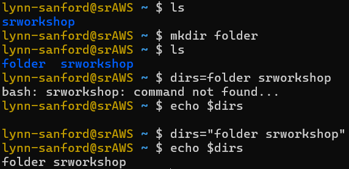
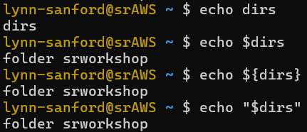
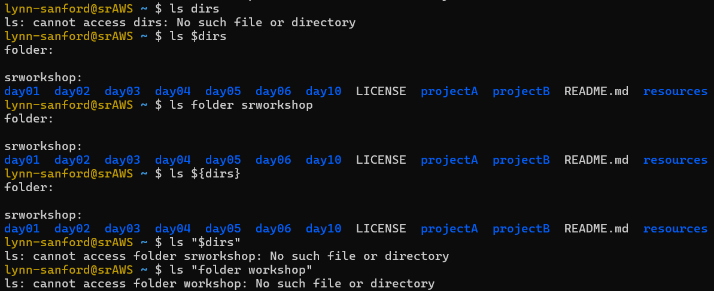
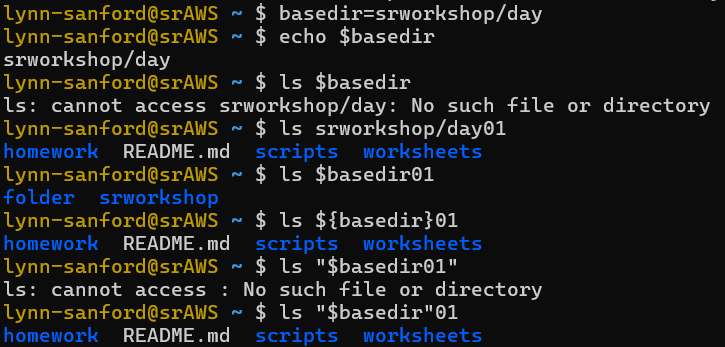

# Variables in Bash
Author: Lynn Sanford, 2024

## What is a variable?
A variable is a basic programming concept. It is a symbol that represents a value of some sort, and it's common to use multiple variables in a single block of code.

Taken together, variables allow programmers to do two major things:
1. Perform the same operations on different values
2. Make code more concise and readable.

For example, if I need to run a program like the read mapping software HISAT2 on multiple files in a directory, without variables my code could look like this:

```
hisat2 -p 32 -x /scratch/Shares/public/genomes/hisatfiles/hg38/HISAT2/genome -U /scratch/Users/lynn-sanford/day4/fastq/S1.fastq.gz > /scratch/Users/lynn-sanford/day4/sams/S1.sam
hisat2 -p 32 -x /scratch/Shares/public/genomes/hisatfiles/hg38/HISAT2/genome -U /scratch/Users/lynn-sanford/day4/fastq/S2.fastq.gz > /scratch/Users/lynn-sanford/day4/sams/S2.sam
hisat2 -p 32 -x /scratch/Shares/public/genomes/hisatfiles/hg38/HISAT2/genome -U /scratch/Users/lynn-sanford/day4/fastq/S3.fastq.gz > /scratch/Users/lynn-sanford/day4/sams/S3.sam
hisat2 -p 32 -x /scratch/Shares/public/genomes/hisatfiles/hg38/HISAT2/genome -U /scratch/Users/lynn-sanford/day4/fastq/S4.fastq.gz > /scratch/Users/lynn-sanford/day4/sams/S4.sam
hisat2 -p 32 -x /scratch/Shares/public/genomes/hisatfiles/hg38/HISAT2/genome -U /scratch/Users/lynn-sanford/day4/fastq/S5.fastq.gz > /scratch/Users/lynn-sanford/day4/sams/S5.sam
hisat2 -p 32 -x /scratch/Shares/public/genomes/hisatfiles/hg38/HISAT2/genome -U /scratch/Users/lynn-sanford/day4/fastq/S6.fastq.gz > /scratch/Users/lynn-sanford/day4/sams/S6.sam
```

Instead, if I define a few variables, it looks like this:

```
indexpath=/scratch/Shares/public/genomes/hisatfiles/hg38/HISAT2/genome
fastqs=/scratch/Users/lynn-sanford/day4/fastq
sams=/scratch/Users/lynn-sanford/day4/sams

hisat2 -p 32 -x $indexpath -U "$fastqs"/S1.fastq.gz > "$sams"/S1.sam
hisat2 -p 32 -x $indexpath -U "$fastqs"/S2.fastq.gz > "$sams"/S2.sam
hisat2 -p 32 -x $indexpath -U "$fastqs"/S3.fastq.gz > "$sams"/S3.sam
hisat2 -p 32 -x $indexpath -U "$fastqs"/S4.fastq.gz > "$sams"/S4.sam
hisat2 -p 32 -x $indexpath -U "$fastqs"/S5.fastq.gz > "$sams"/S5.sam
hisat2 -p 32 -x $indexpath -U "$fastqs"/S6.fastq.gz > "$sams"/S6.sam
```

In addition to being a lot less messy and more readable, I can also easily change the directory path variables without changing the rest of the code.

There are other methods to make this code even more concise, and we'll cover those later in the week. For now, let's explore how variables are defined in Bash, and how they can be used.

## Bash variables
General properties of Bash variables:

<ul>
<li>
Variables in Bash must be defined by an equals sign with no spaces on either side:

<code>a=hello</code>, NOT <code>a = hello</code>\
<code>testnum=91</code>, NOT <code>testnum=   91</code>
</li>
<li>
Variables in Bash are called (used) by preceding them with a dollar sign. There also must be no spaces between characters.

`$a` or `$testnum`, NOT `$ a` or `$ testnum`
</li>
<li>
Generally be aware of whitespace (spaces or tabs) in Bash. Whitespace is by default a separator unless you indicate otherwise. We'll explore this concept more below.
</li>
<li>
Unlike in other programming languages, Bash variables have no type. They are all stored as strings of characters, though some mathematical operations can be performed on them if the characters happen to be numbers. Bash is <strong>not</strong> the language to use for anything but basic computation, but it is powerful for manipulating files.
</li>
</ul>

## Experimenting with Bash variables
<ol>
<h3><li>Open a terminal window and log into the AWS.</h3>

You should have already cloned the srworkshop repository. Now, also in your home directory, create a new directory called 'folder' by typing <code>mkdir folder</code> (you'll do this much more tomorrow).
</li>
<h3><li>Set a variable</h3>

Say we want to set a variable equal to "folder srworkshop".

Make a new variable: `dirs=folder srworkshop`. Notice that because there is a space in the middle of this variable, Bash parses this as two separate commands.

Did we set `dirs`? You can print the value of `dirs` to the command line with `echo`: `echo $dirs`

Now try setting the variable with quotes around it: `dirs="folder srworkshop"`. The quotes specify to include everything between as a single string. Print this out with `echo`.



This should be the value of your variable for the next few steps. 
</li>
<h3><li>Explore variable notation</h3>

Run the following code, line by line:

```
echo dirs
echo $dirs
echo ${dirs}
echo "$dirs"
```



Notice that the first line does not print the value of a variable. It just prints the value `dirs`, since there is no dollar sign preceding it.

The other three all look the same, right? All of these notations are ways to call a variable, but there's some useful differences.
</li>
<h3><li>Handling whitespace</h3>

Run the following code, line by line:

```
ls dirs
ls $dirs
ls folder srworkshop
ls ${dirs}
ls "$dirs"
ls "folder srworkshop"
```



`ls` is a command that can take multiple files/directories as input. So when whitespace is a separator here, the contents of both directories are listed. The only instance where whitespace isn't a separator is when quotes are used. Lines 2-4 are functionally equivalent in this case, as are lines 5-6.
</li>
<h3><li>Variables as substrings</h3>

A common thing to do with Bash variables (and their primary usage in this class) is to specify paths and filenames. There are many cases where we might want to set a variable to <em>part</em> of a path and fill in different values around it.

Run the following code line-by-line:

```
basedir=srworkshop/day
echo $basedir
ls $basedir
ls srworkshop/day01
ls $basedir01
ls ${basedir}01
ls "$basedir01"
ls "$basedir"01
```



With no brackets or quotes, Bash assumes anything after the $ is the variable name. So extra characters can't just be added to variable names with no delineation. Either brackets or quotes must be used.

Also note that since there is no whitespace (or special characters) in this variable value, the `"$variable"` and `${variable}` notation is functionally equivalent. Since all Bash users are soon trained out of using whitespace, the notation people use is largely a matter of personal preference. You'll see both notations in class scripts, depending on who wrote them. But it's also useful to know that there are edge cases where the notation differences might matter.
</li>
</ol>


