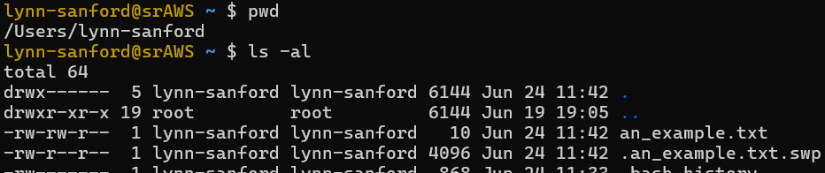
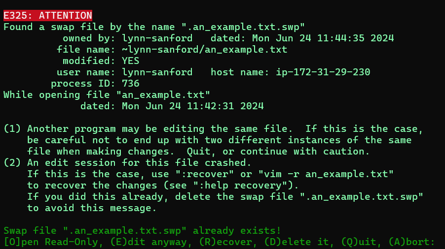
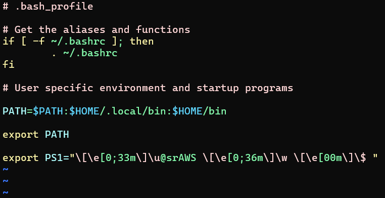

# Getting started with Vimtutor
Author: Mary Allen\
Edited: Lynn Sanford, 2024

### This worksheet covers:
[Vimtutor](#vimtutor)\
[What to do if Vim crashes](#vimcrashes)\
[Vim color schemes (optional)](#vimcolor)

## Background to Vim
Vim is a text editor, vaguely similar to Word but with much less graphical user interface. It's decades old and fairly complicated to learn, but it is able to be used on the command line and was specifically developed for programming.

Vim does have a steep learning curve, and Vimtutor is a program within Vim that is intended to help you learn it. As you go through, remember not to try to memorize all of the commands. Just remember that a command for something exists. You can always Google it later.

## <a id="vimtutor">Vimtutor directions</a>
<ol>
<li>Open a terminal</li>
<li>Run the command <code>vimtutor</code></li>
<li>As you'll soon learn, if you need to quit out of Vim/Vimtutor, type <code>:q</code></li>
<li>Follow the instructions you see in Vimtutor</li>
</ol>

## <a id="vimcrashes">What to do if Vim crashes</a>

There will come a time that Vim will crash while you are in the midst of writing/editing. This most frequently happens if you close a terminal or are logged off of a supercomputer with Vim still open. Here's what to do if that happens.

<ul>
<li>
As you're editing a file in Vim, it automatically saves any changes into a <code>.swp</code> file, which is analagous to the recovery file generated by Word. This is a hidden file in the same directory as the edited file that can be seen (through a different terminal window) with the command <code>ls -al</code>

\
(I have this <code>an_example.txt</code> file open to edit in Vim in another terminal window)
</li>
<li>
If you save (write) the file changes and exit Vim normally, the <code>.swp</code> file is deleted. But if Vim crashes, this <code>.swp</code> file remains in the directory and needs to be handled.
</li>
</ul>

1. Open a new file in Vim in any directory (`vim <filename>`) and edit it with any text (`i` to enter insert mode, then text). Save the text (`Esc` to exit insert mode, then `:w`). Then go back into insert mode and write something else.

2. Do not save. Close your terminal window to crash Vim.

3. Open a new terminal window, log into the AWS (if that's where you made your file), and navigate back to your file's directory.

4. Run `ls -al` to see the `.swp` file.

5. Try to open the file (`vim <filename>`). You'll see something alarming like this:\

6. Stay calm.

7. Your options for what to do are along the bottom. Choose the option that you'd like by the capital letter indicated.

8. Once you have chosen your option, and properly saved your file if you need to, quit out of Vim again. Run `ls -al` again. You'll see that the `.swp` file is still there.

9. Manually delete the `.swp` file to remove any conflicts and avoid getting the same message again. (`rm .<filename>.swp`)

## <a id="vimcolor">Vim color schemes (optional)</a>

Vimtutor is entirely white text on black. When you actually start scripting in Vim, you'll see that it uses different colors for different kinds of strings, i.e. paths, variables, commands, comments, etc.

Take the .bash_profile file we copied earlier as an example:

The colors are incredibly useful for readability of code, but the default color scheme may be difficult for some people to see (including your TAs!). You can change the colors as follows:

<ol>
  <li>Find the color scheme you want.
    <ul>
      <li>Navigate to your home directory and open the <code>.bash_profile</code> file in Vim.</li>
      <li>We're not modifying anything in this file, so stay out of insert mode. Type <code>:colorscheme</code>, then a space, and then Tab can cycle through the possible color options. Hit Enter to immediately switch to one to try it out.</li>
      <li>If you find the default dark blue text difficult to read, good options to start with are 'desert','elflord','murphy', or 'ron'.</li>
      <li>Once you have one picked out, quit out of the file with <code>:q!</code></li>
    </ul>
  </li>
  <li>Make a .vimrc file
    <ul>
      <li>Make sure you're still in your home directory.</li>
      <li>Open a new file called <code>.vimrc</code> in Vim.</li>
      <li>Enter insert mode (<code>i</code>) and type <code>colorscheme &#60;chosen colorscheme&#62;</code>.<li>Exit insert mode and save and quit.</li>
    </ul>
  </li>
</ol>

The next time you open vim, your color scheme should automatically load from this VIM configuration file.
