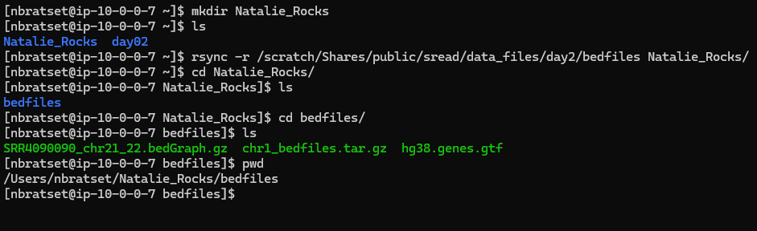

## Day 2 Answer Key
1. Log onto the super computer and make the directory `<your_name>_Rocks`. Check that it's there with `ls`.

2. Use `rsync -r /scratch/Shares/public/sread/data_files/day2/bedfiles <your_name>_Rocks/`. Notice the `-r` flag. That stands for recursive, which means copy the directory and everything in it. Check that this worked with `ls`. Navigate to the new `bedfiles` folder and confirm that all 3 files were copied over.
    > Why do I have a `/` before `scratch` but not before `<your_name>_Rocks`? Do you remember? If not, make sure to look up more Linux relative vs. absolute paths.
### Example Code

3. Make sure you practice `vimtutor` some more before tomorrow!

4. Watch videos for day 3!
