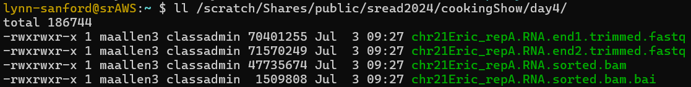
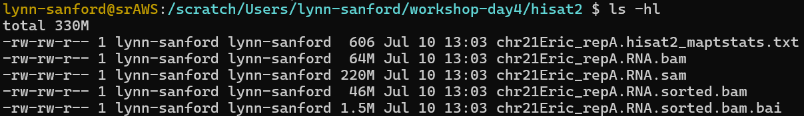
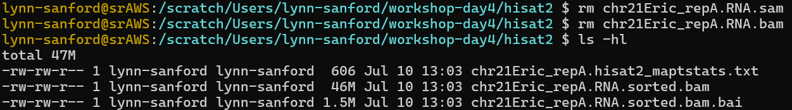

# Day 4 Worksheet - Read mapping and visualization
Author: Qing Yang, 2021\
Edited: Lynn Sanford, 2024

1. Make sure that you have two trimmed fastq files from the Trimmomatic step, one for read 1 and one for read 2. **If you're still struggling to get Trimmomatic to work**, copy the two files from `/scratch/Shares/public/sread2024/cookingShow/day4/` to your scratch `workshop-day4/trimmomatic/` directory.\
\

2. Copy the `d4_mapping.sbatch` script from the GitHub repo to your scratch `workshop-day4/scripts/` directory, then open it in Vim.

3. Edit the SLURM header configurations:
    - Change the name of the job to something useful like `hisat2_mapping`
    - Replace any user inputs (`<>`) with your specific values. Make sure your output and error directory exists.
    - HISAT2 can use multiple processors per input file, but still only one node. For this run, edit the fields to reserve 1 node, 8 processors (`ntasks`), 8gb memory and 1 hr of walltime.

4. Assign path variables. In this case, `DATADIR` is set to your working directory on scratch, and the `TRIM` path variable is the default trimmomatic directory within that. The `HISAT` variable points to the output directory for this script. Make sure all of these paths are accurate for you.
    - Note that in this case, we didn't manually make a `hisat2` directory on the command line. The `mkdir` command in the script should do it for us.

5. Load modules for hisat2 and samtools. HISAT2 is our read mapping software and we'll use SAMtools for file conversion afterward.
    - `samtools/1.8` is the version actually on the AWS.

6. Finally, look at the read mapping and file conversion commands.
    - As before, note that `\` with no trailing spaces provides a displayed line break that doesn't actually break up the command as run by the computer. This makes the code more readable.
    - The genome index, which is specific to HISAT2, is located at the `-x` path. If you look at this directory on the command line, you'll see that the last term in that path (in this case, `genome`) should correspond to the prefix for the files in that directory.
    - Make sure you understand the HISAT2 and SAMtools commands we're using here. Look at the online documentation for these tools for more information. One exception is that the HISAT2 parameter `--very-fast` is not well-documented in the HISAT2 manual and actually is a holdover from a previous generation mapping software called Bowtie2 - the Bowtie2 documentation has more information for that parameter.

7. Save your edits and exit Vim, then run the job with the `sbatch` command.

8. You should have 5 non-empty output files in your scratch `workshop-day4/hisat2/` directory when your job is complete. If you don't, check your error file to troubleshoot.\
\

9. Of your 5 output files, you'll see that they vary in size. Take a look at the top 200 lines of the large `.sam` file with `head` (look up parameters for how to change the default number of lines shown). Most of these lines are an extensive header, but at the bottom of these 200 lines you'll see a copy of the hisat2 command you ran, and then a few actual read alignments. You can look up more about the SAM file format in the SAMtools documentation.

10. Most importantly, human-readable SAM files are almost never used in downstream analysis, as they are too large. Downstream analysis is instead uses the binary BAM files derived from SAM files. So in general, it's best to save your final BAM file (in this case the `.sorted.bam` file) and delete the rest to save space and money.
    - Remove the `.sam` and non-sorted `.bam` files in your scratch working directory.
        - By default read alignments in a SAM/BAM file are in order of the reads in the fastq file (i.e. random). In order for many downstream programs to run efficiently, the BAM file needs to be sorted by (usually) chromosomal coordinate or by (sometimes) read name. Other than the read order, the unsorted and sorted BAM files are equivalent, so keeping both is redundant.\
        \

11. Back up your mapping script, FastQC results, and final mapped files to your home directory.

12. To visualize the mapped reads using IGV, you will need to transfer the `chr21Eric_repA.RNA.sorted.bam` AND `chr21Eric_repA.RNA.sorted.bam.bai` files to your local machine.
    - Copy the full path to your `chr21Eric_repA.RNA.sorted.bam` file. One way to display this full path is using the command `realpath <file>`. Then copy it to your clipboard.
    - Open a terminal on your local machine (NOT connected to the AWS).
    - Navigate to the local directory where you want your mapped files.
      - Note again that on a Windows machine, it may be easiest to navigate to your Desktop, which is either located at `/mnt/c/Users/<username>/Desktop/` OR `/mnt/c/Users/<username>/OneDrive/Desktop/`
    - Use `rsync` to transfer the bamfile to your current directory on your local machine (`rsync <username>@<AWS_ip_address>:<path to file> ./`). Do the same with the `chr21Eric_repA.RNA.sorted.bam.bai` file.