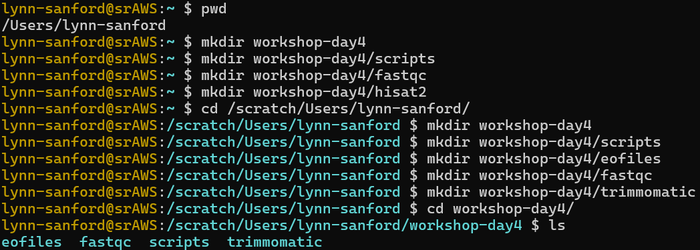
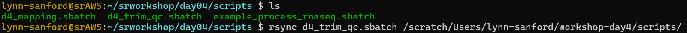
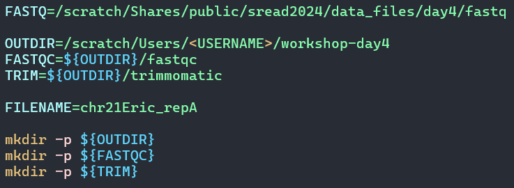
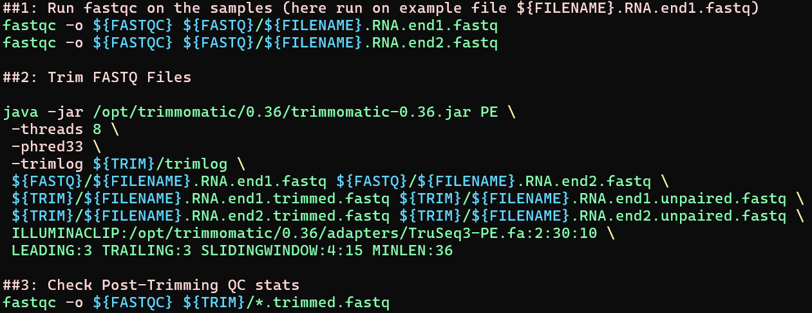

# Day 4 Worksheet – Trimmomatic 
Author: Jessica Westfall, 2021\
Edited: Lynn Sanford (2024), Georgia Barone (2025)

## Introduction
Now that we have evaluated our sequence library initially to determine if the libraries are worth analyzing, we will do some “cleaning up” by trimming unwanted sequences such as adapter sequences. This step is necessary for improved alignment and mapping to the reference genome downstream. Once trimming is completed, we will reevaluate our trimmed files with FastQC for quality to decide if we will move forward with mapping.

## Make working directories and copy script
- In your home directory, make a `workshop-day4` directory. Within that, make `scripts`, `fastqc`, and `hisat2` subdirectories.
- Navigate to your scratch directory and create the same directory with `scripts`, `eofiles`, `fastqc`, and `trimmomatic` subdirectories.

  

- Navigate to the srworkshop repo and `git pull`. Then `rsync` the `d4_trim_qc.sbatch` script from `day04/scripts/` into your scratch day4 scripts directory.

  

## Trimmomatic

In your scratch day4 scripts directory, edit the trimming script in Vim.

You will need to change the job name, user email, and the standard output and error log directories. Use a useful name for the job name, such as `trim_qc`.
- Note also that we have changed the numbers of processors (`--ntasks`) for the job, as Trimmomatic can use multiple processors per input file. We'll request 1 node, 8 ntasks, 4gb of memory and 30 minutes of wall time.
- You'll also see just under the header is a section that specifies certain information about the job that might help in troubleshooting or in documenting your work. Since we're just printing this to standard output, this information will be stored in the `.out` file.

Assigning path variables will make your scripts easier to read. In addition, this makes it easier to reference a given path and utilize it in your scripts.
- Here we define five variables.
- The `FASTQ=` (input directory) variable specifies the path to the directory where the fastq data files are located. This has been filled in for you.
- Modify the `OUTDIR=` (output directory) to point to the appropriate output file directories for our fastQC and trimmed fastq files.
- Note that although in this case you already manually made these directories, it's useful to make sure that the output directories exist by calling `mkdir` within the sbatch script. Look up what the `-p` parameter does.**Note: file path below has `sread2024` incorperated into the path. It should be `sread2025`**

  
 

Add commands to load the required modules for running this pipeline. We will be using FastQC and the trimming program Trimmomatic. If you are not sure which version of a program is available on the cluster you can save and quit out of Vim, then use the command `module spider <program>` to find the available versions.
- Note again, though, that the version of fastqc that is actually available to us is 0.11.5.
 
For the meat of the script, we will be running 3 analysis steps. Several analysis steps run together is called a pipeline. Our pipeline allows us to:
1. Run FastQC on raw sample fastq files
2. Trim the fastq files to remove adapters and other problematic sequence elements
3. Reevaluate the quality of the trimmed fastq files with FastQC.

  

The FastQC steps should look familiar to you from yesterday. Now let's look closer at the trimming step.
- In this script we are running paired end reads. Trimmomatic can be used on both single end or paired-end reads. When setting your parameters use the appropriate adapters.
- Below is the syntax needed to run trimmomatic:
  - For single-end reads\
    ```
    java jar /opt/trimmomatic/0.36/trimmomatic-0.36.jar SE [ -threads <n> ]  [ -phred33 | -phred64 ] [ -trimlog <output_trimlog> ] <input_file> <output_file> ILLUMINACLIP
    ```
  - For pair-end reads\
    ```
    java jar /opt/trimmomatic/0.36/trimmomatic-0.36.jar PE [ -threads <n> ]  [ -phred33 | -phred64 ] [ -trimlog <output_trimlog> ] <input_file1> <input_file2> <output_fileP1> <output_fileU1> <output_fileP2> <output_fileU2> ILLUMINACLIP
    ```
  - In the script, you'll see this command is split into multiple lines. Recall that the `\` at the end is used to break the code up for ease of reading. Depending on your Vim color settings, if `\` does not change color as you see above, you may have an extra space after the `\`. Remove that space or your code will not run properly.

- The final parameter shown in the Trimmomatic commands above is the `ILLUMINACLIP` parameter, which should be replaced by a series of strings that define the trimming behavior you need. Below are several possible trimming strategies that can be implemented, singly or in combination:
  - `ILLUMINACLIP:<path_adapters_fasta>:<seed_mismatches>:<palindrome_clip_threshold>:<simple_clip_threshold>`
  - `LEADING:<quality>`
  - `TRAILING:<quality>`
  - `SLIDINGWINDOW:<window_size>:<required_quality>`
  - `MINLEN:<length>`

Each of the trimming behaviors is described in much more detail in the Trimmomatic manual. Find the manual online and read more about the two we're using in this script, `ILLUMINACLIP` and `CROP`.

After saving all of your changes to the script, run it!

- Submit the job (`sbatch <scriptname>`). The job manager will assign a job id to your run.
  - This pipeline has more tasks than yesterday's worksheet, so you will want to check the status of your job (`squeue -u <username>`) to see if the job is configuring (`CF`), pending (`PD`), running (`R`), or complete (not present on queue anymore).
  - If you don't get your expected outputs, or if the files are empty, troubleshoot using your error file (located at the path in your SBATCH header). Again, you can view this file by using `more`, `less`, `cat`, or opening it in Vim.
