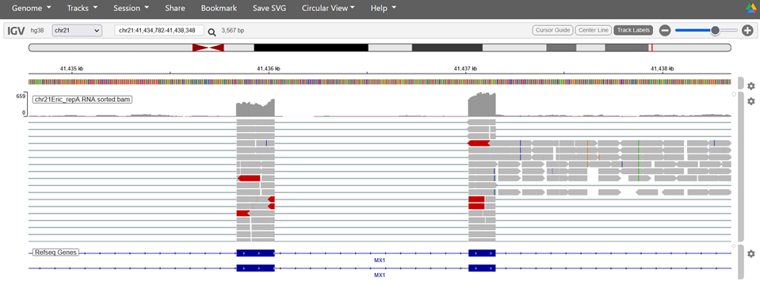

# Visualizing with the IGV Web App
Authors: Samuel Hunter and Lynn Sanford, 2023

## Introduction
To view BAM and TDF files, we can use IGV.

In the videos for today, you saw the functionality of the IGV Desktop Application. Though we encourage you to download and use the desktop version of the software to take advantage of much of its functionality, today we’ll be using the IGV Web App, which is a lightweight, cloud-based version of IGV.

## Using the IGV Web App

- Navigate to IGV in your web browser: https://igv.org. Click on IGV Web App. This will bring you to the genome viewer window.
  

- IGV will automatically load the hg38 genome and the RefSeq gene annotations as a default. This is the human genome version we used to map our reads, so we can stick with the default. If you were to use a different genome to map, you MUST use the same genome to visualize, otherwise all of the genomic coordinates will be wrong.

- To zoom in on a chromosome, you can click on any of the chromosomes, or use the dropdown menu (currently labeled “all”). Navigate to chromosome 21.
  

- We are now zoomed in on chromosome 21 (to zoom back out to the whole genome, select “all” on the chromosome drop-down menu). Use the zoom slider in the top-right to zoom in further, or simply click-and-drag the bar right below the chromosome diagram.
  

- We can also navigate to a specific region by using the search bar in the top-left. Enter chromosomal coordinates in the format `<chromosome>:<start_position>-<end_position>`, or enter a gene name to localize to a specific gene in the annotation.

- As an example, navigate to this region by typing either the exact coordinates, or the gene name (MX1):
  

- You’ll notice that the MX1 annotation tracks have a couple different elements. The small tick arrows indicate the directionality of this gene (in this case, we have a + strand gene). Exons are shown as thick, tall bars, while introns are the thin lines in between. 

- Let’s load in our mapped read files. Select the “Tracks” tab from the top left. Select “Local File” and navigate to wherever you stored your `.bam` and `.bam.bai` files. You **MUST** select both files.
  

- You’ll see nothing at first except for a prompt to zoom in. This is due to the fact that `.bam` files are large, so the browser will not show all of the read information if the region is too wide. Zoom in over any two neighboring exons (I picked the following region):
  

- When you zoom in, two tracks pop up. The top one shows a histogram of read numbers over genomic locations. Right away, you can see the reads pile up over the exons, which is expected for RNA-seq. Below the histogram is a panel that show all of the individual reads. You can hover over reads for specific read and mapping information. Scroll around explore this visualization.
  

- In the individual read visualization panel, the thicker grey bars indicate reads, while the thin grey bar indicates the continuation of a read across a splice junction. If a base in the read doesn’t match the reference, the mismatch will be indicated by a colored vertical line in the read. If the read alignment suggests a deletion, the entire read will be colored red. Insertions will be colored blue, and translocations colored green. For more info about the IGV color-codes, visit:
https://software.broadinstitute.org/software/igv/interpreting_insert_size

- Note: BAM files are memory-intensive, so it isn’t a good idea to load in many at once. TDFs (more tomorrow on these) are lightweight, but specific read info isn’t retained.
 
- Visualizations can be misleading! Making sure the read scaling and count normalization are the same is necessary for comparing multiple libraries. Next week, you’ll learn how to run differential analysis for a principled way of determining significant changes between data sets.