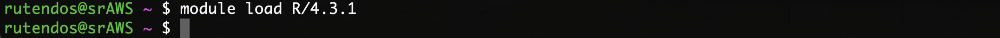

# Short Read Day 6 Worksheet | Introdution to R and RStudio (R you ready to learn R?!)

Authors: Taylor Jones (2022), Rutendo Sigauke (2024)

## Introduction

### Before class

- Make sure you have [RStudio](https://www.rstudio.com/products/rstudio/download/) and the latest version of [R](https://cran.rstudio.com/) (R 4.4.1 or greater) installed on your computer!

	- You want to get RStudio Desktop - Free

- R is awesome for plot generation and any statistical analysis you want to do- even those that aren’t related to next gen sequencing!

### Useful resources

- [Introduction to R](https://cran.r-project.org/doc/manuals/r-release/R-intro.pdf): This is an introduction to the ins and outs of R syntax.

- [R for Data Science (2e)](https://r4ds.hadley.nz/): This discusses applying R to data science with tips on exploratory data analysis.

- [The Pirate’s Guide to R](https://bookdown.org/ndphillips/YaRrr/): This is an excellent (and famous) comprehensive guide to R. I highly recommend this for learning as it starts at the basics and helps you build up skills for data analysis. It is also an easy read.

- [Beautiful Plotting Tips](http://zevross.com/blog/2014/08/04/beautiful-plotting-in-r-a-ggplot2-cheatsheet-3/): Cheat sheet for making beautiful, publication worthy plots in ggplot2!

- [Base R Cheat Sheet](https://iqss.github.io/dss-workshops/R/Rintro/base-r-cheat-sheet.pdf): A cheat sheet for Base R 

> **Note:** A good number of packages also  have cheat sheets. If you find a package you like, check if a cheat sheet already exist.


### Useful packages

- Data isn’t always beautiful. To tidy data up there is a very useful package called `tidyvrse` with instructions in R for Data Science. Info can be found here: https://www.tidyverse.org/

- To plot data beautifully with `ggplot2` (`ggplot2` is also a part of `tidyverse`): https://ggplot2.tidyverse.org/

- Arranging multiple plots with `cowplot` (this package also works well with `ggplot2`): https://wilkelab.org/cowplot/index.html

## Getting familiar with R

You can access R through the command line or through RStudio. We will start on the command line. 

We use this on a big cluster when a viz instance isn’t available. You can write an R script and submit it with a sbatch script. 

1. Navigate to your github repo clone and git pull to _"pull"_ any updates that someone had _"pushed"_ to the repository to your own work environment on the AWS.

```
cd /Users/<username>/srworkshop
git pull
```


2. Go ahead and launch R in the command line on the AWS server. Different versions of R are already installed. We can check which R is installed by running `module spider R`

Load the newest version of R listed on the AWS server using `module load R/4.3.1`



Lauch R in the terminal! Do this by typing R and Entering. Notice when you do this your username will be replaced by `>` indicating you are in R.


Now we can look at some basic R syntax.

3. Now that you are in R do a basic calculation of your choosing to test it out!

```
19 + 22
```


Here I typed 19+22(Enter) and it returned the answer to the summation which is 41.

4.  Set some variables. In R you can set variables that represent numbers, lists, dataframes etc. Let’s start
with numbers. To create a variable, you use the following syntax: `VARIABLE_NAME <- CONTENT` For example:


5. We can perform arithmetic on these variables now that they are set. We get the same answer, 41.


6. Now let’s set a slightly more complex variable. Let’s make a vector. To create a vector, we used the `c()` function for combine or concatenate. 

```
a_vector <- c(2, 10, 27, 100, 36)
```


You can see it returns the vector we just created.

Here I made a vector. Let’s call the vector to check its contents.


7. We can check data classes with `class()`. This can be applied to vectors, lists, data.frames etc.

```
class(a_vector)
```

8. Let’s test some basic functions on this list such as sum, mean, and standard deviation.


You invoke R functions by calling the function name (such as `sum`) followed by your variable in parentheses (such as `a_vector`). Some functions require more than one input, with the inputs separated by comma. Let’s exit command line R and switch to RStudio to try it out!

9. Exit R in the command line by typing `q()`, saving the workplace image saves the work we did.


10. Note, all the variables in your environment have been saved to a hidden folder in your home or working directory. The hidden folder is called `.RData` and can to be loaded in R to access the variables `load("/Users/<YourUsername>/.RData")`. 


You can load in the `.Rdata` in R (shown below).

> **Note:** This environment you saved will be automatically loaded when you reopen R on AWS.


You can copy the `.RData` file to your personal computer and load in your local R. This will allow you to access the variables established on the AWS.


> **NOTE:** This is not a script! It is an environment with variables stored. If you want a human readable file, you write an *R script* (See `Day6_worksheet2_R_in_Rstudio.md`).
>
> Scripts are a great way to ensure reproducibility!


