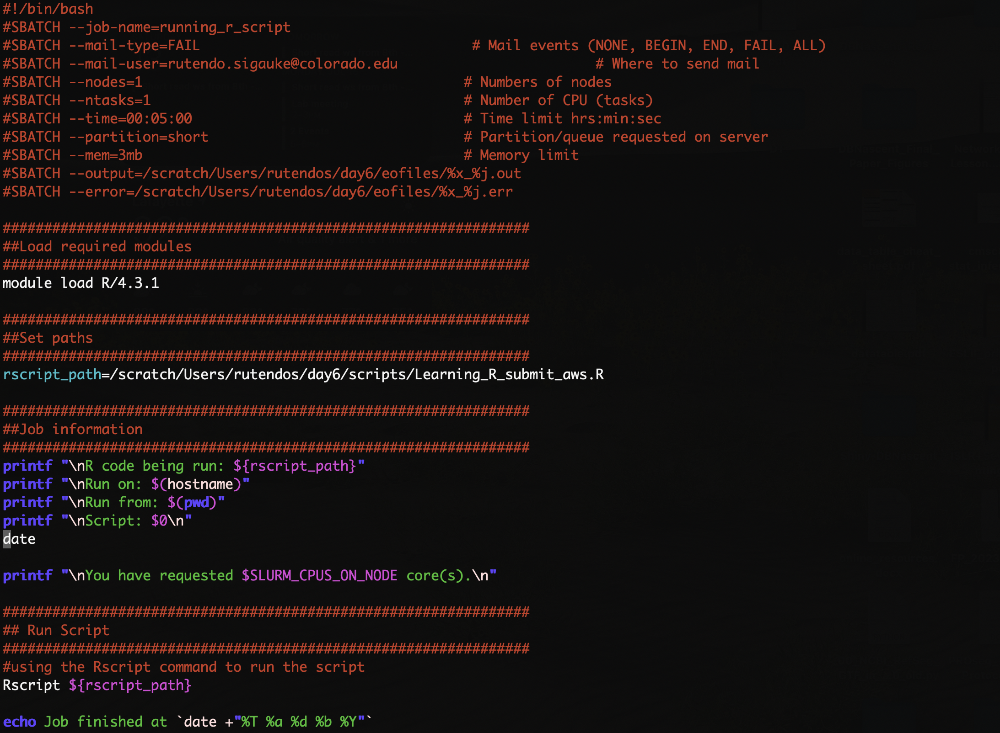

# Short Read Day 6 Worksheet | R in RStudio

Authors: Georgia Barone (2023), Rutendo Sigauke (2024)

## Section A : Learning R in RStudio

- Before beginning this worksheet, make sure RStudio is downloaded on your local computer.

1. Make sure you have updated changes from the GitHub repository in you AWS home directory

Move into the `srworkshop` repository and update from repository by running `git pull`

2. Copy the `Learning_R.R` script from the day06 scripts folder on the AWS (in `/Users/<your_username>/srworkshop/day06/scripts`) to your _local computer_

3. Open up RStudio _on your computer_. Once it is open go to File -> Open File -> Select `Learning_R.R`

4. Complete the	`Learning_R.R` script!

## Section B : Writing an R script to submit on a supercomputer

- The other script is `Learning_R_submit_aws.R`! This is an example R script where we submit R code in an R script as an sbatch job on the AWS server. Therefore, we save all outputs in order to view them after the process is complete. Submitting R scripts as an sbatch job is very useful when you have compute intensive processes (examples are counting reads).

1. Log in to AWS

2. Go into `/scratch/Users/<your_username>/` and use the mkdir command to make a folder called `day6`

- Inside your `day6` folder, make the folders `scripts`, `eofiles`, and `results`

3. Use the `rsync` or `scp` command to copy `Learning_R_submit_aws.R` and `Submit_Rscript.sbatch`
from `/Users/<your_username>/srworkshop/day06/scripts`, into the scripts directory in
`/scratch/Users/<your_username>/day6` you just made.

4. Go to `/scratch/Users/<your_username>/day6/scripts`. Use vim to open and edit the
`Learning_R_submit_aws.R` file. Add your own working directory path (it should be something
along the lines of: `/scratch/Users/<your_username>/day6/results`).

5. Look through the rest of the script before saving and exiting vim, to make sure you know what
the code is doing and where your output will be saving to.

6. Now use vim to open/edit the `Submit_Rscript.sbatch` file. This is the sbatch script we will be
using to submit our code to the supercomputer. Edit the script by adding your job name, email,
eofiles path, and path to `Learning_R_submit_aws.R`.

> **NOTE:** the command Rscript runs R scripts or R commands directly from the bash shell

7. Once you are happy with your `Learning_R_submit_aws.R` and `Submit_Rscript.sbatch` scripts,
submit the `Submit_Rscript.sbatch` script.

8. If the script worked, back up your results to your home directory
(`/Users/<your_username>/srworkshop/day06`).

9. Use `rsync` to copy `mtcars.csv` & `mtcars_mpg_wt_scatterplot.png` from AWS to your local
computer to view.
