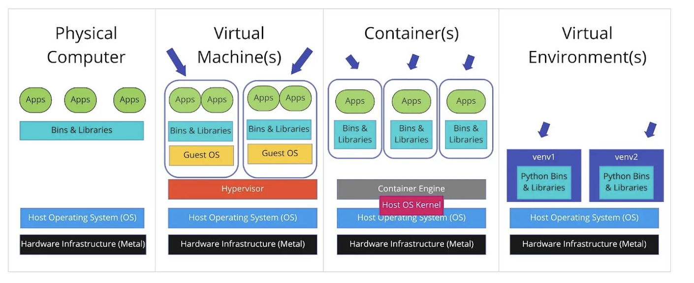

# Its hard to do Data Science cheap, but not impossible

## backing up data
	1. Storing fastq files is not free.
		They are not small. 20-100 Gb
	2. But you still need to back them up!
	Tip: Put fastq file on GEO right away and ask for them to be private for 5 years. 
		https://www.ncbi.nlm.nih.gov/geo/info/submission.html

## Check the data anaysis is working right the first time
	Programs fail--- and when they do they can lose reads. If you are not checking the number of reads at every step you will likley have to redo stuff!
	Always make sure the number of reads stay the same!
		`wc -l fastqfile `<>.#this is 4x the number of reads you have
		All mappers have stats... can you find the state file hisat2 put out on day 8?
		All counters give stats on how many reads were counted. Can you find the stats from day 7?
	

## Finding a super computer
	First, check on on your campus website. Search for HPC, or super comptuer. Some of them are free, some charge fees. Some charge for storage. 
	
	Second, if you don't have one, check if a collaborator does. We can get our collaboators on fiji if there project fits with Biofrontiers and the IT team agrees. 

	Third, check out ACCESS, which is funded by NSF. https://operations.access-ci.org/ 

	Fourth, consider super computer "rental". See below. 

## Super computer "Rental", a.k.a. cloud computing. 
	0. Use GCP (Google Cloud Platform) or AWS (Amazon Web Services). These are super computer you essentialy rent. That's what we did this week. 
	  There are lots of tutorials online about how to set up a super comptuer on GCP or AWS. But renting super computers costs some  money--- so you need to practice stuff below, before you do that!
 	1. Practice what you will do in GCP/AWS in google shell
                `ide.cloud.google.com`
	2. Installing sutff or learn to use Docker
		A. Learn to Installing stuff
		 	You have to know what is on the computer you are on: Lots of exploring.
			Often times you have to pick the version that goes with your super computer
		B. Learn to use docker containers
			Docker is like a box that wraps up the program and the stuff you need for the program.
			
			image from https://www.geeksforgeeks.org/devops/docker-or-virtual-machines-which-is-a-better-choice/
			tutorials:
			https://github.com/NIH-NICHD/Elements-of-Style-Workflow-Creation-Maintenance/
 	3. Once you are ready both GCP and AWS have free credits you can start with. 

## test with a tiny file	
	The main cost is in failure. You will fail! That's ok. So test on 1-2 smaller files. Then run it on all files. This decreases the time and money  you spend.  

## As soon as the big data is sumerized you can move it to your laptop and work there					
	So think ahead of time about how fast you can get the files to something smaller.

## Always keep the raw data and the code you used to make it
	You don't have to keep the intermediate files if you keep the code and the raw files. But you do have to compare the cost of keeping the files to the cost of reproducing the files. 
 
## Keep compressed versions of files
	1. Cram is smaller than bam is smaller than sam. All hold the same data.
	2. tar and gzip are useful for making text files smaller
	3. In single cell you should use hd5 files (or something like it). Single cell has mostly 0 values. So HD5 removes the 0 and stores the position of the data with values. (By the way, 0 counts for a gene doesn't mean that gene is not expressed. I didn't get any mike and ikes when we did the M and M example, but that doesn't mean there were not Mike and Ikes in the bowl.)
