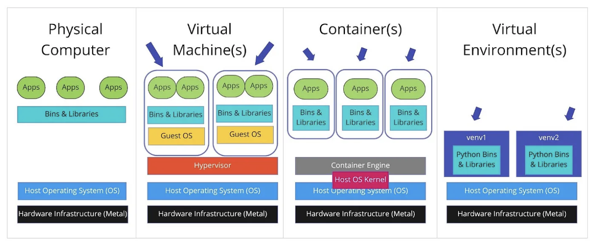

# Its hard to do Data Science cheap, but not impossible

## Backing up data
Storing fastq files is not free.
  - They are not small (20-100 Gb)
  - But you still need to back them up!
  - Tip: Put fastq files on GEO right away and ask for them to be private for 5 years. 
    - (https://www.ncbi.nlm.nih.gov/geo/info/submission.html)

## Check the data anaysis is working right the first time
Programs fail--- and when they do they can lose reads. If you are not checking the number of reads at every step you will likely have to redo stuff!
  - Always make sure the number of reads matches expectation!
  - `wc -l fastqfile`: this is 4x the number of reads you have
  - All mappers have stats... can you find the stats file hisat2 put out on day 4?
  - All counters give stats on how many reads were counted. Can you find the stats from day 7b?

## Finding a super computer
First, check on on your campus website. Search for HPC, or super computer. Some of them are free, some charge fees. Some charge for storage.

Second, if you don't have one, check if a collaborator does. We can get our collaborators on fiji if their project fits with BioFrontiers and the IT team agrees. 

Third, check out ACCESS, which is funded by NSF: (https://operations.access-ci.org/)

Fourth, consider a super computer "rental". See below. 

Fifth, chop your data into lots of small files. Then run the reads mapper on the smaller files on many of your friends computers. Or thirty really old computers you set up in the lab. 
  - To run it on your friends computers in the background you don't want it to affect what they are doing. So you want the pieces of your fastq to be small enought that hisat2 (or your mapper) doesn't take to much memory or CPU. 

# Step 1 - chop into lots of files
```
filename="sample.fastq"
basename="${filename%.fastq}"
lines_per_file=400 #400 may not be right, right is based on how many computers you will be running this on. 

awk -v lines_per_file=500 -v basename="$basename" '{
    file = sprintf("%s.%02d.fastq", basename, int((NR - 1) / lines_per_file) + 1)
    print > file
}' "$filename"`
```

# Step 2: run it on lots of computers
You don't need to use slurm, since that's probably not on a normal mac or windows with a linux virtual enviorment. 

You should open a terminal, install the program you need. Then when you run the program you want to add a `&` (ampersand) at the end of the line, like this: `histat2 -input_files -output_files &`

The ampersand pushes something you are running to the background so its not sitting on the command line the whole time. Leave the terminal running to or the job will stop.

# Step 3: put the output back together
Each hisat2 run will make a smaller bam, so once you are done you have to put the bams back together, then sort and index them:
```
samtools merge output.bam input1.bam input2.bam input3.bam ...			
samtools sort merged.bam -o merged.sorted.bam
samtools index merged.sorted.bam
```

## Super computer "rental", a.k.a. cloud computing. 
Use GCP (Google Cloud Platform) or AWS (Amazon Web Services). These are super computer you essentialy rent. That's what we did this week.

There are lots of tutorials online about how to set up a super computer on GCP or AWS. But renting super computers costs money, so you need to practice stuff below, before you do that!
  - Practice what you will do in GCP/AWS in [google shell](ide.cloud.google.com)

When you rent a super computer, you need to install software by doing full installs or using containers
  - Learn to Installing stuff
    - You have to know what is on the computer you are on: Lots of exploring.
    - Often times you have to pick the version that goes with your super computer
  - Learn to use docker or singularity containers
    - These containers wrap up the program and all the dependencies you need for the program.
    
	- Image from (https://www.geeksforgeeks.org/devops/docker-or-virtual-machines-which-is-a-better-choice/)
	- Turtorial: (https://github.com/NIH-NICHD/Elements-of-Style-Workflow-Creation-Maintenance/)
  - Once you are ready both GCP and AWS have free credits you can start with.

A pro of this approach is that you don't have to use slurm! You are not sharing! You have this super computer to yourself. Use Bash to run stuff, not sbatch. 
 
## Test with a tiny file	
The main cost of data science is in failure. You will fail! That's ok. So test on 1-2 smaller files. Then run it on all files. This decreases the time and money you spend.  

## As soon as the big data is summarized you can move it to your laptop and work there
So think ahead of time about how fast you can get the files to something smaller.

## Always keep the raw data and the code you used to make it
You don't have to keep the intermediate files if you keep the code and the raw files. But you do have to compare the cost of keeping the files to the cost of reproducing the files. 
 
## Keep compressed versions of files
Cram is smaller than bam is smaller than sam. All hold the same data.

`tar` and `gzip` are useful for making text files smaller

In single cell analysis, you should use hd5 files (or something like it). Single cell has mostly 0 values. So HD5 removes the 0s and stores the position of the data with values. (By the way, 0 counts for a gene doesn't mean that gene is not expressed. It just means you didn't sample it.)
