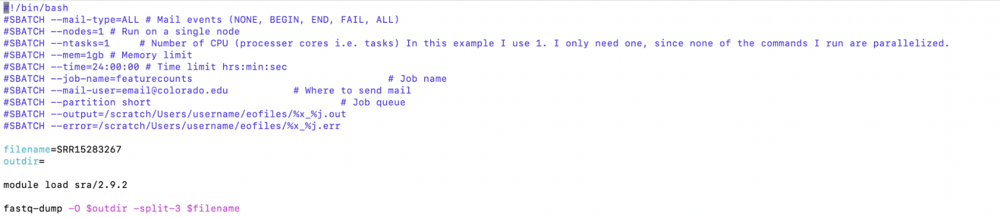
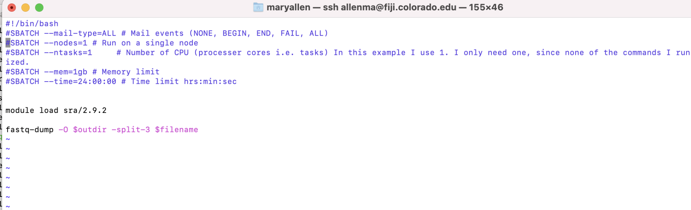
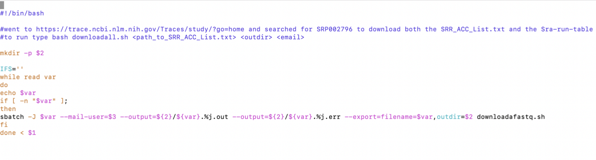
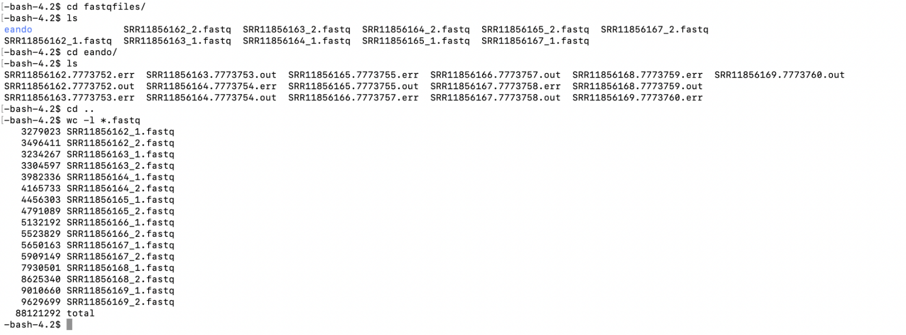

# Downloading Public Data

Authors: Mary Allen (2023)

## Pre-processed ChIP-seq from CistromeDB 

1. Go to http://cistrome.org/db/#/

2. Pick an organism, cell line and TF

3. You can do a lot on this site

   a. download the bed file

   b. look at the quality of each chip

   c. See what motif was most enriched in this chip

   d. Find genes that may be regulated by this TF

   e. They also have a site you can search a gene to see what TFs bind it
http://dbtoolkit.cistrome.org/

## FASTQ downloads
1. Go to the European website with raw data

## Arrange an out directory

1. Make a new outdirectory on the supercomputer

2. Copy the scripts in the day 10 scripts I made for downloading a fastq from GEO

`run_wholeline.sh`
`acommandsbatch.sbatch`

## Upload your downloadscript to the super computer

## From NIH GEO via the tool fastq-dump

Downloading one fastq

The -split-3 flag is essential and should be default. That flag will do nothing if you have single end data. If you have paired end data you NEED it. Paired end data will come down as one file instead of two files (the R1, which means read1, and R2 files) 

Run the sbatch script 
1. Make a directory for the fastq files to go into
2. Edit the `downloadall.sh` script. 
   a. Change your email!!!!
3. Run the two scripts by typing 

   `bash downloadall.sh </path/to/your/SRR_AccList.txt> <outdir>`

4. Under the hood 

   a. the main script, called `downloadfastq.sbatch`, uses a program called `fastq-dump` to download public data from GEO. 

   > **IMPORTANT!!!** Use the -split-3 flag every time! If you are doing single end data that flag does nothing (it won’t hurt you), but if you are using paired end data then that flag outputs the fastq files as two files. If you don’t use this flag you will get one file with both the forward and reverse reads in it!!!!

   b. This script, `downloadall.sh`, just runs the other script via sbatch. It reads the SRR_ACC_List.txt file and submits each SRR to a different CPU to download. 

   c. If it works you will have fastq files in your outdirectory

   d. You should do a `wc -l` on the files to check them. 

`SRR#_1.fastq` and `SRR#_2.fastq` represents read 1 and read 2 of a pair. Therefore `SRR#_1.fastq` and `SRR#_2.fastq` should have the same line numbers. 

