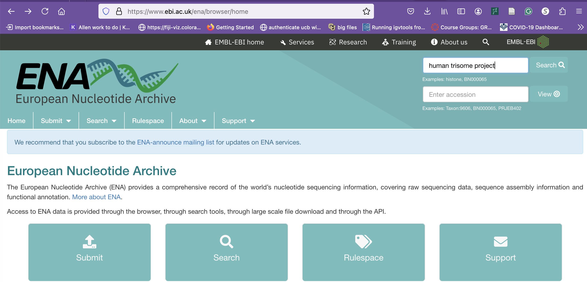
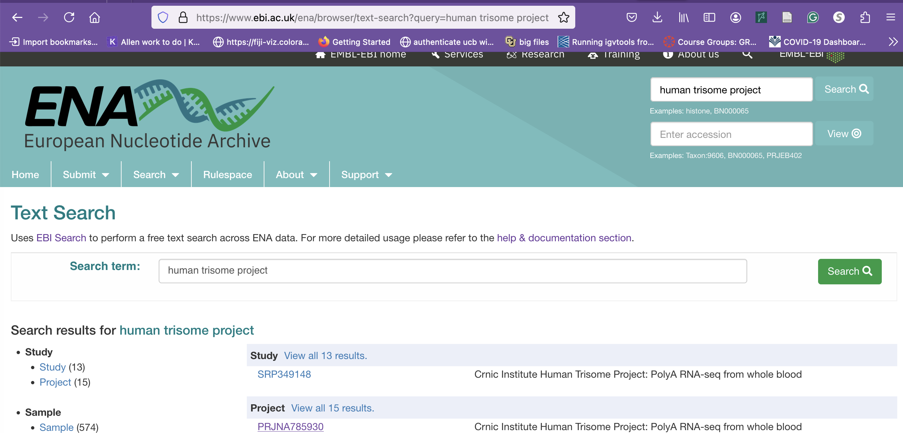
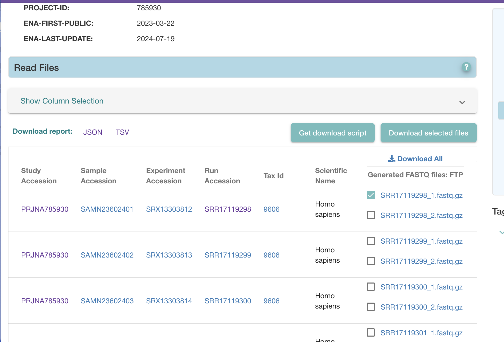
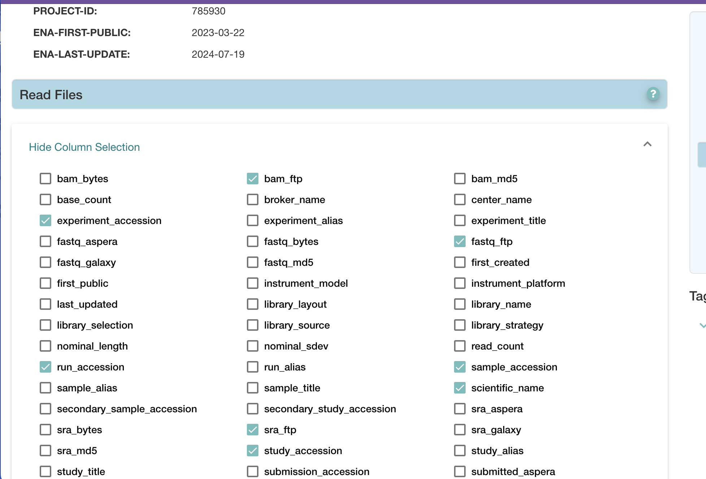
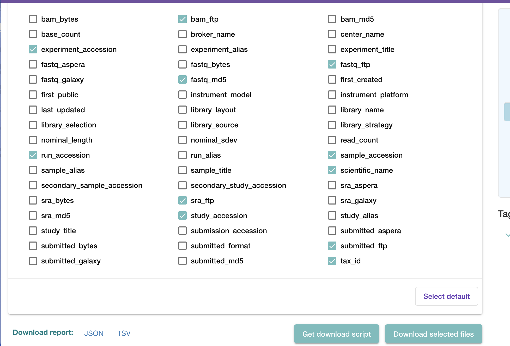
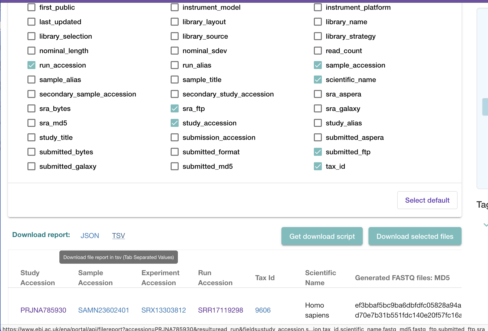
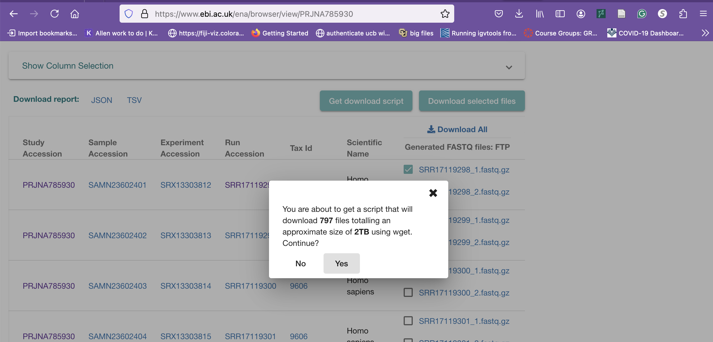
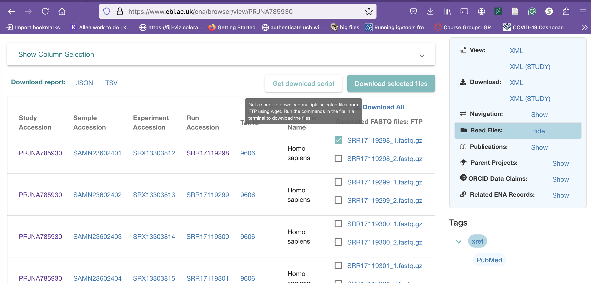
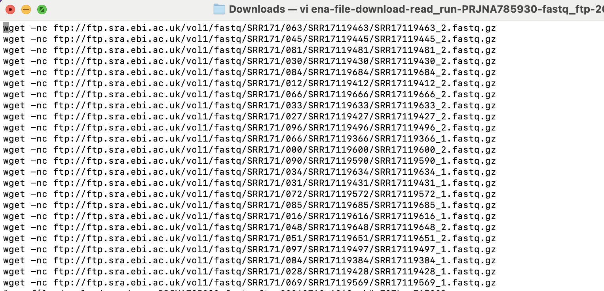

# Downloading Public Data

Authors: Mary Allen (2023, update 2026)

## FASTQ downloads

You are going to collect metadata about your project from a website and then you are going to use scripts to download that data. 

https://www.ebi.ac.uk/ena/browser/

1) To start make a directory for the project (called PRJEB32618 in this case) in your scratch directory on the AWS.  Inside the PRJEB32618 directory make 5 sub folders; fastqs, scripts, output, metadata, qc.

2) Go to the European website with raw data and gather both the metadata file and the download scripts. Go to the ENA website and find your favorite project, a.k.a. PRJEB32618 (I chose this example because its small)

3) Turn on all the options you want under "Show column selection" (you should always select fastq_md5!!!!!)

                                                                 

5. Download  the metadata text file by clicking "tsv" (this is what we call the metadata file). 

6. Download the script to download the files by clicking "Download all" above the "Generated FASTQ files: FTP Submitted files: "
   

This is what that file ("the download script") looks like

7. Put both of these file in the metadata directory on your super computer.

# scripts for downloading in parallel

1. Copy from srworkshop/day10/scripts/ the following files checkmd5totxt.sh, acommandsbatch.sbatch and run_wholeline.sh. Put them in your scripts directory.

2. Edit  `run_wholeline.sh` to point to the download script from ENA and the proper fastq outdir

3. Edit `acommandsbatch.sbatch` on your email and e and o file locations

4. run the pipeline by typing `bash run_wholeline.sh`. A copy of `acommandsbatch.sbatch` script for each download file will be submited to the queue. If not all the fastq come down run the run_wholeline.sh again until you have all files down. 

8. Edit the script checkmd5totxt.sh to point to your output fastq directory and qc directory

9. Once all the fastq files look like they have been downloaded run the checkmd5totxt.sh by typing `bash checkmd5totxt.sh`

that will output a file full of md5scores for your fastq. You need to compare those md5 scores to the md5 scores in the tsv you put in metadata to make sure the fastq downloaded without error. 

## Pre-processed ChIP-seq from CistromeDB 

1. Go to http://cistrome.org/db/#/

2. Pick an organism, cell line and TF

3. You can do a lot on this site

   a. download the bed file

   b. look at the quality of each chip

   c. See what motif was most enriched in this chip

   d. Find genes that may be regulated by this TF

   e. They also have a site you can search a gene to see what TFs bind it
http://dbtoolkit.cistrome.org/
