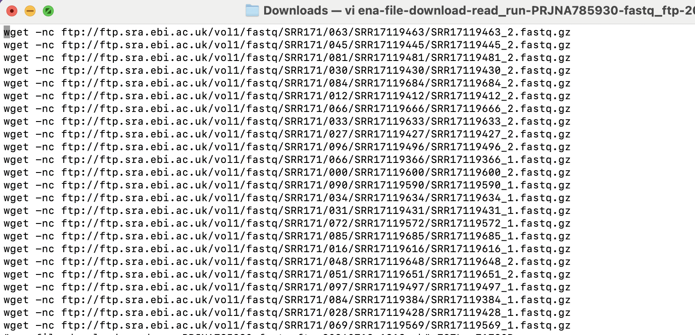

# Downloading Public Data

Authors: Mary Allen (2023)

## Pre-processed ChIP-seq from CistromeDB 

1. Go to http://cistrome.org/db/#/

2. Pick an organism, cell line and TF

3. You can do a lot on this site

   a. download the bed file

   b. look at the quality of each chip

   c. See what motif was most enriched in this chip

   d. Find genes that may be regulated by this TF

   e. They also have a site you can search a gene to see what TFs bind it
http://dbtoolkit.cistrome.org/

## FASTQ downloads
1. Go to the European website with raw data

2. Search for something you want data for and click on the PNRJA

3. THis is what you will see

4. Click on "Show column selection" make sure to add the md5sum for all the files you are downloading is selected

5. Download  the metadata text file

6. Download the script to download the files
   

This is what that file looks like

## Arrange an out directory and put the script ENA made on the server

1. Make a new out directory on the supercomputer

2. Copy the scripts in the day 10 scripts I made for downloading a fastq from GEO

`run_wholeline.sh`
`acommandsbatch.sbatch`

3. Upload the ENA shell script

   
