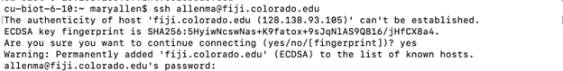
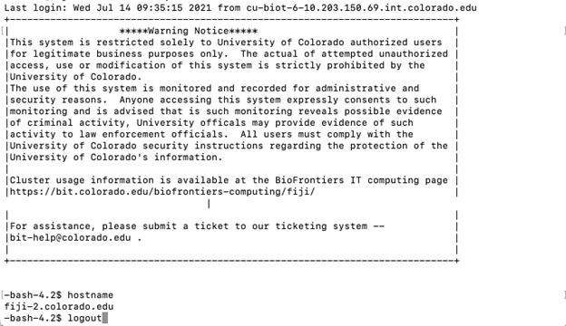
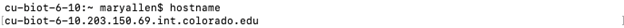

# Accessing a new super-computer
Author: Mary A. Allen, 2021

**The AWS (Amazon Web Services) supercomputer we used in class goes away the Monday after the workshop ends!!!**

AWS supercomputers aren't cheap, so it's nice if your campus has a cluster, supercomputer, or some high performance compute option.

## Super computers on the Boulder/Anschutz campuses

| Super computer name | Run by | Who can get on | Security system |
| ------------------- | ------ | -------------- | --------------- |
| fiji | BioFrontiers IT (bit-help@colorado.edu) | Boulder BioFrontiers faculty and their labs | You must be on campus or use vpn before login when off campus. Use your identikey and password as login information. |
| Summit | RC (Resource Computing) | Boulder campus - Anyone | Duo 2-factor Authentication |
| Rosalind | TICR High Performance Computing | CU Anschutz: Authorized faculty, students, and staff | Must be on campus or use vpn when off campus. Requires a password. |
| Bodhi | Dept of Biochemistry and Molecular Genetics, School of Medicine (david.farrell@cuanschutz.edu) | CU Anschutz  Authorized faculty, students, and staff | Must be on campus or use VPN, and Duo 2-factor authentication using university credentials |

## Working on supercomputers

### Log in
Open a terminal on a mac or Ubuntu on a PC. You will then login to the computer using your username (on fiji this is your identikey) and the machine name (example: fiji.colorado.edu).  

`ssh <username>@<computername>`

The first time you log in it will ask you:\
`Are you sure you want to continue?`\
Type `yes`
 
Super computers will either use a ssh key or a password (or both). If you type a password, you will see nothing. That’s normal! It's a privacy feature, not a bug.

This is me logging onto fiji: 

This is after I log onto fiji.

To confirm you are on the super computer, type `hostname`, and the computer will tell you its name. 

This is my personal computer:

 
### Log out
Type `logout`.

### I’m on a new supercomputer. What do I need to know?
This section assumes the super computer uses Slurm as a queue system. There are other possibilities including Torque and Moab. Ask the admin of the computer how jobs are scheduled/managed.

#### What are the partition names?
If the supercomputer has distinct resources (is heterogenous) then likely there will be different partitions available (i.e. what you input for the `-p` flag in a sbatch script). For a supercomputer that uses Slurm, you can find these partition options with `sinfo`.

#### How many Nodes and CPUs are there?
In the diagram below, a 4x4 box is a node (a single computer), smaller boxes inside of a node are CPUs (also known as ntasks or processors). The default for most programs is to assume they are running on a single node and 1 CPU. Writing software that can leverage multiple ntasks, processors, or CPUs is not hard, so check if the program you are using can take advantage of parallelization in this manner.

> **Remember:** The more CPUs used, the faster the program will run. Writing software to take advantage of multiple nodes (computers) is far more challenging and very few bioinformatics programs use multiple nodes, but it is possible! If you run into this situation, talk to your IT support guys for help in how to run these programs.   

To find out how many nodes and CPUs the cluster has, type `scontrol show node`.

Generally, you should use about half a node to run `hisat2` and `samtools sort`.

### How much is this going to cost?
- Storage of data costs money! (disk drives, back ups, administration)
- Compute (running the programs) costs money! (air conditioning, hardware, administration)
- Budget for the analysis (not just the library prep and the sequencing): it takes somebody time to do this analysis!
- Your best storage space estimate is 3-10x the size of your initial fastq files. This assumes you are not keeping intermediate files.

### Where should I be putting data I’m working on vs. data I’m storing?
**ASK!**

Generally there is “local disk storage” (fast) and “network disk storage” (slower). The speed of the disk influences how fast your jobs can run. For example, on Fiji the `/scratch` directories are the fastest. 

Ask what storage is backed up. Not all directories can be backed up. Back-ups are expensive (more disks, disks have to be set up and maintained, ideally are physically distant). On Fiji, home directories (`/Users/<username>/`) are backed up but anything on `/scratch` is not. 

| Storage type | Speed | Location | Backed up? | I/O capacity | Path on Fiji | Cost |
| ------------ | ----- | -------- | ---------- | ------------ | ------------ | ---- |
| Local (scratch) | Fast | On-site with compute nodes | No | High, easier on compute nodes | `/scratch/Users/<username>/` | Expensive |
| Remote (home directory) | Slower | Often off-site | Yes | Fairly Low | `/Users/<username>/` | Cheaper |

The other way in which these disk resources vary is in total available space. Generally speaking, faster disks are more expensive to buy initially, and therefore there may be less available.

Many computer systems have quotas (maximum amount of space available to you in either scratch or home), so be aware of these limits. Contact the administrative staff if space constraints are limiting, as there may (or may not) be other options and/or workarounds available when very large amounts of disk space are needed.

### How much space am I using?
Type `du -h <directory path>`. So to look at your entire home directory, `du -h ~`.
