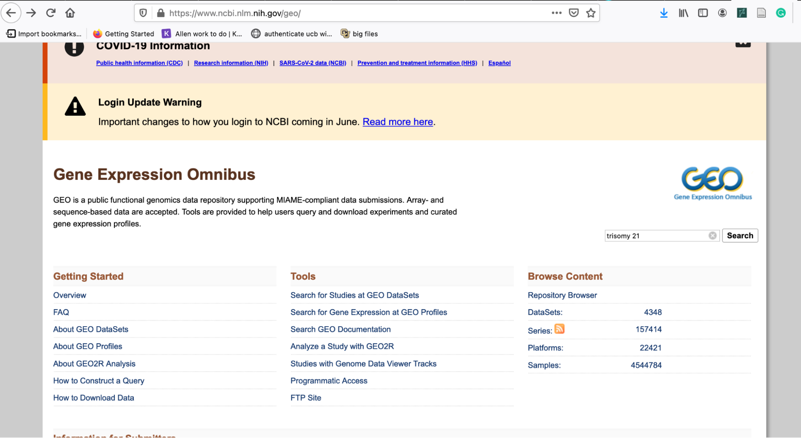
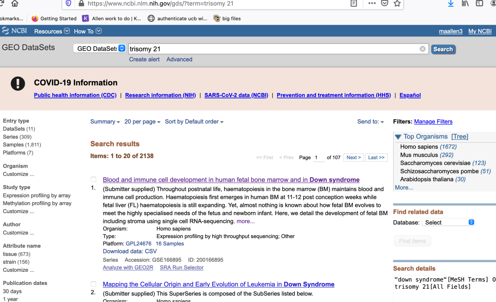
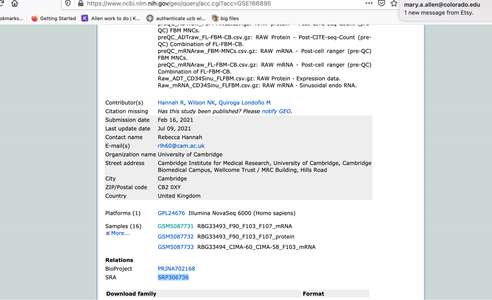
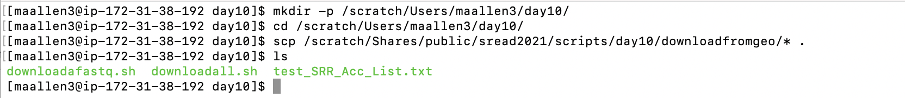
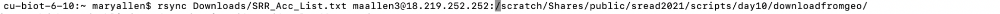
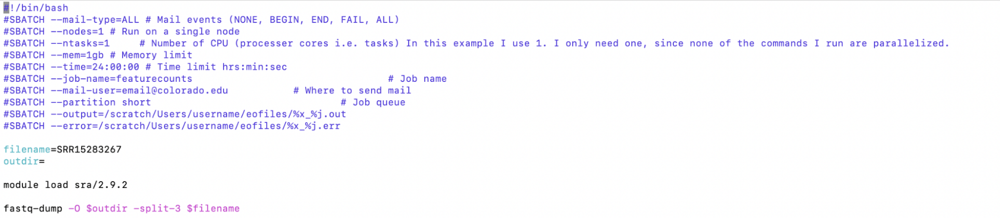
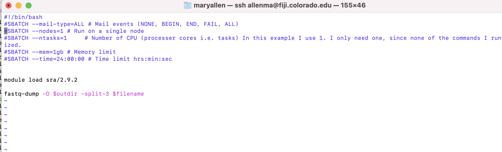
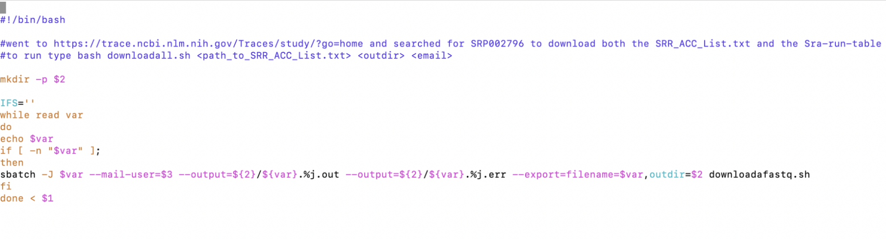
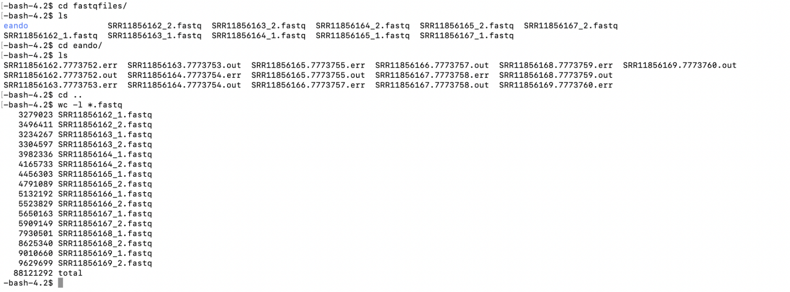

# Downloading Public Data

Authors: Mary Allen (2023)

# Pre-processed ChIP-seq from CistromeDB

1. Go to (http://cistrome.org/db/#/)

2. Pick an organism, cell line and TF

3. You can do a lot on this site
  - Download the bed file
  - Look at the quality of each ChIP
  - See what motif was most enriched in this ChIP
  - Find genes that may be regulated by this TF
  - They also have a site you can search a gene to see what TFs bind it: (http://dbtoolkit.cistrome.org/)

## Downloading sequencing data from the NCBI Short Read Archive (SRA)
1. Go to GEO and find the SRP# for the data you care about

2. Paste the SRP into this website: (https://trace.ncbi.nlm.nih.gov/Traces/study/)
3. Download both the accession and metadata
4. Metadata will download a tab delimited text file of all SRRs in that SRP
  - This is a start for the metadata table you will need for to know which files are which (names of files are not very helpful)
5. Accessions are just the SRR numbers themselves, and this is the file you will need to download stuff

## Arrange a output directory
1. Make a new output directory on the supercomputer
2. Copy the scripts I made for downloading a fastq from GEO

## Upload your SRR_ACC_List.txt to the super computer

### Get the files from AWS

See scripts within the GitHub scripts directory. 

## From NIH GEO via the tool fastq-dump

Downloading one fastq:

> Important: The `-split-3` flag is essential and should be default. That flag will do nothing if you have single end data. If you have paired end data you NEED it. Paired end data will come down as one file instead of two files (the R1, which means read1, and R2 files) 

Run the sbatch script 
1. Make a directory for the fastq files to go into
2. Edit the `downloadall.sh` script.
  - Change your email!!!!
3. Run the two scripts by typing `bash downloadall.sh </path/to/your/SRR_AccList.txt> <outdir>`
  - Under the hood: the main script, called `downloadfastq.sbatch`, uses a program called `fastq-dump` to download public data from GEO. 

  - This script, `downloadall.sh`, just runs the other script via sbatch. It reads the `SRR_ACC_List.txt` file and submits each SRR to a different CPU to download. 

  - If it works you will have fastq files in your output directory

  - You should do a `wc -l` on the files to check them. 

`SRR#_1.fastq` and `SRR#_2.fastq` represent read 1 and read 2 of a pair. Therefore `SRR#_1.fastq` and `SRR#_2.fastq` should have the same line numbers. If they don't, your download or splitting wasn't correct.

