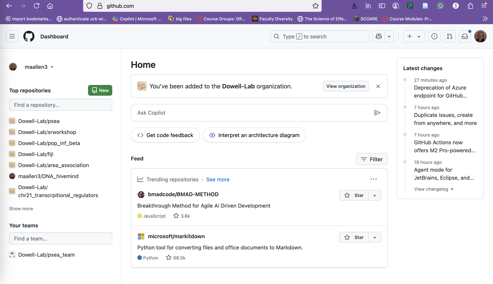
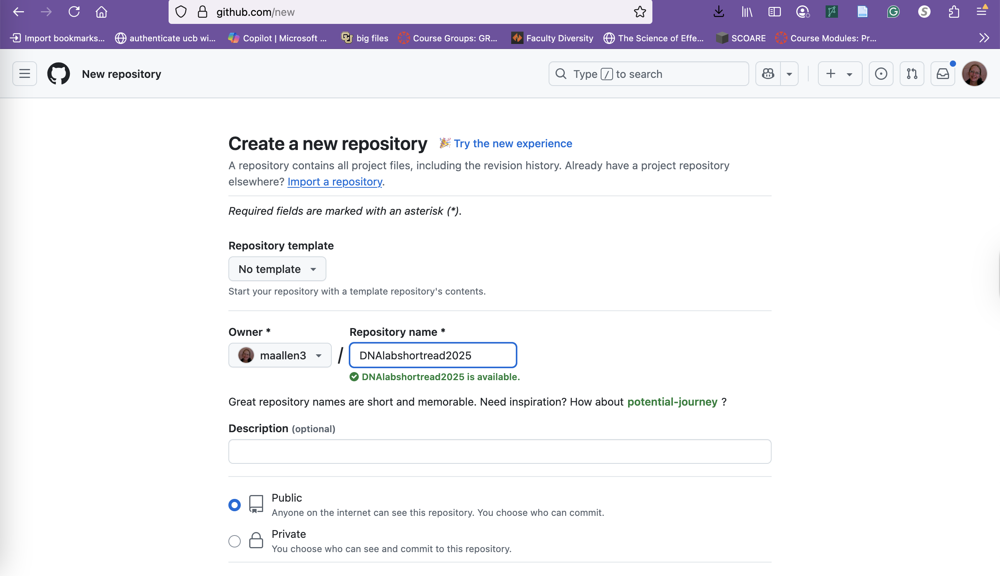
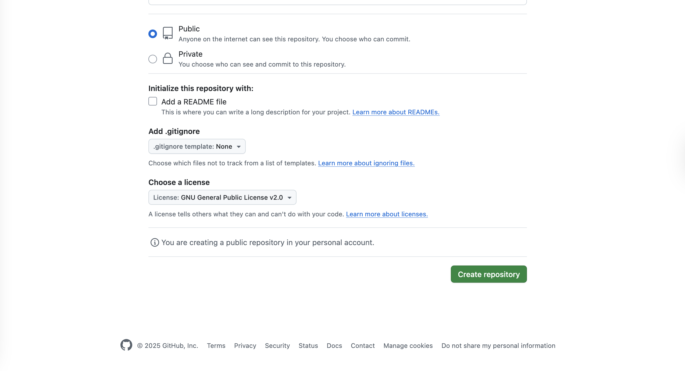
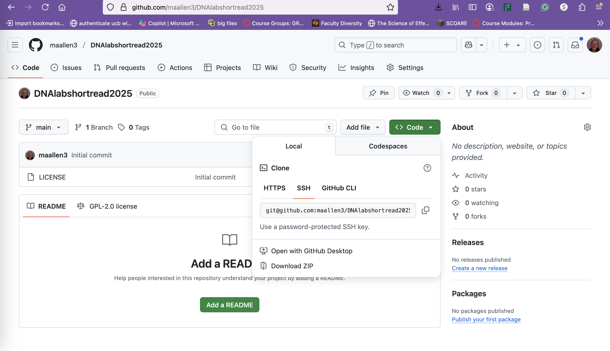
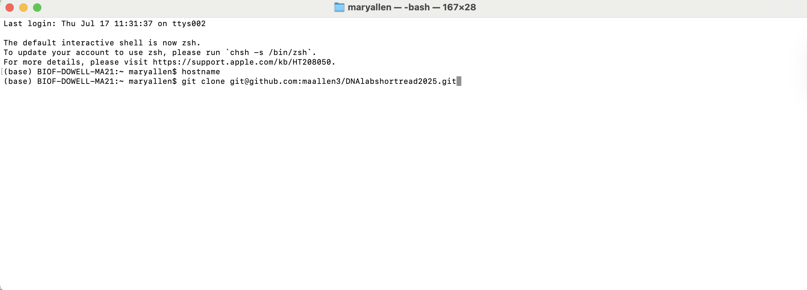
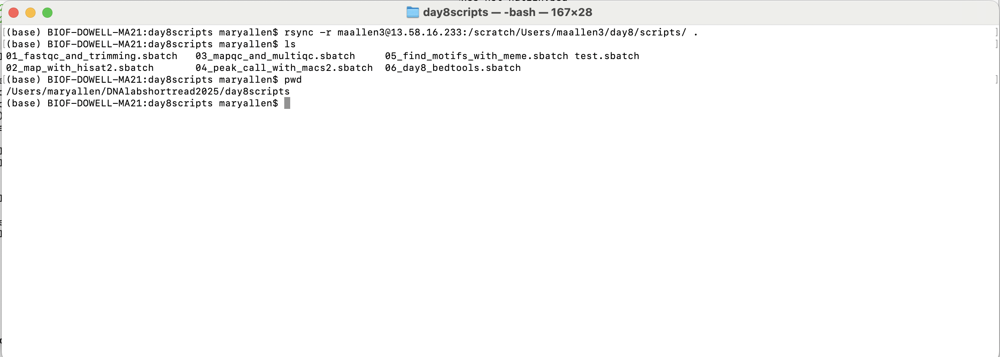
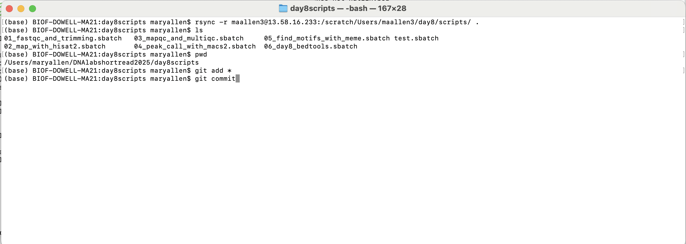
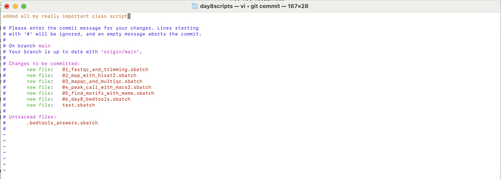
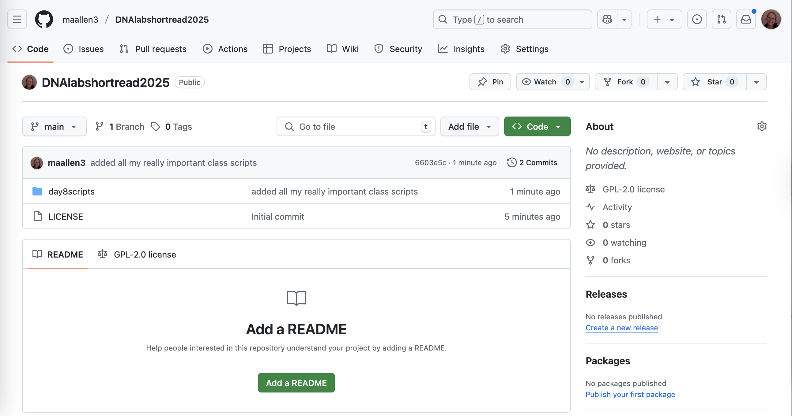
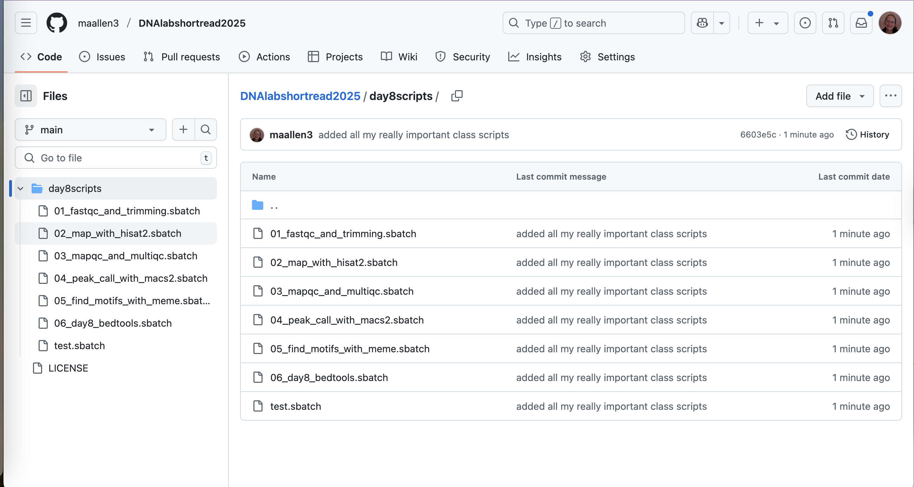

# A quick guide to GitHub | Software Engineering for Scientists

Authors: Jacob Stanley (2023), Mary Allen (2023,2025)

**Version control** is a system designed to manage changes to files for a project. The basic functionality of a version control system includes:

- keeping track of changes
- synchronizing code between developers and users
- allowing developers to test changes without losing the original
- reverting back to an old version
- tagging specific versions

# Creating a repository

## Go to the github website and start a new repository.
 

On your GitHub page if you select the "Repositories" tab, it will bring you to the list of your repos. At the top right you’ll see a green button "New", which will bring up the "Create a new repository" page.
 
## Chose GNU licence and create it.

To create your new repository, specify a name, whether or not it’s public or private, and whether or not to include a README and a license.
 
It is recommended that you include a README. This file is a markdown file that will be displayed on your repo’s page, below all the files. These READMEs are useful for providing information about the contents of your software and how it can be run.
 
The license is also important because it is required for a piece of software to be truly "open source". For an explainer on the choice of license, see [here](https://docs.github.com/en/repositories/managing-your-repositorys-settings-and-features/customizing-your-repository/licensing-a-repository).

Once you have specified all the above information, click the green button "Create repository".

Check _Add readme_ and choose a license. Then click _create a repository_.

You will then get a homepage for the repository.

## Clone the repository (pick SSH!)

### General rule of thumb, pick HTTP to clone something you will only pull from, SSH if you want to pull and push

Now that you’ve created a remote repository on GitHub, you will have to run the "clone" command to create a copy of it *locally* on your computer. On the repo page click the green "Code" button which will bring up the clone menu. Copy the 'SSH' link.
 
Run `git clone <repository link>` in your local terminal. This will download the contents of the repo and create the local repo in the current directory in a folder with the name of the repo.

## Put something in  the repository
But it's currently empty. Let's add a file or six.

## Git add and commit (general rule, pull then push)

Now that we have added a file… we need to update the github repository. We need to tell git what file changes we'd like to save. To do that we use the `git add` or `git rm` commands.

`git add <filename>` to tell the code which files to add/save changes (in this case our new file).

`git commit` to document what item(s) you changed and why. This then creates a save point for the repository. This save point is only local until...

`git push` to push your changes up to the remote repository on github.

I’m going to add all files in the directory so I use \*.

When you commit you will go to a new screen. This screen is running vim and wants you to create a 'commit message' to document the changes you made. Keep in mind, what you put here will be forever on the internet. Check out [https://twitter.com/gitlost?lang=en](https://www.google.com/url?q=https://twitter.com/gitlost?lang%3Den&sa=D&source=editors&ust=1721333013905913&usg=AOvVaw3U5pv0E4ZUGK7rYqGbMzdf).

## If it's your first time 

The first time you push you may need to configure your settings. Try to push, and you will get a warning message. Use the config statements provided in that message to set your username and email address.

You may also get an warning that requires you to configure your push settings. If so, do that as well.

## It worked!

## Everytime you change a file, 
I want to change the files,  what do I do?

1. git pull
(kinda silly, but always better to pull before pushing. Less accidents with Lab mates)

2. Edit the file

3. git add *, then git commit, then git push
	git add  * (only working locally)
	git commit (only working locally)	
	git push (putting it on the internet)

## Github repositories on a supercomputer
If you only want to *use* a repository on the supercomputer, you can do as we did in this class and clone the repository with the 'HTTPS' link. After doing so, you can pull from the repository anytime you'd like.

If you want an interactive repository on the supercomputer, you'll need to clone the repository with the 'SSH' link, but before you do you must make a new key to link your account on the supercomputer to GitHub. Use the [key generation worksheet](https://github.com/Dowell-Lab/srworkshop/blob/main/day01/worksheets/SSH_AWS.md) from Day1, to create keys on the supercomputer. Then you'll be able to use your github account there.

## More information

[Git commands](https://education.github.com/git-cheat-sheet-education.pdf)\
[Git repository overview](https://www.geeksforgeeks.org/what-is-a-git-repository/)

