# A quick guide to GitHub | Software Engineering for Scientists

Authors: Jacob Stanley (2023), Mary Allen (2023)

**Version control** is a system designed to manage changes to files for a project. The basic functionality of a version control system includes:

- keeping track of changes
- synchronizing code between developers and users
- allowing developers to test changes without losing the original
- reverting back to an old version
- tagging specific versions

## Creating a repository

On your GitHub page if you select the "Repositories" tab, it will bring you to the list of your repos. At the top right you’ll see a green button "New", which will bring up the "Create a new repository" page.
 
To create your new repository, specify a name, whether or not it’s public or private, and whether or not to include a README and a license.
 
It is recommended that you include a README. This file is a markdown file that will be displayed on your repo’s page, below all the files. These README are useful for providing information about the contents of your software and how it can be run.
 
The license is also important because it is required for a piece of software to be truly "open source". For an explainer on the choice of license, see [here](https://docs.github.com/en/repositories/managing-your-repositorys-settings-and-features/customizing-your-repository/licensing-a-repository).

Once you have specified all the above information, click the green button "Create repository".

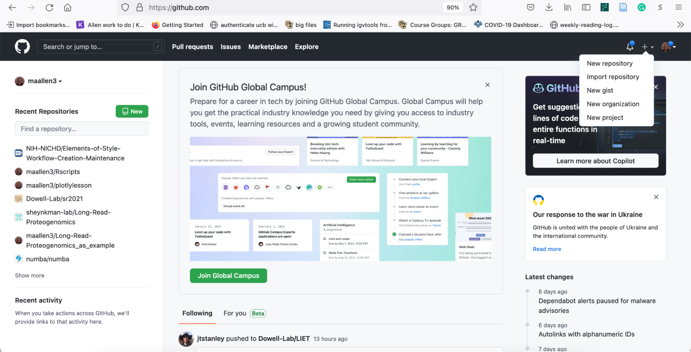

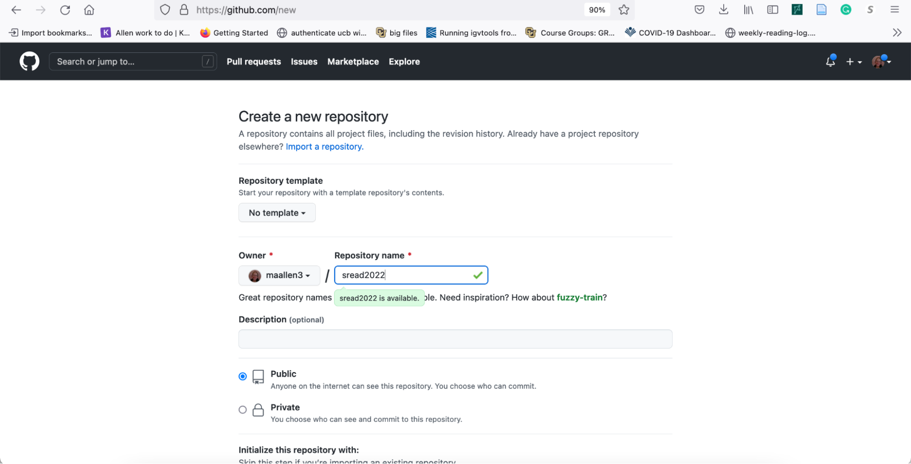

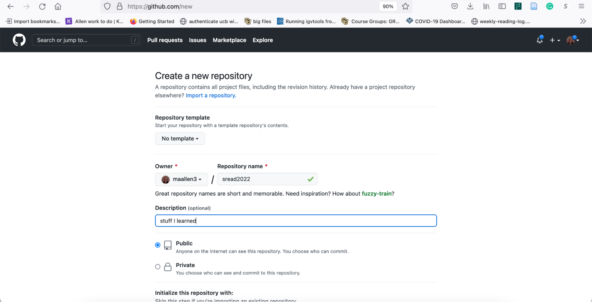

Check _Add readme_ and choose a license. Then click _create a repository_.

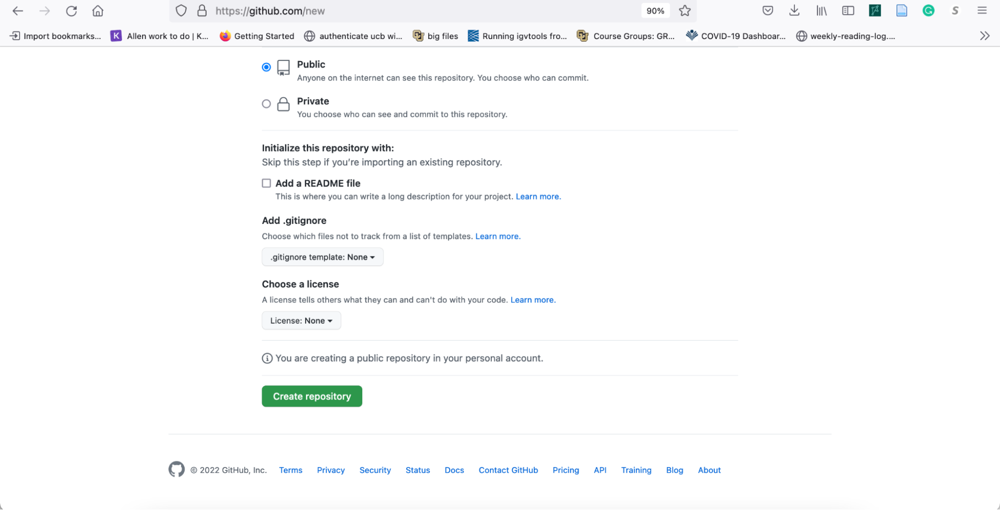

You will get this page. Copy the address that ends in .git.

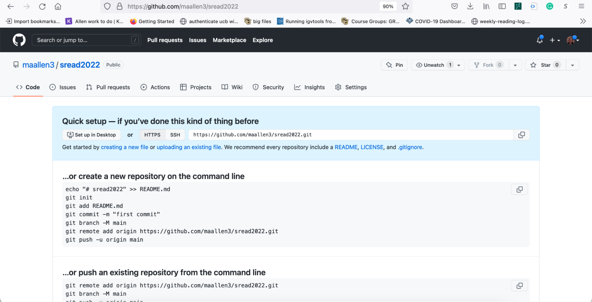

Clone the git repository

## Clone the repository

Now that you’ve created a remote repository on GitHub, you will have to run the "clone" command to create a copy of it *locally* on your computer. On the repo page click the green "Code" button which will bring up the clone menu. Copy the appropriate link.
 
Run `git clone` with the copied link. This will download the contents of the repo and create the local repo in the current directory in a folder with the name of the repo.

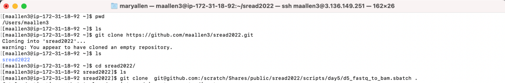

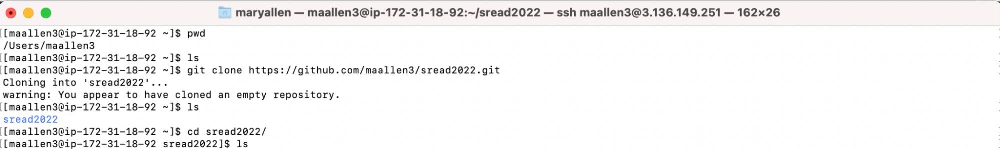

But it's empty. Let's add a file.

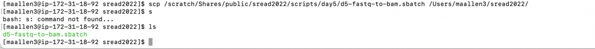

## Git pull and push

Now that we have added a file… we need to update the github repository. To do that we do

`git add <filename>` to tell the code which files to add

`git commit` to tell the code why you changed it

`git push` to push it up to the internet

I’m going to add all files in the directory so I use \*.

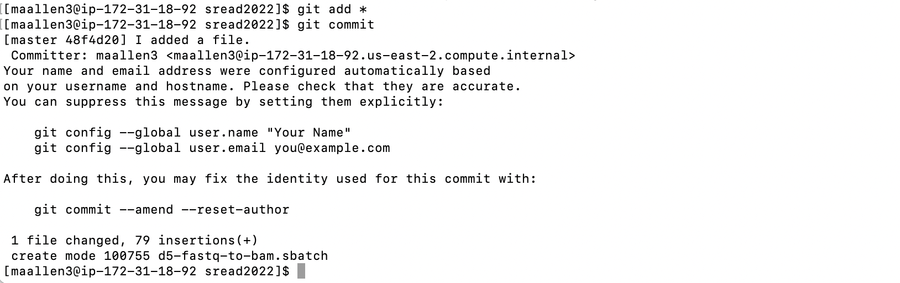

When you commit you will go to a new screen. This screen is running vim and wants you to write down what you did. What you put here will be forever on the internet. Check out [https://twitter.com/gitlost?lang=en](https://www.google.com/url?q=https://twitter.com/gitlost?lang%3Den&sa=D&source=editors&ust=1721333013905913&usg=AOvVaw3U5pv0E4ZUGK7rYqGbMzdf).

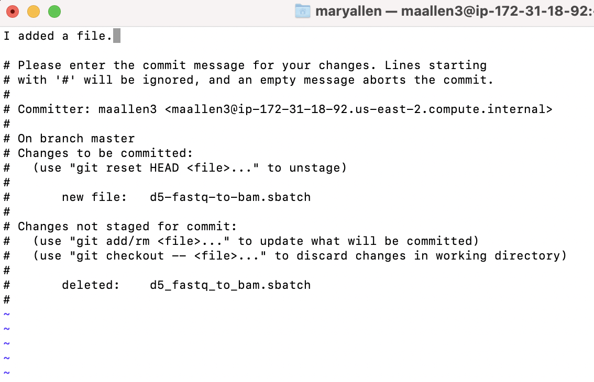

The first time you push you will get an error… But we are going to fix that later.

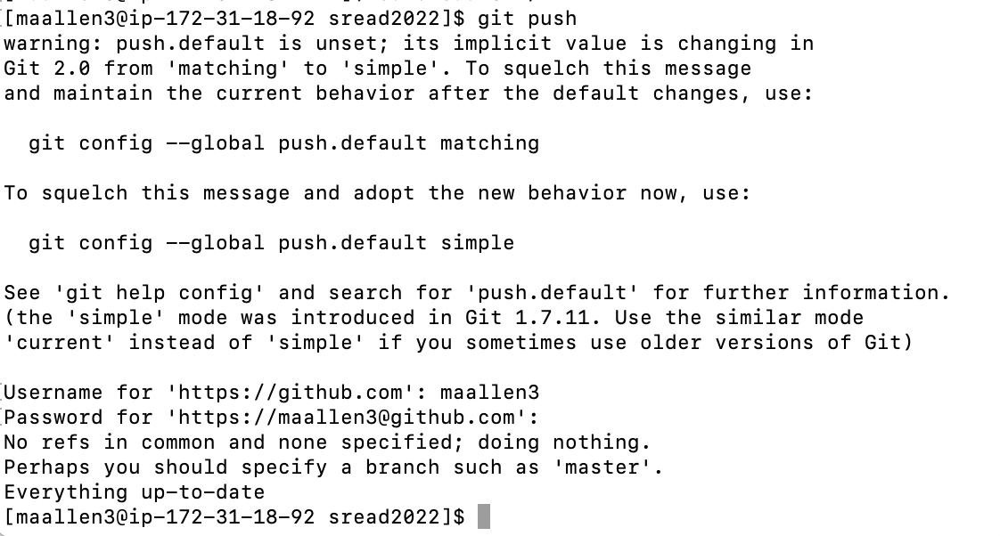

The first time you push you need to enter a GitHub "password". The weird thing is that when they say the password. **They don’t mean your GitHub password.** Github wants a "Personal Access Token". So you should go get one of those.

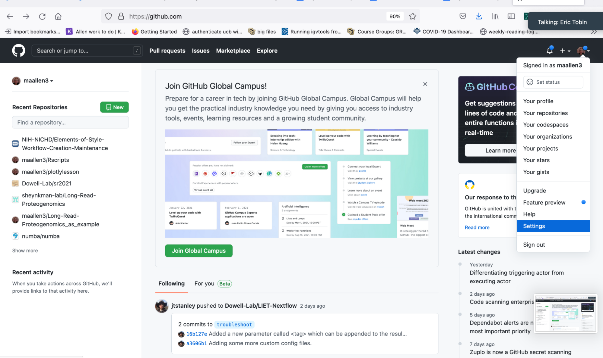

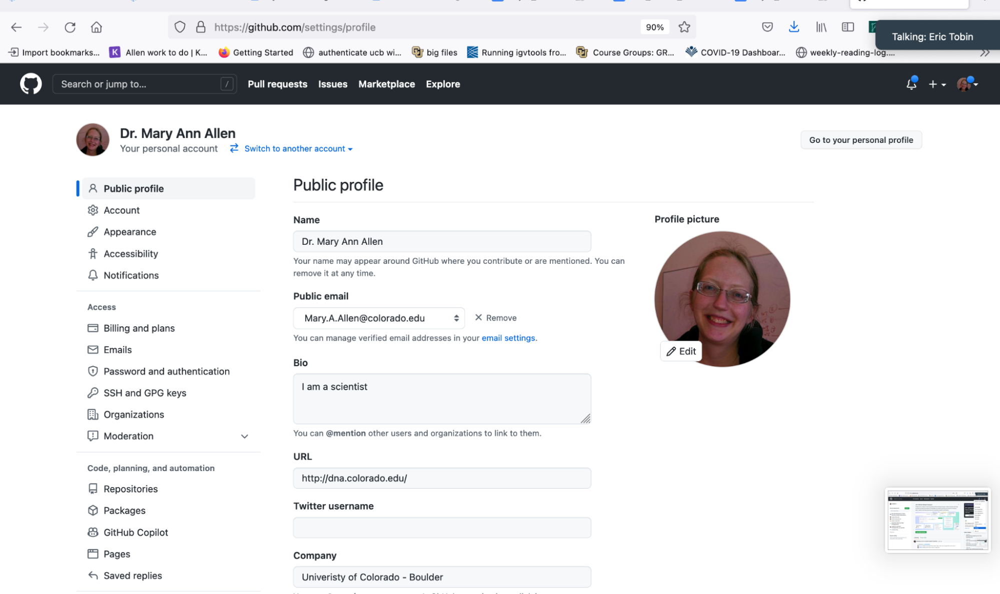

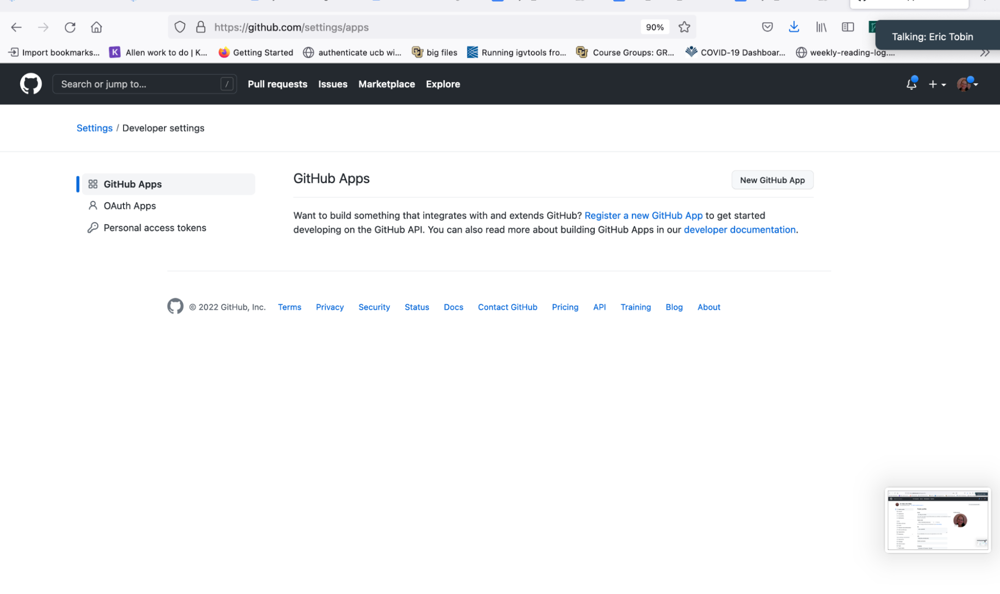

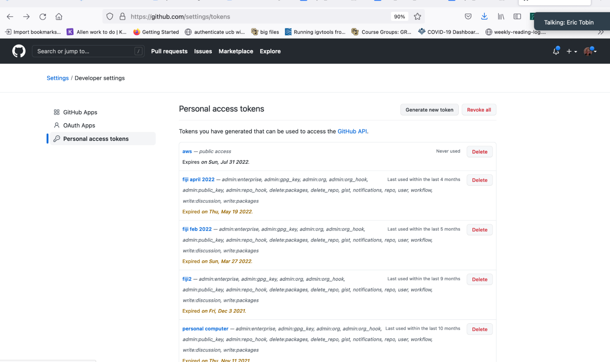

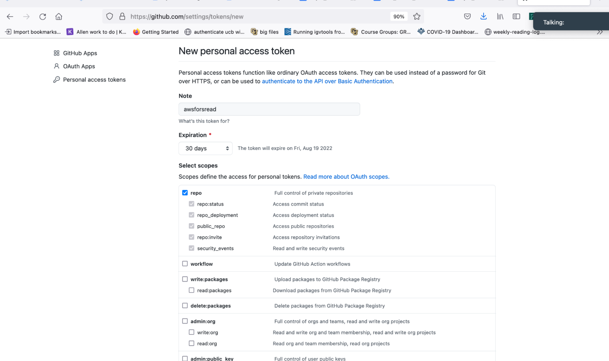

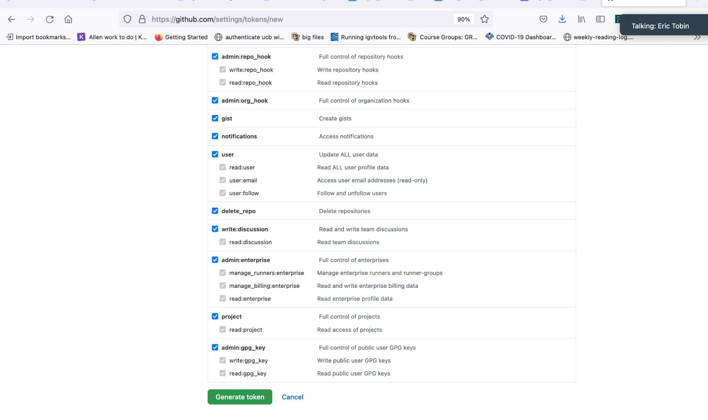

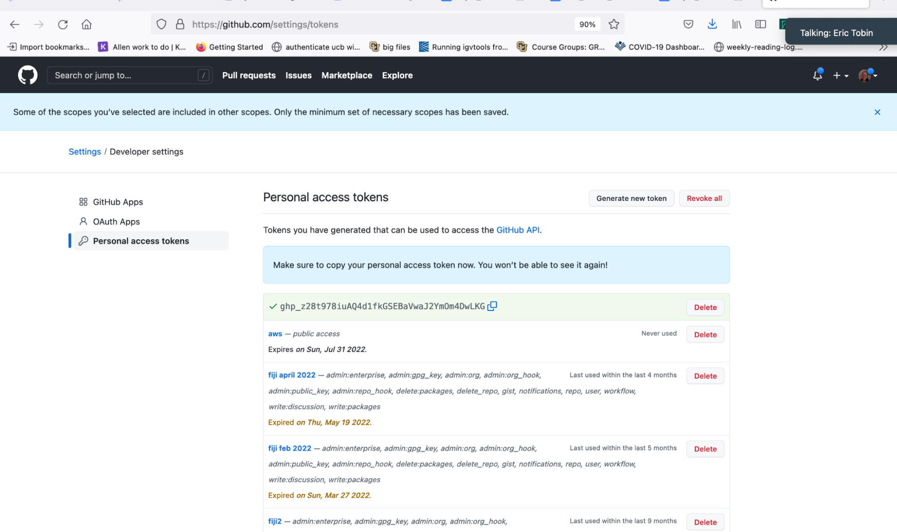

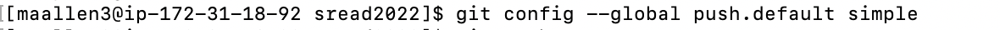

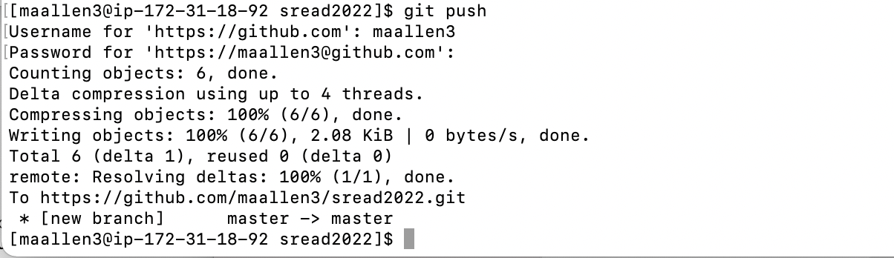

## More information

[https://docs.google.com/document/d/1ziARSvSyzSjTQXvMus5AstEBKsQa3t86/edit](https://www.google.com/url?q=https://docs.google.com/document/d/1ziARSvSyzSjTQXvMus5AstEBKsQa3t86/edit&sa=D&source=editors&ust=1721333013907605&usg=AOvVaw0ZZzwoVUHIEBUb5dsPpxFU)
