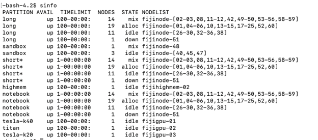
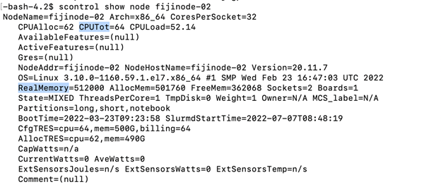
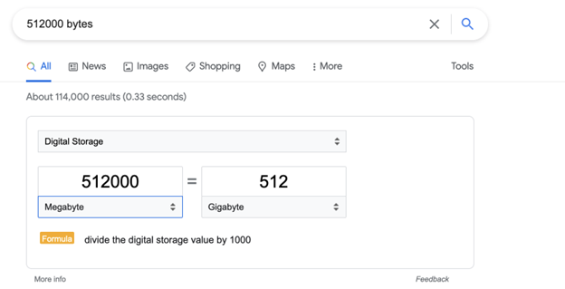
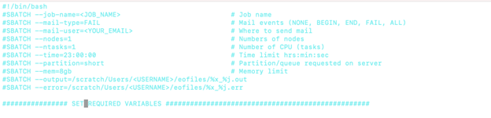
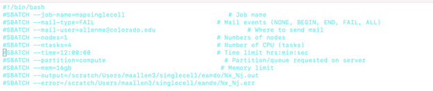
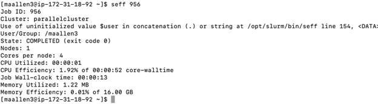
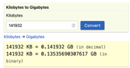

# How do I choose my slurm parameters?
Author: Mary Allen, 2022

## Talk to your coworkers
Have they run this before? What resources did it take?

## What if no one has run this before?
Guess and Share:
- Look at what's on your supercomputer so you can play nice. Never take over the whole super computer. Half of the CPUs and memory on a node is about as high as you should go!
    - First run `sinfo` (this tells you the partitions and the node names on the computer)
        - This computer has a partition named `compute` and has a node named `compute-st-m52xlarge-1` and 14 nodes named `compute-dy-m52xlarge-` with the node number at the end.
        
        - The below super computer has many partitions (`long`, `short`, `sandbox`, `highmem`). It also says the longest you are allowed to use that partition. (`TIMELIMIT`)
        
            - `TIMELIMIT`= The stuff before the dash is days, after the dash is hrs:mins:seconds.  
            - `NODES`= The number of nodes on your computer that look alike
            - The default here is the `short` partition. It will run for no more than 1 day. 
- Now that I know the partitions and their time limits, that narrows which partition I might need. I tend to start with a small time limit. If the job fails due to lack of time, the `.err` file or the email will say that. Then I move to a node with a longer time limit by changing the partition. 
    - Test it yourself.
        - What is the `TIMELIMIT` on the `short` partition? What about the `long` partition?
        - How many CPUs and how much memory is on one of our AWS nodes?
    - Create an sbatch script that runs the command `sleep` for 100 seconds. Set the slurm time of that script to 2 seconds.  What error message do you get?
- Next, I need to check the nodes in the partition I need to see what resources they have (CPUs and memory).  
    - `scontrol show node <nodename>`
    
    - This node has 64 CPUs (62 we can use) and 512000 megabytes of memory.
    
        - 512000 megabytes is 512 gigabytes. Because 512/64 is 8, there are 8 Gigabytes of memory per CPU.

## Design a test job. 
Pick your largest input file for a test run.

If I have a program without parallelization, based on what I learned above, I start with 1 CPU and the amount of memory that should belong to this CPU. In my case that is 8 because 512/64 is 8.

 
So if I have a program with parallelization, I generally use half of the CPUs on a node and the number of gigabytes of memory each CPU would get if it was fairly shared.
    - Why half? Then people using 1 CPU can hop on the same node as me. I could set it to all the CPUs - then I would get the node to myself, but I often wait in the queue a long time for that.

Test it yourself.
- Look at what partitions, time limits, and CPUs are on your super computer. 
- If your script runs a program that is not parallelized what resources are fair to use? What if your script runs a program that is parallelized?

## Optimize your guess - are you playing nice?
You can check how much time/memory/CPU you are really using:  
- While the job is running:
    - `sstat --format=AveCPU,AvePages,AveRSS,AveVMSize,JobID -j <job id>.batch`
        - NOTE: The `sstat` command requires that the `jobacct_gather` plugin be installed and operational on your supercomputer. 
    - `scontrol show jobid -dd <job id>`
- For completed jobs 
    - `sacct --format="Elapsed,CPUTime,MaxRSS,AveCPU,AvePages,AveRSS,AveVMSize,JobID, MaxVMSize" -j <job id>.batch`
    - `seff <job id>`

Did using 4 CPUS work well for this script? How do you know?

How much memory did I ask for? How much did I use?

Hint:\

For running on all of your files, a good rule of thumb is to request 20% more memory than it took to run on the largest file.