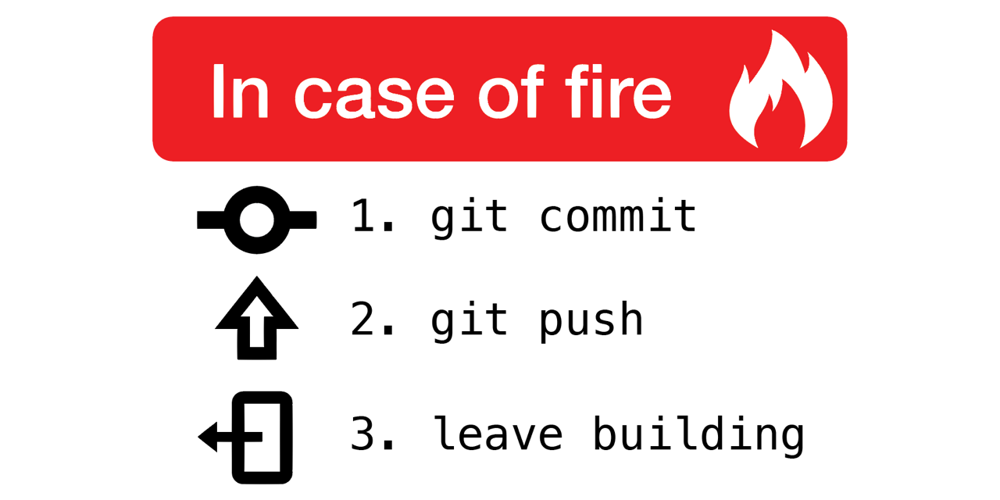

# Notes on Planning a Project

Author: Mary Allen

## Start planning a project

You will need
Paper (or a napkin)
Pen/pencil (preferably two colors)
           
 
1. Start with a piece of paper.  At the bottom write your hypothesis.

2. Then draw at least 2 graphs. What you will see if your hypothesis is true. What you will see if it is not true.
 
3. Then write the type of file you will need to draw that graph. (Since this is almost always a csv/tsv file, I like to put the row and column types and names I expect.)

4. Then write a program you think can generate that file. (Sometimes this is a custom program you wrote in R or python)
     
5. Then write the inputs and the outputs to that file. 

Repeat steps 4-5 until you get back to a fastq file. If you don’t know what tool to use at this stage that’s ok. Sometimes you try a couple. 

> **Side note:**
>
> To find tools you might want consider
>    Reading a paper that does something similar to what you want to do
>    Reading a paper that compares tools
>    **Remember,** there is no such thing as the right tool for every job. Only the best tool for your job.	

7. You probably need genome files. Where are you going to get them? (don’t get them yet!)

a. [https://support.illumina.com/sequencing/sequencing_software/igenome.html](https://support.illumina.com/sequencing/sequencing_software/igenome.html)
b. [https://www.ncbi.nlm.nih.gov/genome/](https://www.ncbi.nlm.nih.gov/genome/)
c. [https://genome.ucsc.edu/cgi-bin/hgTables](https://genome.ucsc.edu/cgi-bin/hgTables)
d. [https://zoonomiaproject.org/the-mammal-tree-list-view/](https://zoonomiaproject.org/the-mammal-tree-list-view/)

- make sure the fasta file and the gtf/bed match each other!!!
- same number of chromosomes, same chromosome names!!!

e. When picking a genome file think about
- Would I chase every gene on this list if it matters? If you don’t follow up on a non-coding RNA, don’t pick a list with a non-coding RNA. You have to perform multiple hypothesis corrections for it. 

8. Figure out if data already exists, so you don’t have to make it. Or alternatively, make the data. 

9. Figure out the file structure you are going to use for your project. 

a. Back up raw data and lock the files!!! (`chmod`)
b. Back up scripts to GitHub

10. Estimate the size of the data and the size of compute you need. 
- Figure out which computer you are going to use for your analysis. 
- What does it have installed?
- Will you have to install things?

11. Go back through the whole plan for quality assurance. Where could you lose data? What effect do false positives or false negatives have on your plan? Do you need more controls to make sure the data/tools do not fool you?  What quality checks will you do?

12. Share your plan and ask another person to look for issues. 

## Starting analysis

Now, and only now start analysis. 
     When you download the data, md5 check it!
     When you download the data back it up!
     	  If you don’t have money for backups
	     	[https://www.synapse.org/](https://www.synapse.org/)
		[https://www.ncbi.nlm.nih.gov/geo/](https://www.ncbi.nlm.nih.gov/geo/)

Virtual environments

## Additional resources

### What is this sequencing protocol? I've never heard of it!

[my three-letter seq definition](https://www.google.com/url?q=http://education.knoweng.org/sequenceng/&sa=D&source=editors&ust=1721339169014794&usg=AOvVaw10jMZTxJOlBGO2olTsd5Od)

### Where can I learn more about sequencing or bioinformatics?

[RNA-seq tutorial](https://www.google.com/url?q=https://rnaseq.uoregon.edu/&sa=D&source=editors&ust=1721339169015038&usg=AOvVaw0ZY-vmvCdv6B8UzsM5mpx5)

[R tutorial (If you are a biologist, the ecology lesson is just as helpful as the genomics lesson. Do both.)](https://www.google.com/url?q=https://datacarpentry.org/lessons/&sa=D&source=editors&ust=1721339169015193&usg=AOvVaw3vvMMDZilbLbr25WzR5WIm)

[Differential expression of genes](https://www.google.com/url?q=https://github.com/hbctraining/DGE_workshop&sa=D&source=editors&ust=1721339169015343&usg=AOvVaw1ie-ZBDJ0YDqYMz5cy3r5y)

### Where can I find out more about my favorite SNP(s)?

[Haploreg -connects snps to lots of data](https://www.google.com/url?q=https://pubs.broadinstitute.org/mammals/haploreg/haploreg.php&sa=D&source=editors&ust=1721339169015617&usg=AOvVaw0nvPQFw0ITbCeLyE6rOcpY)

### Where can I find lists of genes that respond to stuff? Or lists of genes that are regulated by stuff?

[GSEA Gene lists](https://www.google.com/url?q=http://software.broadinstitute.org/gsea/msigdb/genesets.jsp?collection%3DCGP&sa=D&source=editors&ust=1721339169015904&usg=AOvVaw2L6W6qjDmQp8LENNVNkQMF). List of genes that change in different conditions.

### Can I find my favorite sequence in some other public data set?

[Magic-BLAST](https://www.google.com/url?q=https://ncbi.github.io/magicblast/&sa=D&source=editors&ust=1721339169016141&usg=AOvVaw1tzuS5aOAlY6M1BMaaCNYE)[.](https://www.google.com/url?q=https://ncbi.github.io/magicblast/&sa=D&source=editors&ust=1721339169016246&usg=AOvVaw3o_rrTNS2DqMmCG2GMZ8kc) Blasts a fastq file… but don’t use it for the big stuff. Its slow!

[SearchSRA.](https://www.google.com/url?q=https://www.searchsra.org/&sa=D&source=editors&ust=1721339169016411&usg=AOvVaw1vUqqpdkt0zWcjycQfgooc) You input a fasta file of a seq you care about (like a circular RNA) and then you input a list of SRRs (samples from GEO) and it can give you back the reads that map against that fasta file from lots of geo samples.

### Where can I learn more about my favorite gene?

Like the expression level in a bunch of different cell types or the SNPs that regulate it, or the perturbations that change its expression, or what regulates my favorite gene.

[Protien Atlas](https://www.google.com/url?q=https://www.proteinatlas.org/&sa=D&source=editors&ust=1721339169016747&usg=AOvVaw1SGRqWB2yZuJdSEIHjUOS6)

[RNA-seq data database](https://www.google.com/url?q=https://www.gtexportal.org/home/&sa=D&source=editors&ust=1721339169016953&usg=AOvVaw2QUbWrJ1p633wT9BDg0Svr)

[FANTOM CAGE analysis](https://www.google.com/url?q=https://fantom.gsc.riken.jp/cat/v1/%23/&sa=D&source=editors&ust=1721339169017112&usg=AOvVaw2Qbf5q5C9-HDKFxIggklDI)

[SSTAR](https://www.google.com/url?q=https://fantom.gsc.riken.jp/5/sstar/Main_Page&sa=D&source=editors&ust=1721339169017339&usg=AOvVaw0oqfS7sG300kZgliubS1Fc)

[TFs that regulate this gene (found via chip-seq database)](https://www.google.com/url?q=http://dbtoolkit.cistrome.org/&sa=D&source=editors&ust=1721339169017496&usg=AOvVaw0J5ooouxUk05PPj5VI7YFL)

[Genecards](https://www.google.com/url?q=https://www.genecards.org/&sa=D&source=editors&ust=1721339169017660&usg=AOvVaw0X7p1vQvl_4mA8G6g5btgb)

[Harmonize](https://www.google.com/url?q=https://maayanlab.cloud/Harmonizome/&sa=D&source=editors&ust=1721339169017864&usg=AOvVaw1N6EVNX2Ov0wPEHNbppiyC)

[wiki pathway](https://www.google.com/url?q=https://www.wikipathways.org/index.php/Pathway:WP4117&sa=D&source=editors&ust=1721339169018034&usg=AOvVaw2Uy4G9uQChOh1cidxqKp6x)

[slidebase](https://www.google.com/url?q=http://slidebase.binf.ku.dk/&sa=D&source=editors&ust=1721339169018181&usg=AOvVaw2wV0pXnDyRrLf7HJCLomxB)

[Depmap](https://www.google.com/url?q=https://depmap.org/portal/&sa=D&source=editors&ust=1721339169018356&usg=AOvVaw32Nz6iaxgcUHwEEl1YpgB5)

### Where can I find data on my favorite TF?

[ChIP and ATAC data](https://www.google.com/url?q=http://cistrome.org/db/%23/&sa=D&source=editors&ust=1721339169018587&usg=AOvVaw0RfWpcdEmi_nds0Lx46nGX)

[GUI interface overlap chip-seq with public data (chip, sequence, annotation)](https://www.google.com/url?q=https://ccg.epfl.ch/chipseq/chip_extract.php&sa=D&source=editors&ust=1721339169018747&usg=AOvVaw2okS3IDso9iRUAu9UXPlue)

### I ran an RNA-seq experiment. I got a gene list. What do I do with my gene list? (warning: human or mouse)

[Enrichr](https://www.google.com/url?q=https://maayanlab.cloud/Enrichr/&sa=D&source=editors&ust=1721339169018975&usg=AOvVaw2nanCiAMZkkpurFFHDh8pv)

[GSEA tutorial](https://www.google.com/url?q=https://github.com/Dowell-Lab/codeclub/blob/master/gsea/gsea.md&sa=D&source=editors&ust=1721339169019136&usg=AOvVaw0CJjjM8mFEXoWKS5Nar4bj)

[DAVID GO terms](https://www.google.com/url?q=https://david.ncifcrf.gov/tools.jsp&sa=D&source=editors&ust=1721339169019368&usg=AOvVaw0WIIOqYr3F60kT-OU0wK9o)

[LISA](https://www.google.com/url?q=http://lisa.cistrome.org/doc&sa=D&source=editors&ust=1721339169019522&usg=AOvVaw0tYpyz7GhwfRtMEewo9Mrf)

### Where can I find more research papers to read?

[Pubmed labs (this is googlefied pubmed searches)](https://www.google.com/url?q=https://www.ncbi.nlm.nih.gov/labs/pubmed/&sa=D&source=editors&ust=1721339169019756&usg=AOvVaw1D1KfmSyi_4Rgemco5Akmm)

[visual pubmed searches](https://www.google.com/url?q=https://pubvenn.appspot.com/&sa=D&source=editors&ust=1721339169019907&usg=AOvVaw3TP46NH3Lf2kLHCN3x6ZK4)

### How can I turn one cell type into another?

[mogrify](https://www.google.com/url?q=http://www.mogrify.net/&sa=D&source=editors&ust=1721339169020240&usg=AOvVaw1xBvwWqIKt-Iy4209tuVOK)

### Where can I learn more about reproducibility rigor and responsible conduct of research?

[Turing way](https://www.google.com/url?q=https://the-turing-way.netlify.app/welcome.html&sa=D&source=editors&ust=1721339169020511&usg=AOvVaw0Zm0pV-jrd-zg54K4W-Ou3)

[Registered-reports](https://www.google.com/url?q=https://www.cos.io/initiatives/registered-reports&sa=D&source=editors&ust=1721339169020668&usg=AOvVaw1IQ3Wwx0Wh9n9ZJsaubVoF)

[Project organization](https://www.google.com/url?q=https://osf.io/&sa=D&source=editors&ust=1721339169020804&usg=AOvVaw0FQtV9YE-BcpT2Ea9j4hD3)

### How do I select colors for plots?

[Colorbrewer](https://colorbrewer2.org/) for picking printer friendly and colorblind friendly colors for plots. There is an R package also available.