# Virtual Environments Walkthrough
Author: Lynn Sanford, 2023

## What are virtual environments?
Virtual environments are ways to partition software installations within a certain programming language. Earlier in the course you worked with R and had to install packages for it that were specific to bioinformatics analysis. Was this easy? Probably not.

A major issue with installing software, especially software that depends on a lot of other software, is making sure versions align correctly. Many software packages are continually updated, which is usually good for the functionality of the package in question, but also may make certain commands obsolete or work differently. This may break other packages that were written to depend on the first package. This also may change downstream results.

For reproducibility reasons, as well as your own sanity, it’s often useful to use virtual environments to partition sets of software installations that work correctly into one place. You can then install different versions of software in another place or another virtual environment, if need be.

This worksheet will go through basic management of R and python virtual environments.

## R virtual environments
Outside of R, make a directory to house your virtual environment. All your software will be installed in subdirectories of this directory. I like to put all my virtual environments in a `virt_env/` directory within my home directory so I know where to look for them. For this example, I’m making an environment called `test_r_env`.

**After making this directory, navigate inside it so that it is your current working directory**. Make sure to `module load` the version of R that you want for the virtual environment. Then start R.

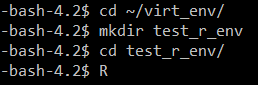
 
R virtual environments are managed by a package called `renv`. This package must first be installed within R. (see more at https://rstudio.github.io/renv/articles/renv.html)

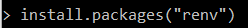

Then the virtual environment must be initialized.

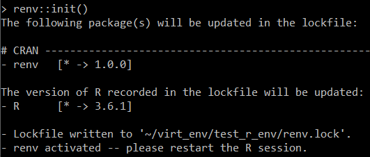

I’m prompted to restart the R session. When I do, the last line above my prompt tells me which environment I’m using. 

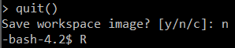

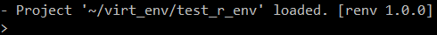

Packages can then be installed as normal with `install.packages()` or through `BiocManager`, but they can also be installed with the `renv::install()` command, which can handle CRAN, Bioconductor, and GitHub packages.

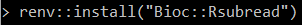
 
You’ll notice R will tell you where it’s installing packages, which is in the subdirectories of your current virtual environment.

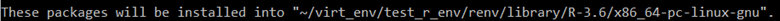
 
A cool thing about `renv` is that if you’re using the same version of the same software that you’ve already downloaded and compiled and installed in a different virtual environment, it just links to that one, so you don’t have to go through that process again. It only installs something fresh if you need to install a different version of a package or an entirely new package.

After you have all your software installed, if you ever need this specific software set for something, just navigate to this virtual environment and start R.

If you want to use this R virtual environment in a bash or sbatch script, within the script move into the environment directory with `cd` or `pushd`, then run the script.

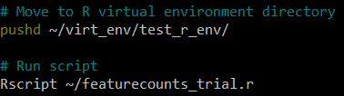
 
There’s more functionality of `renv` for recording metadata on your current libraries and reloading previous states in case you install something new and it breaks something else. It can also manage python virtual environments within the same project. Check the documentation.

## Python virtual environments
Python virtual environments are a little more complex than `renv` conceptually, but not mechanically. You still install software within the virtual environment, and installed software is still segregated into subdirectories of the environment.

The exact command to create a python virtual environment depends on whether you’re using `python2` or `python3`. I’ll use `python3` for the purposes of this walkthrough.

Again, I like to make my virtual environments in a specific directory. Unlike with `renv`, though, I don’t have to pre-make my virtual environment project directory.

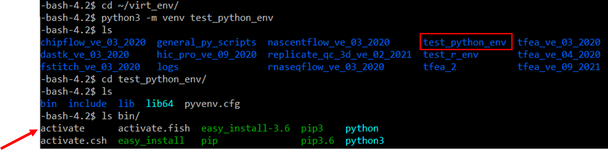
 
First, make sure to `module load` the version of python you want. Then the `python3 -m venv` command makes the virtual environment. Navigating into the directory that appears shows a few initialized directories. The most important path in here to know is the path to the activate file. For me, this is `~/virt_env/test_python_env/bin/activate`.

You can’t use a python virtual environment until it’s activated. Do this with the `source` command.

>NOTE: Unlike with the R virtual environment, you can activate a python virtual environment from anywhere in the filesystem, as long as you use the absolute path to its `activate` file.

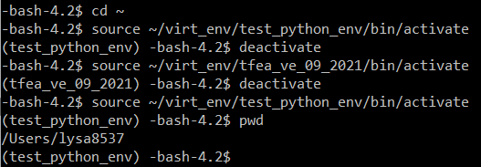
 
You’ll see that once you activate an environment, the name of that environment appears in parentheses at the beginning of your command prompt. You can easily `deactivate` the environment and switch to another one if you need to. I’ve done so here with absolute paths to the `activate` files for my `test_python_env` and another environment I have set up for running a piece of software called TFEA. Note that none of the activation/deactivation changed my current working directory (my home directory).

Make sure you have your correct python virtual environment activated before beginning to install software. Then `pip install` python packages as you would normally.

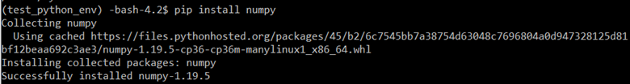
 
Packages are installed under the `lib/` subdirectory of the virtual environment and relevant binary files are stored in the `bin/` directory.

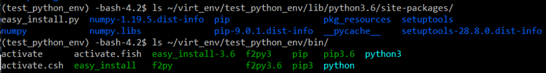
 
Running `pip freeze` will tell you all of your installed packages, and you can give this file to someone else who wants to reproduce your virtual environment.

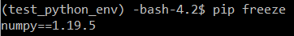
 
To use a python virtual environment within a bash or sbatch script, just run that same `source` command to the `activate` file of the virtual environment.

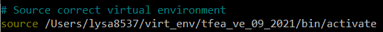
 
This will run the rest of the script within that virtual environment, with only the python packages that you have installed there.