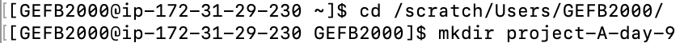

# Day 9, Analyzing scRNA-seq 
### Authors: Georgia Barone (2024), Mary Allen (2024)

## CellChat

Today, we will explore two ways to analyze processed scRNA-seq data. The first will be with the package CellChat. CellChat is a networks-based R package that infers the likelihood of two cell types communicating. This package quantifies the signaling communication probability between two cell types by assessing the expression of ligand-receptor pairs within a pre-labeled scRNA-seq Seurat object. 

1. Make a working directory in `/scratch/Users/<username>/` to perform today's analysis in.

2. Enter the working directory you just made and make folders for `data` (using the `mkdir` command).

3. Copy (using the`rsync` or `scp` commands) the following pre-labeled Seurat objects into the `data` directory you just made.

4. Start on the `Get-Started-With-CellChat.R` on the AWS-viz. Initially, run CellChat on the trisomy 21 samples (T21). If you finish early, repeat the analysis on the disomy 21 data (D21) and look for any interesting differences between the two samples. 

**Note: please switch to R version 4.4.0 on the AWS-viz**
To switch R versions, click the `R.x.x` button on the top right side of RStudio

For more information about the package see below: 
- GitHub: https://github.com/jinworks/CellChat
- Paper: https://www.nature.com/articles/s41467-021-21246-9

## Psuedotime

