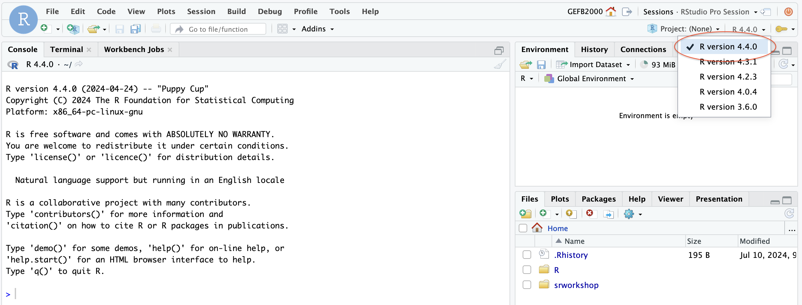

# Getting started with pseudotime
### Author: Mary Allen (2024)

Today, we will explore one way to analyze processed scRNA-seq data with the package monocle3.

## 1. Log on to RStudio 
If you successfully installed Seurat & monocle3 locally, pull up your local RStudio. If you cannot monocle3 installed locally, log onto the RStudio on the AWS server on the board. 

If you are on the AWS server, please select R version 4.4.0

## 2. Complete R scripts for today
Complete the scripts in the `/Users/<your-username>/srworkshop/projectA/day09/scripts/` directory.

Use the script : `pseudotime.R`

If you get throught that use the script:

Use the script : pseudotime_advanced.R

**NOTE: If you are running monocle3 locally, you will need to transfer the Seurat objects to your local computer to complete the worksheets and analysis for today**

Download Rdata file from the Zenodo [here](https://zenodo.org/records/12725642)
