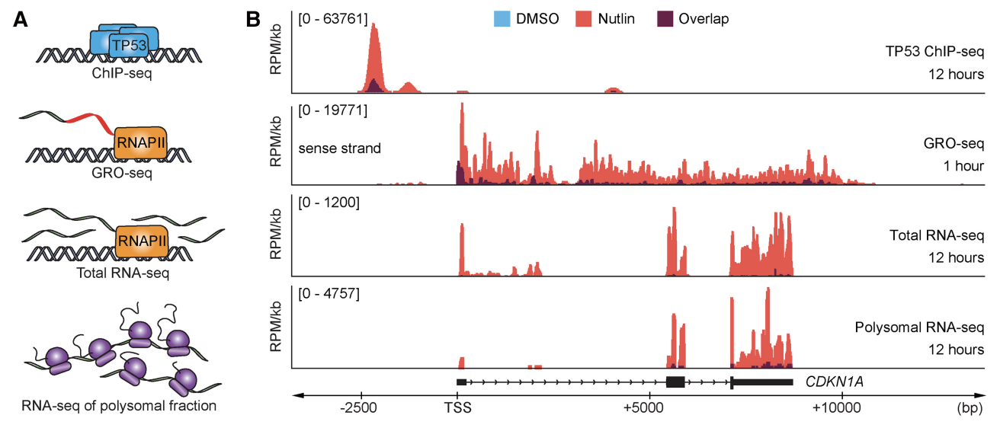

# Project B | Multi-omics: RNA-seq/ChIP-seq/ATAC-seq

The goal for this project is that you will get experience working with RNA-seq data and ChIP-seq data. I'm sure you've read papers that used both, and it's a powerful approach because combining information from multiple modalities allows you to make more specific and supported claims from the data.

The data we will be using is from Andrysik et al. 2017 [doi:10.1101/gr.220533.117](https://genome.cshlp.org/content/27/10/1645). The study looks at the function of TP53 in three cancer cell lines. Authors use different genomic datasets to understand the function of the transcription factor. 

The data was deposited at the NCBI Gene Expression Omnibus (GEO) database [GSE86222](https://www.ncbi.nlm.nih.gov/geo/query/acc.cgi?acc=GSE86222).

## Project outline
### Day 1
Learn how to count reads and perform differential expression. \
Key R packages: 

* Rsubread
* DESeq2

### Day 2
Learn how to work with ChIPseq data \
Key programs: 

* MACS
* MEME
* Tomtom
* bedtools

### Day 3
Learn how to easily perform comparisons between genomic datasets, make figures, and look for functional enrichment. \
Key programs: 

* ggvenn
* pheatmap
* PantherGO

