# Day 7 - Introduction to Gene Differential Expression Analysis using DESeq2  
Author: Jacob Stanley \
Edited and updated by: Daniel Ramirez, 2022; Rutendo Sigauke, 2023; Samuel Hunter, 2024 
 
### Additional DESeq2 resources: 
[DESeq2 Bioconductor Page](https://bioconductor.org/packages/release/bioc/html/DESeq2.html)
[DESeq2 Vignettes](https://bioconductor.org/packages/release/bioc/vignettes/DESeq2/inst/doc/DESeq2.html)

## Introduction: 
Here we'll use those gene counts tables as input for the software DESeq2 to answer the question: What genes are statistically significantly changed upon an experimental condition? In particular, we will explore a dataset from a real experiment published ([Andrysik 2017 et al.](https://doi.org/10.1101/gr.220533.117)). You will use a gene count table that we already prepared for you, from an experiment where human colon cancer cells (HCT116) were treated with either the vehicle DMSO, or with the p53-activator drug Nutlin. 
 
The purpose of DESeq2 is to identify which genomic loci demonstrate a statistically significant difference in expression level between two or more conditions (referred to as "gene differential expression analysis"). DESeq2 takes as an input the unnormalized count values for each (non-overlapping) loci in each sample. DESeq2 is only to be used for non-overlapping, unique genomic loci. If one's aim is to compute differential expression of transcripts, DESeq2 is not appropriate. 

## Running DESeq2
### Setup and reading in files
> IMPORTANT: We will use DESeq2 with RStudio on your local computer. Input files are in the `projectB/day07/data` folder in the `srworkshop` GitHub repository. They are called `Andrysik2017_counts.tsv` and `Andrysik2017_samples.tsv`. Make sure you have these files on your LOCAL computer, not just on the AWS.

All of the commands shown in this worksheet are available in the `srworkshop/projectB/day07/scripts/d7_differential_gene_expression_analysis.R` script.

Open RStudio if you haven't already done so. First, we need to tell RStudio to load the DESeq2 library
> Note: if you have not yet installed DESeq2, let a class helper know. Be aware that installing DESeq2 takes some time as it also needs several dependencies installed as well.

```
library(DESeq2)
```
Read in the input files using `read.table()`. Replace the path with your own file path to the data files above.
> Note: If you are using RStudio with Windows, the path syntax is strange. It MUST have forward slashes, like in Unix, but MUST also start with the drive name, like in Windows. So an RStudio-compatible path for a file on the desktop might look like `C:/Users/<username>/Desktop/Andrysik2017_samples.tsv`. You can also get to a path within your WSL like this: `//wsl.localhost/Ubuntu/home/<WSL username>/srworkshop/projectB/day07/data/Andrysik2017_samples.tsv`.

Let's start with the Conditions Table:
``` 
conditionsTableFile <- "/PATH/TO/DATAFILES/Andrysik2017_samples.tsv" 
conditionsTable <- read.table(conditionsTableFile, 
            sep = "\t", 
            header = TRUE)
```
 
This file is a tab-separated data frame containing experimental information. Let's explore its contents: 
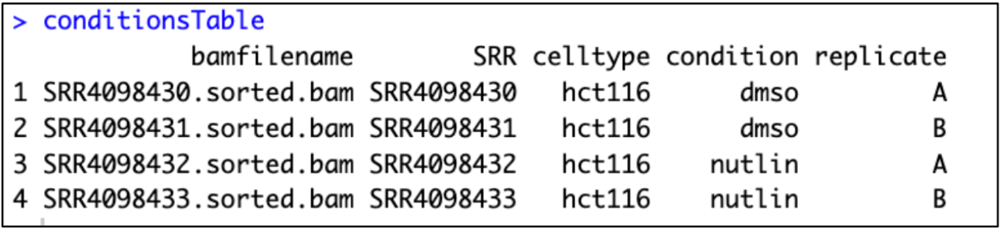

Here, we've recorded information about each sample, namely `bamfilename`, `SRR`, `celltype`, `condition`, and `replicate`. Note that this is a file that we write ourselves describing design elements of our experiment. We could even write in more columns with more experimental details we might want to test (e.g., genotype, dosage, treatment time, etc.).  

Next, load in the Counts Table and print the first few lines:
```
geneCountsTableFile <- "/PATH/TO/DATAFILES/Andrysik2017_counts.tsv" 
geneCountsTable <- read.table(geneCountsTableFile, 
               header=TRUE, 
               row.names = "GeneID", 
               sep = "\t", 
               stringsAsFactors = FALSE) 
 
head(geneCountsTable) 
```
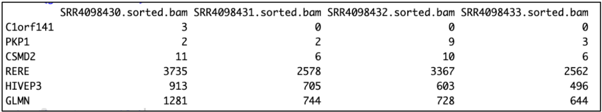

The sample columns of this Counts Table **must** be in the same order as the rows of our Conditions Table. Note also that we've stored the gene names as rownames in the Counts Table. The Counts Table must only consist of numeric entries, otherwise DESeq2 will fail to run. 
 
### Running DESeq2
Next, load the two inputs into DESeq2 using the `DESeqDataSetFromMatrix` function. The parameters should be as follows:
- `countData` should point to our Counts Table object 
- `colData` should point to our Conditions Table object 
- `design` is a formula describing the experimental elements you want to test. It can only contain column names from your Conditions Table. In this case, we want to test whether there is a significant difference in gene expression between Nutlin- and DMSO-treated samples. The condition column of our Conditions Table specifies this information, so we tell DESeq2 to focus only on this column.  

``` 
dds <- DESeqDataSetFromMatrix(countData = geneCountsTable, 
                   colData = conditionsTable, 
                   design =~condition) 
```

The new dds variable is a special DESeq2 object containing all of the information from our Counts Table and Conditions Table. You can print a description of its contents:
``` 
dds 
```
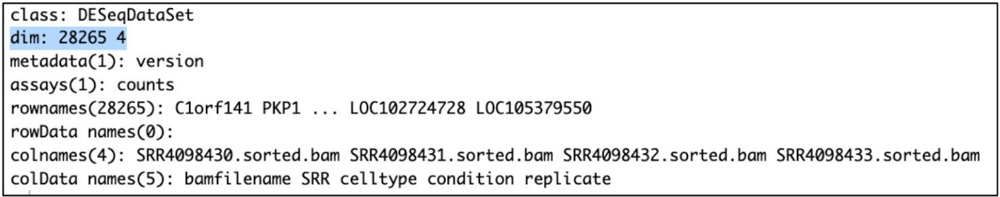

The `dim` value tells you how many genes (rows) and samples (columns) are being tested. Later, DESeq2 will automatically filter genes with low average counts as part of its pipeline. You can also specify your own threshold: 
```
dds <- dds[rowSums(counts(dds)) > 1,] 
dds 
``` 
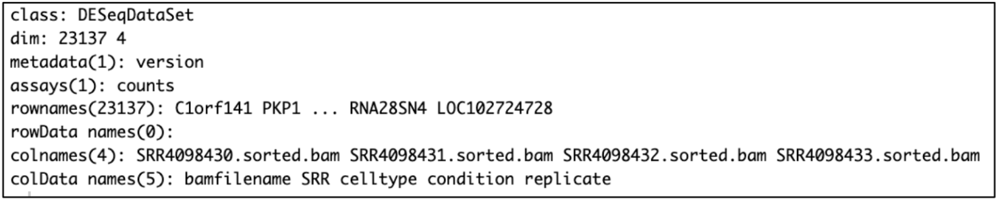

Here, we require that the sum of counts for each gene across all 4 samples is greater than 1. Notice that printing the `dds` variable again gives us a smaller number of genes (e.g. 23,137).
 
Run DESeq2's main function `DESeq` on the `dds` variable you created. DESeq2 will internally do several actions:  
1. It will estimate size factors for normalizing each dataset
2. It will estimate dispersion for variance calculation
3. It will fit a generalized linear model to calculate fold-changes
4. It will perform a statistical test for each gene
```
DEdds <- DESeq(dds)
```
 
Let's first check how well the normalization worked. We first check the `sizeFactors`, which are normalizing factors to account for depth and composition differences between the libraries. We can also check the total number of counts for each sample to see how the normalization performed using `colSums()`.  
```
sizeFactors(DEdds) 
colSums(counts(DEdds, normalized = FALSE)) 
colSums(counts(DEdds, normalized = TRUE)) 
```
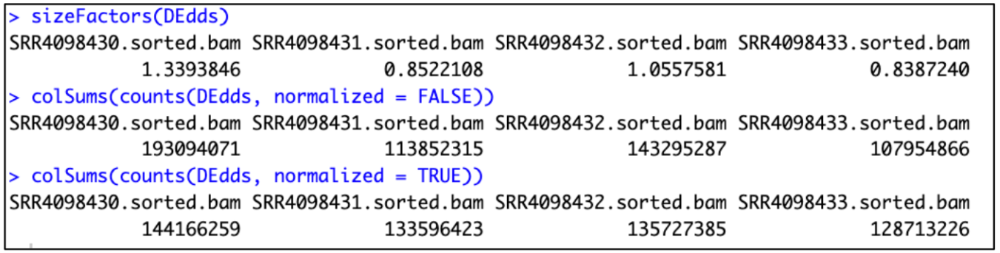

Notice that after setting `normalized` to `TRUE`, the sample counts are much more homogenous (e.g. between 12 and 14 million counts). 

We are now ready to start exploring our data! 
 
## Exploratory Data Analysis 

Prior to examining the differential analysis results, it's always a good idea to look at features of the data itself. This is called Exploratory Data Analysis, or EDA. EDA is vital for ensuring your data were generated correctly, and can often reveal interesting biology prior to differential analysis. 

Start by storing our normalized counts in a new data frame: 
``` 
normcounts <- log2(as.data.frame(counts(DEdds, normalized = TRUE)) + 1)
head(normcounts) 
```
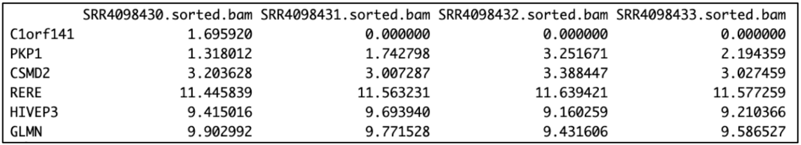
 
Because gene count data often have an extremely wide range, we also rescale our counts to a log2-scale. And, because log-scaling can't handle anything with a value of 0, we also add a pseudocount of 1 to all entries.  

### Histograms 
Let's generate histograms for each sample: 
```
hist(normcounts$SRR4098430.sorted.bam) 
hist(normcounts$SRR4098431.sorted.bam) 
hist(normcounts$SRR4098432.sorted.bam) 
hist(normcounts$SRR4098433.sorted.bam) 
```

The histograms will print one-by-one in the RStudio viewer: 

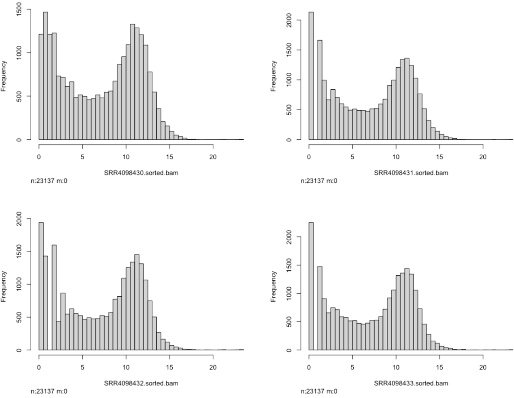 
 
We can see that even after our filtering, each sample has many very low-expression genes, demonstrated by the large peaks on the left side of each graph. Furthermore, we can see another peak occurring around 10-12 (remember, this is log2-scaled) for each sample.  

### Boxplots 
In histogram format, it's difficult to see whether there are large read distribution differences between the samples. We can instead compress the information from the histograms into a boxplot: 
```
boxplot(normcounts) 
```
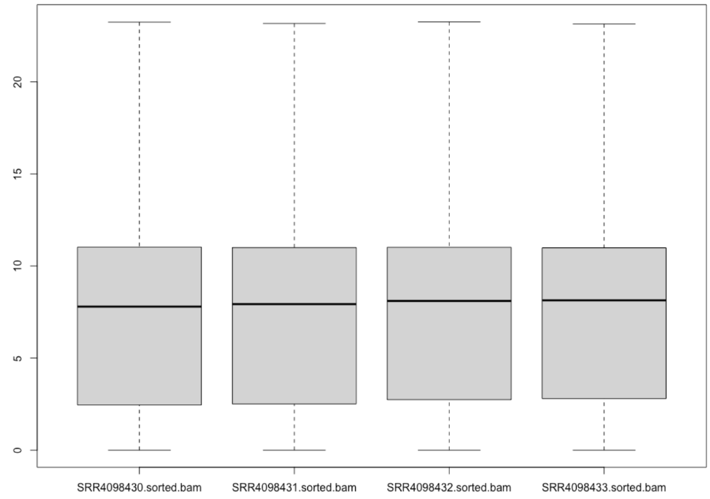

Here we see that the distributions of the data are extremely similar among all four samples. 
 
We can also see potential outliers in our data. DESeq2 will automatically apply outlier detection so these can also be filtered later if we deem it necessary.  
 
### PCA 
While the overall distributions of our samples are very similar, it's possible there are many differences on a gene-by-gene basis. Hopefully, these differences are a result of our experimental intervention, and not just a random result or a "batch" effect from our experimental setup. We can explore this possibility with Principal Component Analysis, or PCA. 
 
First, we apply a specialized transformation (called `rlog`, or regularized log-transformation) to our DESeq2 object, then generate the PCA plot: 
```
rld <- rlog(DEdds)

DESeq2::plotPCA(rld,intgroup=c("condition")) 
``` 
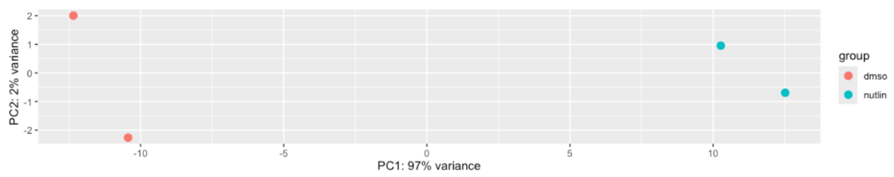

We use the `intgroup` parameter to colorize the samples by their values in the condition column from our Conditions Table. We can see that the Nutlin-treated samples group together away from the DMSO treated samples. This separation occurs along the x-axis (PC1). Let's color the samples by replicate instead: 
```
DESeq2::plotPCA(rld, intgroup=c("replicate")) 
```
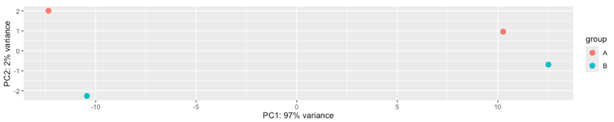

Notice that the colors representing replicate groupings are now separated along the y-axis (PC2). This is potentially indicative of a "batch" effect, a technical error associated with non-biological factors (e.g., if two libraries were prepped on different days or in different labs). Let's explore this further. 
 
PCA provides a percent value for the variance represented along each axis. PC1 explains a very large amount of variance between the samples, at 97% (likely because our experiment caused many distinct effects between our sample groups). PC2 only explains 2% of the variance, indicating whatever batch effect might be there, it's very small compared to the variance from our Nutlin treatment. Because it's so small, we don't need to worry about a batch effect getting in the way of our conclusions about our Nutlin-treated samples and can safely ignore it.  
 
Sometimes, batch effects may be so severe that they show even stronger effects than the experimental treatment! Visit the reference links at the top of the worksheet to find out more info on how to combat batch effects. 
 
Note that our PCA plot only examines variance as a percentage explained along each axis. It should NOT be used to determine whether two samples' gene counts are truly significantly different - that requires statistics and differential analysis. Very similar samples could still show large percentage values for PC1 and PC2, but show little to no statistical differences gene-by-gene. 
 
### Dispersion Plotting 
Finally, before examining our results, we should examine the dispersion estimation for our data.  
```
plotDispEsts(DEdds, main = "Dispersion Estimates") 
```
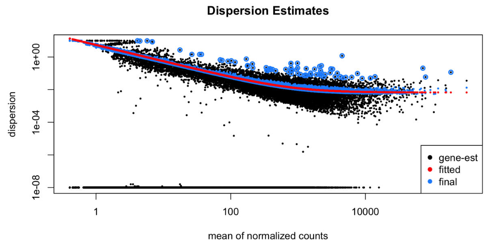

The math behind this plot is outside the scope of this workshop, but your data should show estimates that are monotonically descending, and most data points (blue) that are nearby the fitted line (red). 

## Differential Analysis 
 
Now we will apply statistics to find differentially expressed genes. First, define the alpha value that DESeq2 will need to assign statistical significance, as well as the comparison of the two experimental conditions we want to compare against each other. This is called a "contrast": 
```
alphaValue <- 0.05 
contrast_cond <- c("condition", "nutlin", "dmso") 
```

Let's extract statistically significant results, and do DESeq2 special log fold-change shrinkage, which is useful for visualization purposes. 
``` 
results <- results(DEdds, 
        alpha = alphaValue, 
        contrast = contrast_cond)
results_shrunk <- lfcShrink(DEdds, 
        contrast = contrast_cond, 
        res = results, 
        type = "normal")
```

Print the results. Note that the shrinkage only affects the fold-change estimation values. This keeps uncertain fold-changes for low-expression genes near zero. 
```
results
```
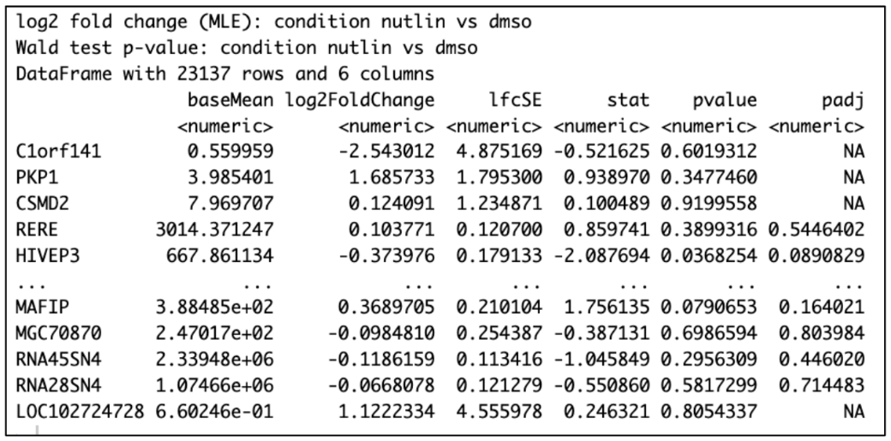

```
results_shrunk
```
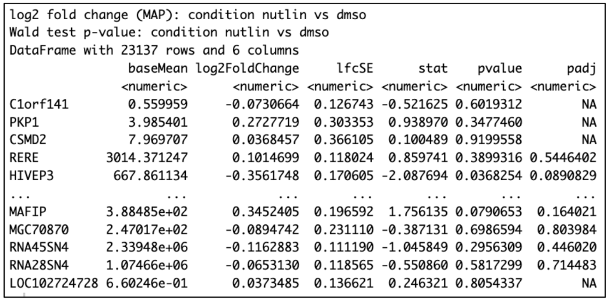

We can get a flyover view of our results with the `summary()` command: 
```
summary(results_shrunk)
``` 
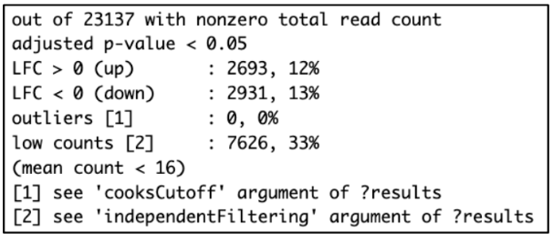

You can check a global visualization of how the genes changed upon the Nutlin treatment using DESeq2 `plotMA` function.  

The resulting MA figure will plot each gene's shrunken fold-change in the Y-axis, and each gene's normalized counts in the X-axis. You can tell `plotMA` to color genes based on whether they are considered significant by specifying your `alphaValue`. 
```
DESeq2::plotMA(results_shrunk, 
           alpha = alphaValue, 
           main = "RNA-seq\nHCT116\nDMSO vs Nutlin", 
           xlab = "mean of normalized counts", 
           ylab = "log fold change", 
           ylim = c(-5,5)) 
```
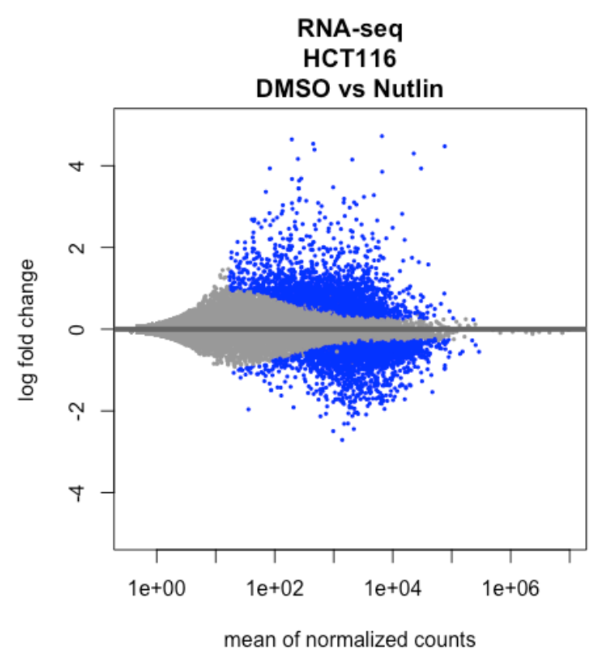

You can plot the normalized read counts for a given gene using DESeq2 built-in function `plotCounts`. You need to tell it the name of the gene as it appears in the original annotation file, as well as the name of the column in the condition file that denotes either "Nutlin" or "DMSO" as the conditions. 
```
gene <- "CDKN1A" 
 
plotCounts(DEdds, gene, 
      intgroup = "condition", 
      normalized = TRUE) 
```
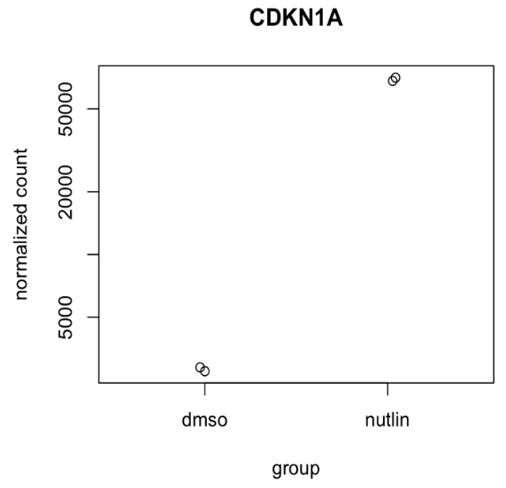

One of the most common visualizations of differential expression results is the volcano plot. While DESeq2 does not have built-in volcano plotting, we can use another package called ggplot2. Install this now if you haven't already done so. 
```
install.packages("ggplot2") 
```

Color the genes by whether they are significant, then input the new results data frame into `ggplot2`: 
```
library(ggplot2) 
results_shrunk$threshold <- ifelse(results_shrunk$padj < alphaValue, "significant", "not_significant") 
ggplot(results_shrunk) + 
  geom_point(aes(x = log2FoldChange, y = -log10(padj), color = threshold)) + 
  ggtitle("Volcano Plot") + 
  xlab("log2 fold change") + 
  ylab("-log10 adjusted p-value") + 
  theme_classic() 
``` 
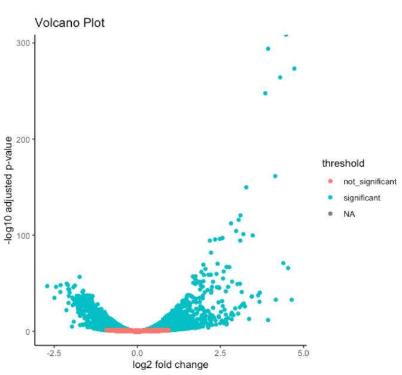

## Storing Results 
 
Order the gene results in descending order by their adjusted p-values, so that the most significant genes will be on the top of your results table. You can see again that the very top gene is CDKN1A or p21, a known gene that controls cell cycle progression directly controlled by the transcription factor p53, which itself is activated by the drug Nutlin. 
```
results_shrunk <- results_shrunk[order(results_shrunk$padj),] 
results_shrunk   
``` 
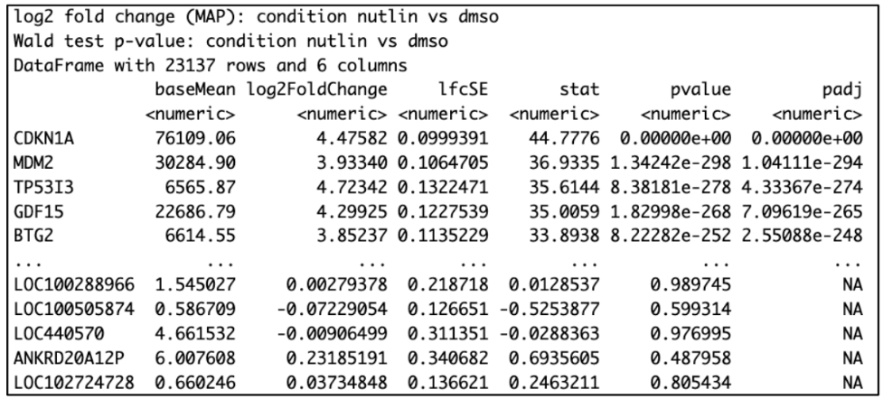

Finally, let's store our significant genes onto a text output file. First, we'll filter our gene list to only the significant results, then we'll write it to our destination. Replace this with your desired path. 
```
results_shrunk_sig <- subset(results_shrunk, padj < alphaValue) 
write.table(results_shrunk_sig, 
      sep = "\t", 
      quote = FALSE, 
      row.names = TRUE, 
      col.names = TRUE, 
      "PATH/TO/DIR/Andrysik2017_RNAseq_Nutlin_results.tsv")
```

### EXTRA: Generating Heatmaps 
First, install `pheatmap` if you haven't already done so. 
```
install.packages("pheatmap") 
```

Heatmaps can be used to visualize patterns between samples across genes, and for clustering genes together with similar expression patterns. For now we will only use the most highly expressed genes: 
```
select <- order(rowMeans(counts(DEdds, normalized = TRUE)), 
      decreasing=TRUE)[1:60]

columns_for_heatmap <- as.data.frame(colData(DEdds)[,c("condition", 
"replicate")]) 

pheatmap(normcounts[select,], 
    cluster_rows = FALSE, 
    show_rownames = FALSE, 
    cluster_cols = FALSE, 
    annotation_col = columns_for_heatmap) 
```
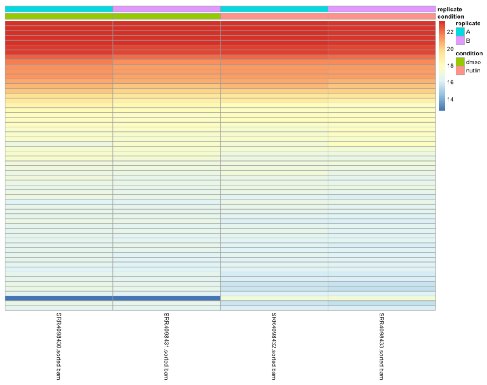

Most genes look very similar across all data sets, but there is one gene near the bottom that seems very different. Let's cluster the results using `cluster_rows = TRUE` and show the gene names using `show_rownames=TRUE`: 
```
pheatmap(normcounts[select,], 
    cluster_rows = TRUE, 
    show_rownames = TRUE, 
    cluster_cols = FALSE, 
    annotation_col = columns_for_heatmap) 
```
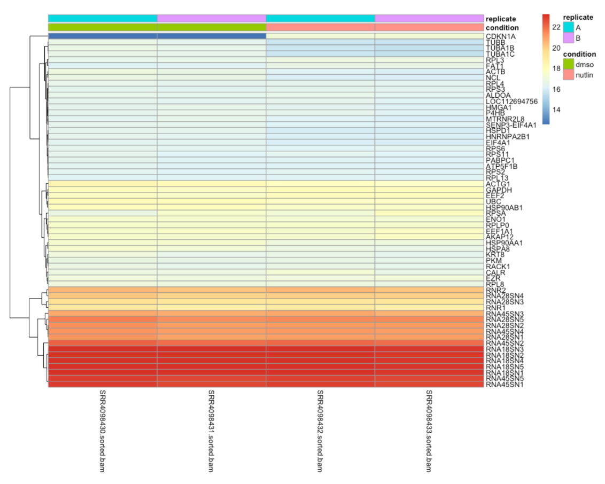