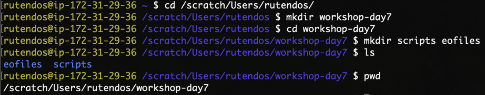
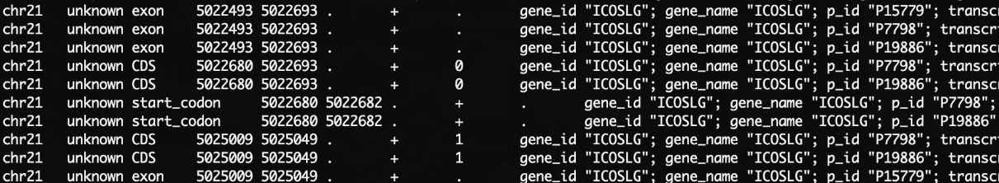
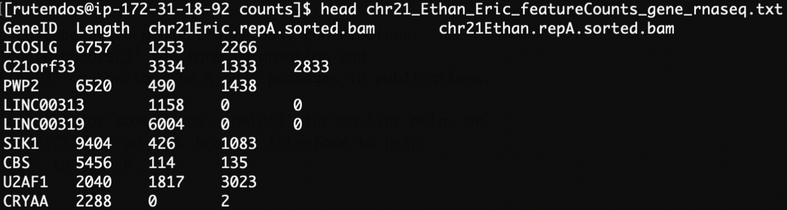
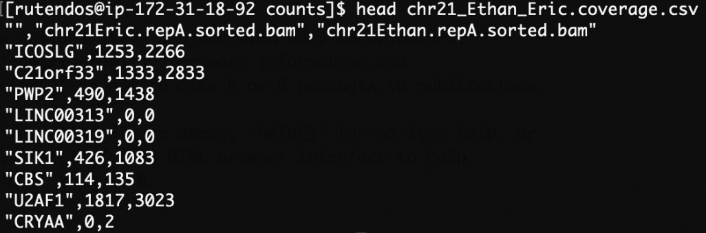
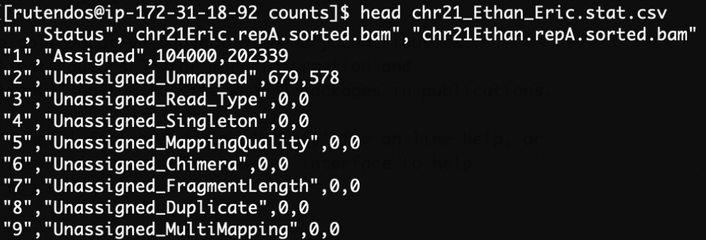
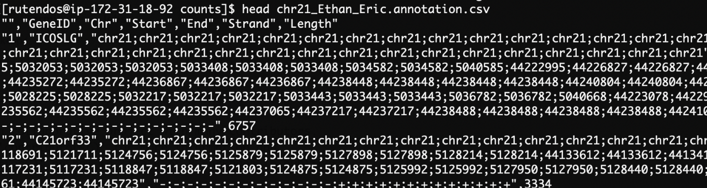
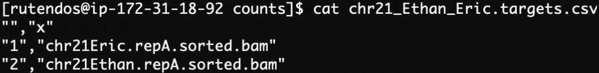

# Day 7 - Introduction to counting reads with featureCounts 
Author: Rutendo Sigauke (rutendo.sigauke@colorado.edu)\
Updated by Samuel Hunter (sahu0957@colorado.edu) - 2024

## Introduction: 
The featureCounts library is part of Subread (written in C) and RSubread (an R wrapper for Subread), and it is a fast tool optimized for counting reads over features (genes, exons, transcripts, .etc).

To see the full utility of Subread/Rsubread, see their documentation below:
- Subread: http://subread.sourceforge.net/ 
- RSubread: http://subread.sourceforge.net/SubreadUsersGuide.pdf 

Since counting is compute-intensive, this is done on the server (AWS). Usually, we can request multiple threads, which makes the counting run faster. To save on time and memory, the counts that you will generate are subsetted to chr21 genes only.

After you generate these test counts, we will use the pre-generated full counts data for DESeq2. 
 
> Note: If you have not installed Rsubread on the AWS `R`, do so now ([Rsubread](https://bioconductor.org/packages/release/bioc/html/Rsubread.html)). Installation can be done in the R console. See the `Day7_installing_Rsubread` worksheet for more help.

## Worksheet

### Setting up working space:
Update the `srworkshop` folder from GitHub (Change the path below to wherever you cloned the repository)  

```
cd /Users/<your_username>/srworkshop
git pull
``` 

Make a working directory for day 7 in your scratch and create subfolders for your scripts and error/output files 


Copy the counting scripts from `/Users/<your_username>/srworkshop` to your scratch scripts directory 
 
### Summary of scripts
There are two scripts we will be using for counting: 
1.  An R script called `d7_featureCounts.R`
2.  An sbatch script that calls the above R script: `d7_featureCounts.sbatch`

Edit both scripts so that the paths point to your files. 

### Counting with featureCounts: 
1.  Open `d7_featureCounts.R` with vim. The first command sets your working directory. This is where all your files and figures you will be working on will be saved. Set the working directory to a location of your choice.  (e.g. `/scratch/Users/<your_username>/workshop-day7`)

    ```
    workdir <- '/PATH/TO/WORKING/DIRECTORY'
    setwd(workdir)
    getwd() 
    ```

2.  The following command loads the RSubread package into your R environment. This is the library that has featureCounts for counting reads.
    ```
    library("Rsubread")
    ```
3.  In order to count reads, we need to give featureCounts a path to our bam files and gene annotation files.  
    - Below, we are getting a list that contains full paths to the bam files to be counted.
        ```
        bamdir <- '/scratch/Shares/public/sread/data_files/day7/bam'
        filelist <- list.files(path=bamdir, 
            pattern="sorted.bam$", 
            full.names=TRUE) 
        ```
    - The gene annotation file is a gtf format for the human genome (hg38).
        ```
        hg38gtf <- /scratch/Shares/public/sread/data_files/day7/annotations/hg38_ucsc_genes_chr21.gtf
        ```
        Below is what the GTF file looks like. This tells featureCounts how to assign each overlapping read to its corresponding feature.
        
 
        Take a look at the GTF file structure. Note all the different features represented for each `gene_id`. Also, you will see that the file has several columns, where the first column is the chromosome ID and the second column is the name of the source from which the feature was derived (eg. RefSeq, Ensembl, UCSC or HAVANA). The third column is the label for the feature (e.g. exon, CDS, start_codon). This field is used by featureCounts to determine the features over which to count reads. The fourth and the fifth columns are start and end coordinates, respectively. The sixth column is the score of the feature, the seventh is the strand, the eighth is the phase for CDS features (If phase=0, the codon begins at the first base of CDS nucleotide; if phase=1 the codon begins at the second base of CDS nucleotide; if phase=2 the codon begins at the third base of CDS nucleotide.). Lastly, the ninth column contains additional feature annotations, including the gene ID.  
4.  The `featureCounts()` command is shown below, taking in the paths to bam files and gene annotations. The command also allows the user to specify the feature (`GTF.featureType`) to count over. Since this is RNA-seq data we are counting over exons. Additionally, we can set the name to assign the features (`GTF.attrType`) as `gene_id`. Please check the documentation for the `featureCounts()` command to get more information on all the flags. 
    ```
    fc <- featureCounts(
        files=filelist,
        annot.ext=hg38gtf,
        isGTFAnnotationFile=TRUE,
        GTF.featureType="exon",
        GTF.attrType="gene_id",
        useMetaFeatures=TRUE,
        allowMultiOverlap=TRUE,
        largestOverlap=TRUE,
        countMultiMappingReads=TRUE,
        isPairedEnd=TRUE,
        strandSpecific=2,
        nthreads=2
    )
    ```

5.  We can also set the output folder where the counts will be saved. Note that this folder is based on the `workdir` from above. We can also create this new folder in the filesystem from within R.
    ```
    outdir <- paste(workdir,'/', 'counts', '/', sep='') ##naming our outdir
    dir.create(outdir) ###creating the directory
    ```

6.  Once the counts are obtained, the outputs can be saved as tab-separated files. 
    - The GeneID, gene length, and counts are saved to a single file here:
        ```
        write.table(
            x=data.frame(fc$annotation[,c("GeneID","Length")],
                         fc$counts,stringsAsFactors=FALSE),
            paste0(outdir, fileroot, file="_featureCounts_gene_rnaseq.txt"),
            quote=FALSE,sep="\t",
            row.names=FALSE
        )
        ```
    - Separate counts data and summary statistics. 
        ```
        write.csv(fc$counts, paste(outdir, fileroot,".coverage.csv", sep=""))
        write.csv(fc$stat, paste(outdir, fileroot,".stat.csv", sep=""))
        write.csv(fc$annotation, paste(outdir, fileroot,".annotation.csv", sep=""))
        write.csv(fc$targets, paste(outdir, fileroot,".targets.csv", sep=""))
        ```
 
7.  The summary of counts will be in the output counts folder. There are five different files:  
    - `featureCounts_gene_rnaseq.txt` : GeneID, Length, Counts  
    - `coverage.csv` : Counts 
    - `.stat.csv` : Coverage Statistics 
    - `.annotation.csv` : GeneID, Chromosome, Start, End, Strand, Length 
    - `.targets.csv` : file names for input bam files

8.  Edit the `d7_featureCounts.sbatch` script including the SBATCH headers and path to the `d7_featureCounts.R` script. Now we can run featureCounts by submitting the sbatch script! 
 
9.  Open and explore each of the files in the terminal (with `head` or `more`).  
    - `chr21_Ethan_Eric_featureCounts_gene_rnaseq.txt` - This is used as input to differential gene expression analysis packages such as DESeq2.
        
    - `chr21_Ethan_Eric.coverage.csv`
        
    - `chr21_Ethan_Eric.stat.csv`
        
    - `chr21_Ethan_Eric.annotation.csv`
        
    - `chr21_Ethan_Eric.targets.csv`
         
