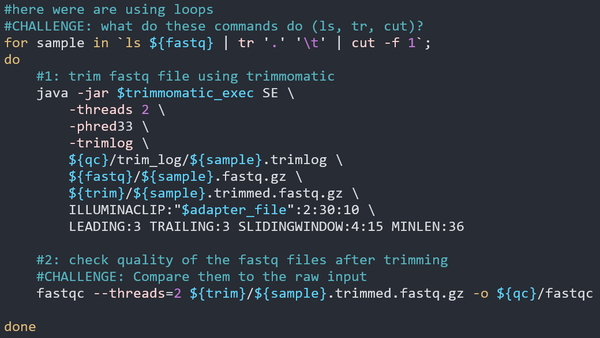
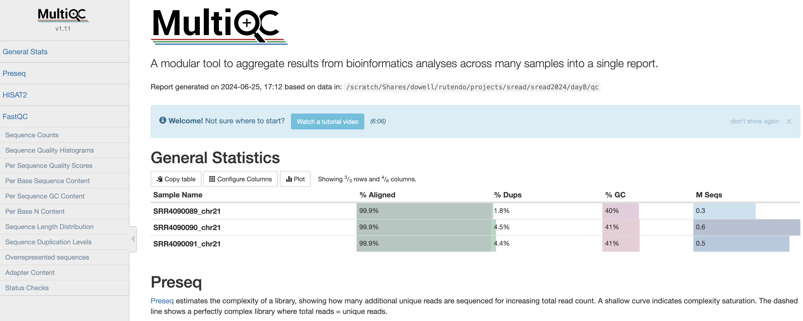
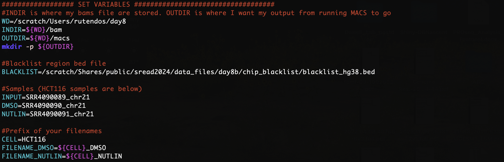
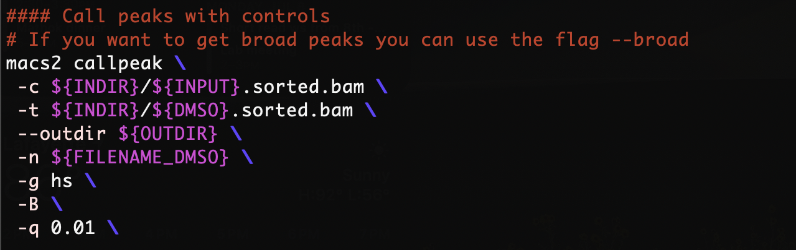
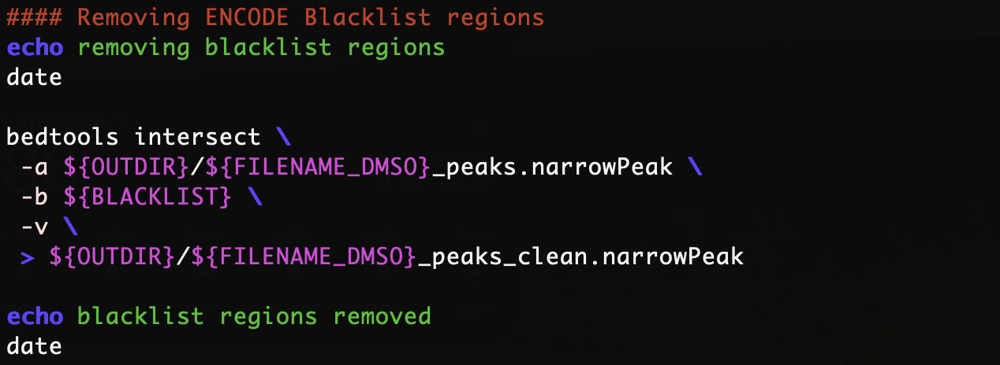
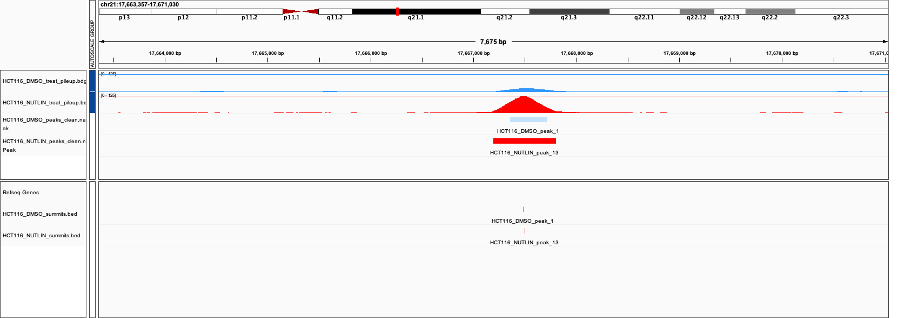
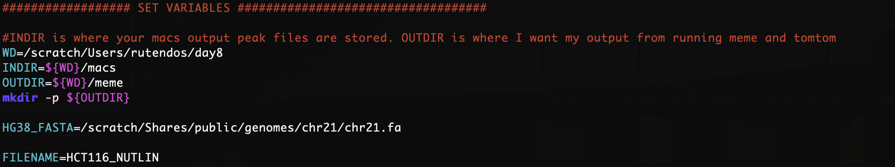
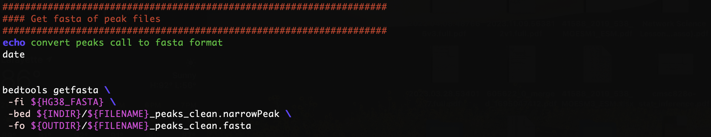

# Workshop Day 8 : Preprocessing ChIP-Seq Data
Authors: Jessica Huynh-Westfall (2023),  Rutendo F. Sigauke (2024), Chris D. Ozeroff (2025)<br>
Edited: Natalie Bratset (2026) & Chris Rauchet (2026)

## Introduction

As we discussed last week, ensuring your data's quality is an important step before you move forward with your data analysis.

This worksheet goes over how to preprocess ChIP-seq data prior to peak calling. ChIP-seq is an assay genome-wide binding of protein to DNA, so the coverage profile is different from RNA-seq,
and as such the data needs to be preprocessed differently. 
We will go over assessing the quality of ChIP-seq data and mapping the reads to the genome. The tools we will use are the same for other genome sequencing data (RNA-seq, ATAC-seq), BUT the flags used will be different.

### QC tools
- [fastqc](https://www.bioinformatics.babraham.ac.uk/projects/fastqc/) : Assess the read quality in samples.

- [trimmomatic](http://www.usadellab.org/cms/?page=trimmomatic) : Trim fastq files (similar to what was covered in week one).

- [preseq](https://preseq.readthedocs.io/en/latest/) : Get read complexity (asses how reads are distributed in the genome after mapping). This is run after mapping with HISAT2.

- [multiqc](https://multiqc.info/) : Summarizing all the QC metrics in a single document.

### Mapping reads:
- [HISAT2](https://daehwankimlab.github.io/hisat2/) : Mapping reads to the genome with ChIP-seq friendly commands. 


### ChIP-seq tools
- [MEME](https://meme-suite.org/meme/index.html) : TF Motif discovery tool. 

- [TOMTOM](https://meme-suite.org/meme/tools/tomtom) : Compared TF motif against TF databases. It is part of the MEME Suite

### Other tools
- [BEDTools](https://bedtools.readthedocs.io/en/latest/index.html) : Powerful genome arithmetic tool kit (e.g. find region overlaps). You will go more indepth with bedtools on day9.


## Expected Outputs 

**Section A** - This will be run in the server

- Fastq QC summary for ChIP-seq data (as an html) and trimmed fastq files (as bam files).

- Mapped files in bam format (as bam files).

- Mapping QC summary (as an html plus folder with intermediate files).

- Peak calls in a text files (in bed file format) highlighting the narrow peaks as well as the summit peaks.

- Text file with TF motif locations.

**Section B** - The first part will be run on the server, while the second will be submitted to the MEME webserver.

- Get sequences for peak regions (as a fasta file)

- MEME results outputted on their website. (see exampls in Section B from steps 6-8)
This step is run on the webserver since it is computationally greedy.


## Section A: Preprocessing of ChIP-seq data

### 1. Update your AWS github repository
Navigate to your github repo (in `/Users/<username>/srworkshop`) and git pull to _"pull"_ any updates that someone had _"pushed"_ to the repository to your own work environment on the AWS.

```
cd /Users/<username>/srworkshop
git pull
```

### 2. Make working directories

After you Log into the AWS, you will make a directory for day 8 in your scratch directory. Make the subdirectories including one stdout/stderr and scripts. 

Create a working directory for day8 in scratch using the `mkdir` command.

```
cd /scratch/Users/<Your_Username>
mkdir day8
cd day8
mkdir scripts eofiles 
```

### 3. Copy scripts to your scratch folder

Copy all of the scripts (01-05) from the github repository (`~/srworkshop/projectB/day08/scripts`) into your scratch scripts directory using `rsync`.

```
rsync -a /path/to/srworkshop/projectB/day08/scripts/<thescriptswewant /scratch/Users/<Your_Username>/day8/scripts
```


### 4. Edit and run the preprocessing scripts

Edit the sbatch script by using `vim <script>` to open a text editor on your sbatch script.

Similar to the previous exercises you will need to change the job name, user email, and the standard output and error log directories. 


### Step 1: QC and preprocess samples

1. `cd` into your scripts directory. 

2. Edit and run `01_fastqc_and_trimming.sbatch` script. 

- The preprocessing will run *TRIMMOMATIC* and *fastQC* on the fastq file.



### Step 2: Map trimmed reads to reference genome

1 Edit and run the `02_map_with_hisat2.sbatch` script.

- In this script we will align reads to the reference genome using *HISAT2*. The main difference between mapping ChIP-seq reads to the genome is that we do not have to use the spliced alignment since these reads originated from the genome, not from cDNA. This feature is turned off using `--no-spliced-alignment` flag. The alignment outputs are bam files and alignment summary (reported if `--new-summary` flag is used). 

- Note: The map statistics are being output into the QC folder (`${qc}/hisat_mapstats`), while the bam files go into the BAM folder.


### Step 3: Map quality and summary of QC

1. Edit and run the `03_mapqc_and_multiqc.sbatch` script.
   
2. Once the alignment is complete, we can assess mapped read distribution on the genome using *preseq*. Preseq estimates a library's complexity and how many additional unique reads are sequenced with an increasing total read depth.

- Note: The output is going into the QC folder as well (`${qc}/preseq`).

3. Lastly, we can summarize all the QC output using *multiqc*. This tool summarizes all the QC metrics within a specified folder and shows all the samples summarized side by side.

- There is a summary table for all the quality control metrics reported, additionally, several tabs for each of the QC metrics can be explored interactively. 

**if you have issues with this step, you can use the completed outputs in cooking show, these can be found at:

For chromosome 21 only:
`/scratch/Shares/public/sread2025/cookingShow/day8b/chr21/multiqc_data`
`/scratch/Shares/public/sread2025/cookingShow/day8b/chr21/multiqc_report.html`

For whole genome:
`/scratch/Shares/public/sread2025/cookingShow/day8b/whole_genome/multiqc_data`
`/scratch/Shares/public/sread2025/cookingShow/day8b/whole_genome/multiqc_report.html`
  
  - You will need to move both the folder `multiqc_data` and the html file `multiqc_report.html` to your local computer. 

  - You can open the html file in a web browser to interact with the page.




## Section B: Peak calling 

To study DNA enrichment assays such as ChIP-seq and ATAC-seq, we are introducing the analysis method, *M*odel-based *A*nalysis of *C*hIP-*S*eq (MACS). This method enables us to identify transcription factor binding sites and significant DNA read coverage through a combination of gene orientation and sequencing tag position.

We will only be using HCT116 samples (SRR4090089, SRR4090090, SRR4090091) in class, where we compare each _treated_ sample to the _input_ sample. 

| Run (SRR)         | Cell line  | Sample Type     |
| :---------------- | :-------:  | :-------------: |
| SRR4090089        |  HCT116    | Input           |
| SRR4090090        |  HCT116    | DMSO treated    |
| SRR4090091        |  HCT116    | Nutlin treated  |

1. Edit and run the MACS2 script. Same as before, edit the header section of `04_peak_call_with_macs2.sbatch`.

    >In addition to MACS, we will want to load *bedtools* which we will use later to remove *Blacklist regions*. The *Blacklist regions* are peak calls that show up in many ENCODE ChIP-seq experiments regardless of treatment.


2. Set variable. Assigning variables will make your scripts easier to read. In addition, this makes it easier to reference to a given path and utilize it in your scripts.

- For the `INDIR` change the path to the bam files directory. We will be using bam file from ChIP-seq data that used a specific transcription factor (TP53). For the `OUTDIR`, point to the appropriate output file directories for our *MACS* output files. You can use the command `mkdir -p` just in case for my output directories if you want to ensure that the output directory exist. 

- In addition, I have a path to the `BLACKLIST` directory. These are regions that have been identified as having unstructured or high signals in Nextgen sequencing experiments independent of the cell line or experiment. Removing these will clean up our genomic data for improved quality measurement. ENCODE has a defined list. The list we are using comes from the following reference: Amemiya HM, Kundaje A, Boyle AP. The ENCODE blacklist: identification of problematic regions of the genome. Sci Rep. 2019 Dec; 9(1) 9354 DOI: 10.1038/s41598-019-45839-z

- Lastly, we are using the variables `CELL`, `FILENAME_DMSO`, `FILENAME_NUTLIN`, `INPUT`, `DMSO`, and `NUTLIN` so that I can quickly interchange different files for analysis and only have to change the variable rather than go through the script to change instances of the file.



3. To run the MACS program, we have many different subcommand options. Depending on your experiment, you will want to change the subcommands to fit your requirements. 

For today’s worksheet, we will be showing an example where we utilized an input control with your experiment.



`-t / --treatment <filename>` is your experimental file. The file can be in any supported format (see –format for options). If you have more than one alignment file, you can specify them and MACS will pool all the files together.

`-c / --control <filename>` is your genomic input/control file.

`-n / --name <NAME>` is the name string of your experiment. The string NAME will be used by MACS to create output files.

`-B/ --BDG` flag to tell MACS to store the fragment fileup, and control lambda in bedGraph files.

`-g / --gsize <GENOME>` is the parameter to assign the mappable genome size. We will be using hs which is the recommended human genome size of 2.7e9.

`-q / --qvalue <VALUE>` is the cutoff to call significant regions. The default is 0.05. If you want to use a p-value cutoff, you can specify -p instead of -q.

>Note that there are many other options than the ones that we are implementing here. 
If you wanted to run to get Broad peaks you will want to use the flag `--broad`

MACS parameters depending on the data types:

| Data Type         | q-value   | `--broad` and `--control` flags |  Reasoning          |
| :-------------------------------- | :-------:  | :-------------: | :----------------- |
| ChIP-seq for Transcription Factor (TF)  |  <0.01     | `--control`, `<INPUT>`            | TF ChIP-seq often has very abrupt, small peaks that are well defines, so narrow peaks is necessary, and a less stringent adjusted p-value is likely need than for other data types. |
| ChIP-seq for histone marks (and Pol II) |  <0.0001   | `--broad`, `--control`, `<INPUT>` | Histonw marks are often broadly dispersed without very well defined edges so a broad peak tag is useful but a very low p-value helps differentiate between background and data. |
| ATAC-seq                                |  <0.0001   | `--control`, `<INPUT>`            | ATAC-seq should show peaks at open chromatin across the genome similarly to histone ChIP-seq data, but with more abrupt peaks, so no broad peak tag is needed. |

4. Removing Blacklist regions via `bedtools intersect`. After we call our peaks, to clean up the data we will remove the BLACKLIST regions that can be problematic. These regions contain repetitive regions across the genome and almost always are enriched in ChIP-seq data.

To run `bedtools intersect`, specify `-a` as the file to be filtered which is your broadpeak output file. The `-a` file will be compared against `-b` file which are the blacklist regions. The `-v` parameter will throw out the regions in your peak files that have an overlap with the blacklist regions in `-b`. `>` is to specify the output directory and output file name.



5. Move the output files from *MACS* on the server to your local computer and open the bedgraph files (`.bdg`) and the bed files (`clean.narrowPeak` and `summit.bed`) in IGV. We can now explore the peak calls in IGV and compare them to coverage data.

You can run IGV on either the web server (preferred) or locally on your machine.

- If you want to install IGV on you local machine, follow instructions on the IGV worksheet here: [Instructions to install IGV locally](https://github.com/Dowell-Lab/srworkshop/blob/main/resources/Downloading_starting_IGV.pdf). Also, if you are running IGV on your local computer, you can use the hotkeys `f` to move forward or `b` for backwards on a selected track. 

- If you load the files on the web server, you may need to change the bedgraph file extension from `.bdg` to `.bedgraph`. The web server IGV is more picky about the file extension.



>### Challenge!
>1. How many p53 peaks did you find in the DMSO vs NUTLIN samples? (Hint: you can count the lines using `wc -l`)
>2. Is there consistancy between the *DMSO* and the *Nutlin* samples?
>3. Check out a few genes (e.g. RUNX1)! How many peaks are near start of the gene and in the gene annotations? 


## Section C: Motif discovery and comparing motifs to database of TF motifs

1. Edit and run the `05_find_motifs_with_meme.sbatch` script.
>### Challenge!
>You will notice that this script can only run one sample at a time (i.e. _HCT116_NUTLIN_). Edit the script to run as a loop so that both _HCT116_NUTLIN_ and _HCT116_DMSO_ are processed!

2. *MEME* suite takes in a fasta file as input. Our MACS peak output is in a bed file format. We will use `bedtools getfasta` and a reference genome `.fa` file to convert our peaks coordinate into a fasta format. The first thing we will do in our script is to load the appropriate modules. 

3. Set your in and out directory as we have in the previous exercise. Here your `INDIR` is the path to your MACS peak output files. The `OUTDIR` will be for the output of the fasta file and the MEME and TOMTOM output files. Additionally, we will want a reference fasta file. For this workshop, we are working with a smaller chromosome 21 fasta file: `chr21.fa`.



4. We will use bedtools getfasta to convert the peaks to a fasta file to feed into MEME. The command is `bedtools getfasta [OPTIONS] -fi <input FASTA> -bed <BED/GFF/VCF>`   



5. We also run MEME in script 05, which will return an HTML file output located in `/scratch/Users/<username>/day8/meme/HCT116_NUTLIN`. Rsync this to your local computer to view. The output will give you information on the motifs that were discovered along with other information such as the E-value.

6. Finally, we run TOMTOM (which is included with MEME), which compares the motifs we found to an existing database. In this case, we are comparing motfis to the HOCOMOCOv11 database. Rsync the output HTML file located at `/scratch/Users/<username>/day8/tomtom/HCT116_NUTLIN` to your local computer to look at it.

> ### Challenge:
> This data is a ChIP-seq experiment for TP53, why are we also seeing the TP73 motif in the TOMTOM output? (Hint: Check the motif logos sequence on the right of the output)

# Example files for chromosome 21 runs
If you cannot run a script and would like to move on, you can find example outputs from each step in the cooking show folder `/scratch/Shares/public/sread/cookingShow/day8b/chr21/`.
