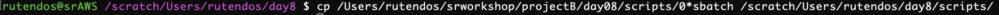
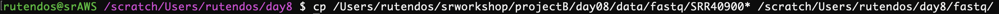
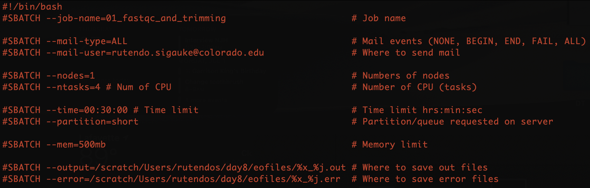
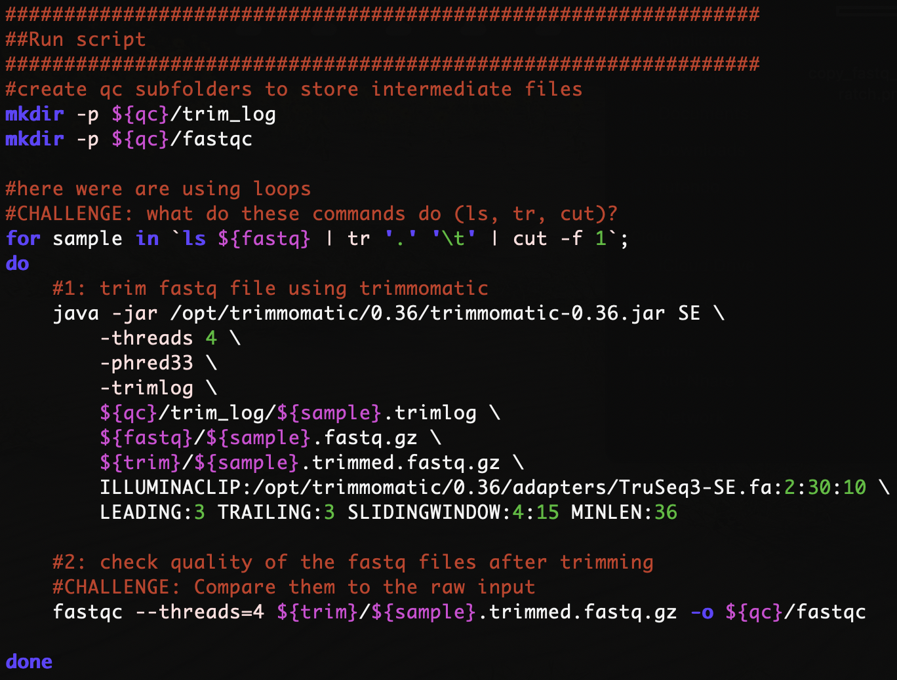
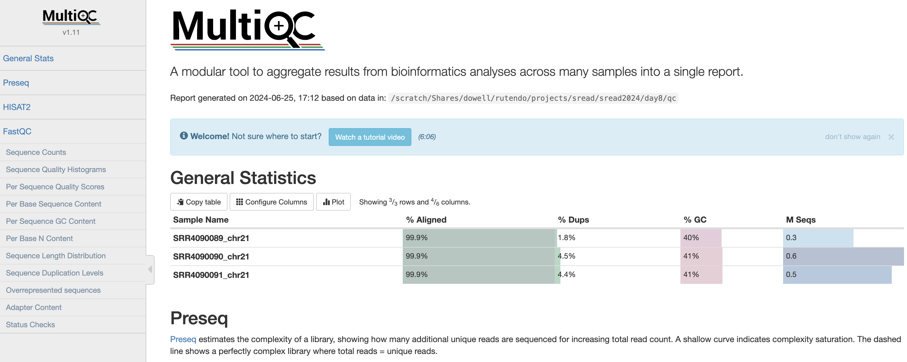

# Short Read Day 8 Worksheet | Preprocessing ChIP-Seq Data

- Authors: Rutendo F. Sigauke 2024, Jessica Huynh-Westfall 2023

## Introduction

As we discussed last week, ensuring your data's quality is an important step before you move forward with your data analysis.

This worksheet goes over how to preprocess ChIP-seq data prior to peak calling. ChIP-seq is an assay genome-wide binding of protein to DNA, so the coverage profile is different from RNA-seq,
and as such the data needs to be preprocessed differently. 
We will go over assessing the quality of ChIP-seq data and mapping the reads to the genome. The tools we will use are the same for other genome sequencing data (RNA-seq, ATAC-seq), BUT the flags used will be different. 

### QC tools
[fastqc](https://www.bioinformatics.babraham.ac.uk/projects/fastqc/) : Assess the read quality in samples.

[trimmomatic](http://www.usadellab.org/cms/?page=trimmomatic) : Trim fastq files (similar to what was covered in week one).

[preseq](https://preseq.readthedocs.io/en/latest/) : Get read complexity (asses how reads are distributed in the genome after mapping). This is run after mapping with HISAT2.

[multiqc](https://multiqc.info/) : Summarizing all the QC metrics in a single document.

### Mapping reads:
[HISAT2](https://daehwankimlab.github.io/hisat2/) : Mapping reads to the genome with ChIP-seq friendly commands. 


### ChIP-seq tools

[MEME](https://meme-suite.org/meme/index.html) : TF Motif discovery tool. 

[TOMTOM](https://meme-suite.org/meme/tools/tomtom) : Compared TF motif against TF databases. It is part of the MEME Suite

### Other tools

[BEDTools](https://bedtools.readthedocs.io/en/latest/index.html) : Powerful genome arithmetic tool kit (e.g. find region overlaps). You will go more indepth with bedtools on day9.

NB: The directory and username used in the screenshot will be for my working directory and username and will be different than yours. Here we will be working on the server and editing the script in *vim*.

## Preprocessing of ChIP-seq data

### Part 1: Make working directories

After you Log into the AWS, you will make a directory for day 8 in your scratch directory. Make the subdirectories including one for day8, stdout and stderr, scripts, and fastq (which will be our input data). 

Create a working directory for day8 in scratch using the *mkdir* command.

```
[<username>@<hostname> ~]$ cd /scratch/Users/<YourUsername>
[<username>@<hostname> ~]$ mkdir day8
[<username>@<hostname> ~]$ cd day8
[<username>@<hostname> ~]$ mkdir scripts eofiles fastq 
```


### Part 2: Copy scripts to scratch

```
[<username>@<hostname> ~]$ cp <path/to/srworkshop git repo scripts> /scratch/Users/<YourUsername>/day8/scripts.
```

Copy the following scripts from the github repository folder into your scripts directory

   a. 01_fastqc_and_trimming.sbatch

   b. 02_map_with_hisat2.sbatch

   c. 03_mapqc_and_multiqc.sbatch

   d. 04_peak_call_with_macs2.sbatch

   e. 05_find_motifs_with_meme.sbatch



### Part 3: Get raw fastq files to your scratch folder

Copy the fastq files over from the scratch directory to your fastq directory. We will only be using HCT116 samples (SRR4090089, SRR4090090, SRR4090091) in class. The MCF7 samples (SRR4090092, SRR4090093, SRR4090094) is another dataset you can practice with in the homework.

| Run (SRR)         | Cell line  | Sample Type     |
| :---------------- | :-------:  | :-------------: |
| SRR4090089        |  HCT116    | Input           |
| SRR4090090        |  HCT116    | DMSO treated    |
| SRR4090091        |  HCT116    | Nutlin treated  |

```
[<username>@<hostname> ~]$ cp <path/to/srworkshop git repo fastq files> /scratch/Users/<YourUsername>/day8/fastq.
```



### Part 4: Edit and run the preprocessing scripts

Edit the sbatch script by using *vim <script>* to open a text editor on your sbatch script. Type *i* to toggle into edit/insert mode. 

Similar to the previous exercises you will need to change the job name, user email, and the standard output and error log directories. 

Change the *–job-name=<JOB ID>* to a name related to the job you will be running, for example, ‘01_fastqc_and_trimming’. 

Additionally, you will want to change the *mail-user=<YOUR_EMAIL>* to your email, as well as the path to your eofiles directory for the standard output (*--output*) and error log (*--error*). 

The *%x* will be replaced by your *-job-name* and the *%j* will be replaced by the job id that will be assigned by the job manager when you run your sbatch script.



#### Step 1: QC and preprocess samples

1. *cd* into your scripts directory. 

2. Edit and run `01_fastqc_and_trimming.sbatch` script. 

- The preprocessing will run *TRIMMOMATIC* and *fastQC* on the fastq file.



### Step 2: Map trimmed reads to reference genome

1 Edit and run the `02_map_with_hisat2.sbatch` script.

- In this script we will align reads to the reference genome using *HISAT2*. The main difference between mapping ChIP-seq reads to the genome is that we do not have to use the splice alignment. This feature is turned off using *--no-spliced-alignment* flag. The alignment output is bam files and alignment summary (reported if *--new-summary* flag is used). 

- Note: The map statistics are being outputted into the QC folder (*${QC}/hisat_mapstats*), while the bam files go into the BAM folder.


#### Step 3: Map quality and summary of QC

1. Edit and run the `03_mapqc_and_multiqc.sbatch` script.

2. Once the alignment is complete, we can assess mapped read distribution on the genome using *preseq*. Preseq estimates a library's complexity and how many additional unique reads are sequenced with an increasing total read count.

- Note: The output is going into the QC folder as well (*${QC}/preseq*).

3. Lastly, we can summarize all the QC output using *multiqc*. This tool summarizes all the QC metrics within a specified folder and shows all the samples summarized side by side. 

- There is a summary table for all the quality control metrics reported, additionally, several tabs for each of the QC metrics can be explored interactively. 

- You can copy an example of the multiqc output to your personal computer. 
  
  - You will need to move both the folder *multiqc_data* and the html file *multiqc_report.html* to your local computer. 

  - You can open the html file in a web browser to interact with the page.



## Peak calling 

To study DNA enrichment assays such as ChIP-seq and ATAC-seq, we are introducing the analysis method, *M*odel-based *A*nalysis of *C*hIP-*S*eq (MACS). This method enables us to identify transcription factor binding sites and significant DNA read coverage through a combination of gene orientation and sequencing tag position.

### Part 1: Run MACS2 to identify peaks

#### Step 1: Edit and run the MACS2 script.

1. Same as before, edit the header section of `04_peak_call_with_macs2.sbatch`.

- To run MACS, we will need to load *python* since *MACS* is dependent on it. In addition we will want to load *bedtools* which we will use later to remove *Blacklist regions*. The *Blacklist regions* are peak calls that show up in many ENCODE ChIP-seq experiments regardless of treatment.

2. Set variable. Assigning variables will make your scripts easier to read. In addition, this makes it easier to reference to a given path and utilize it in your scripts.

- For the *INDIR* change the path to the bam files directory. We will be using bam file from ChIP-seq data that used a specific transcription factor (TP53). For the *OUTDIR*, point to the appropriate output file directories for our *MACS* output files. You can use the command *mkdir -p* just in case for my output directories if you want to ensure that the output directory exist. 

- In addition, I have a path to the *BLACKLIST* directory. These are regions that have been identified as having unstructured or high signals in Nextgen sequencing experiments independent of the cell line or experiment. Removing these will clean up our genomic data for improved quality measurement. ENCODE has a defined list. The list we are using comes from the following reference: Amemiya HM, Kundaje A, Boyle AP. The ENCODE blacklist: identification of problematic regions of the genome. Sci Rep. 2019 Dec; 9(1) 9354 DOI: 10.1038/s41598-019-45839-z

- Lastly, we are using the variables *CELL*, *FILENAME_DMSO*, *FILENAME_NUTLIN*, *INPUT*, *DMSO*, and *NUTLIN* so that I can quickly interchange different files for analysis and only have to change the variable rather than go through the script to change instances of the file.

3. To run the MACS program, we have many different subcommand options. Depending on your experiment, you will want to change the subcommands to fit your requirements. 

For today’s worksheet, we will be showing an example where we utilized an input control with your experiment.

`-t / --treatment <filename>` is your experimental file. The file can be in any supported format (see –format for options). If you have more than one alignment file, you can specify them and MACS will pool all the files together.

`-c / --control <filename>` is your genomic input/control file.

`-n / --name <NAME>` is the name string of your experiment. The string NAME will be used by MACS to create output files.

`-B/ --BDG` flag to tell MACS to store the fragment fileup, and control lambda in bedGraph files.

`-g / --gsize <GENOME>` is the parameter to assign the mappable genome size. We will be using hs which is the recommended human genome size of 2.7e9.

`-q / --qvalue <VALUE>` is the cutoff to call significant regions. The default is 0.05. If you want to use a p-value cutoff, you can specify -p instead of -q.

Note that there are many other options than the ones that we are implementing here. 

If you wanted to run to get Broad peaks you will want to use the flag `--broad`

MACS parameters depending on the data types:

| Data Type         | q-value   | `--broad` and `--control` flags |  Reasoning          |
| :-------------------------------- | :-------:  | :-------------: | :----------------- |
| ChIP-seq for Transcription Factor (TF)  |  <0.01     | `--control`, `<INPUT>`            | TF ChIP-seq often has very abrupt, small peaks that are well defines, so narrow peaks is necessary, and a less stringent adjusted p-value is likely need than for other data types. |
| ChIP-seq for histone marks (and Pol II) |  <0.0001   | `--broad`, `--control`, `<INPUT>` | Histonw marks are often broadly dispersed without very well defined edges so a broad peak tag is useful but a very low p-value helps differentiate between background and data. |
| ATAC-seq                                |  <0.0001   | `--control`, `<INPUT>`            | ATAC-seq should show peaks at open chromatin across the genome similarly to histone ChIP-seq data, but with more abrupt peaks, so no broad peak tag is needed. |

4. Removing Blacklist regions via *bedtools intersect*. After we call our peaks, to clean up the data we will remove the BLACKLIST regions that can be problematic. These regions contain repetitive regions across the genome and almost always are enriched in ChIP-seq data.

5. To run *bedtools intersect*, specify *-a* as the file to be filtered which is your broadpeak output file. The *-a* file will be compared against *-b* file which are the blacklist regions. The *-v* parameter will throw out the regions in your peak files that have an overlap with the blacklist regions in *-b*. *>* is to specify the output directory and output file name.

#### Step 2: Move peak call files to your computer

1. Move the output files from *MACS* on the server to your local computer and open the bedgraph files (*.bdg*) and the bed file (*.narrowPeak*) in IGV. We can now explore the peak calls in IGV and compare them to coverage data.

#### Step 3: Motif discovery and comparing motifs to database of TF motifs

1. Edit and run the `05_find_motifs_with_meme.sbatch` script.

2. *MEME* suite takes in a fasta file as input. Our MACS peak output is in a bed file format. We will use bedtool getfasta and a reference genome .fa file to convert our peaks coordinate into a fasta format. The first thing we will do in our script is to load the appropriate modules. 

3. Set your in and out directory as we have in the previous exercise. Here your INDIR is the path to your MACS peak output files. The OUTDIR will be for the output of the fasta file and the MEME and TOMTOM output files. Additionally, we will want a reference fasta file denoted below as hg38.fa 

4. We will use bedtools getfasta to convert the peaks to a fasta file to feed into MEME. The command is *bedtools getfasta [OPTIONS] -fi <input FASTA> -bed <BED/GFF/VCF>*   

5. Move the *fasta* file to your computer

6. Upload your fasta file to MEME (https://meme-suite.org/meme/tools/meme) and submit. 

7. MEME will return an output file for you. Click on MEME HTML output. The output will give you information on the motifs that were discovered along with other information such as the E-value.

8. Push your MEME output to TOMTOM by clicking on the button  under Submit/Download which will open up a new window with available programs. You just have to “Start Search” button to run TOMTOM. 

- TOMTOM will return an HTML summary of predicted TFs.

