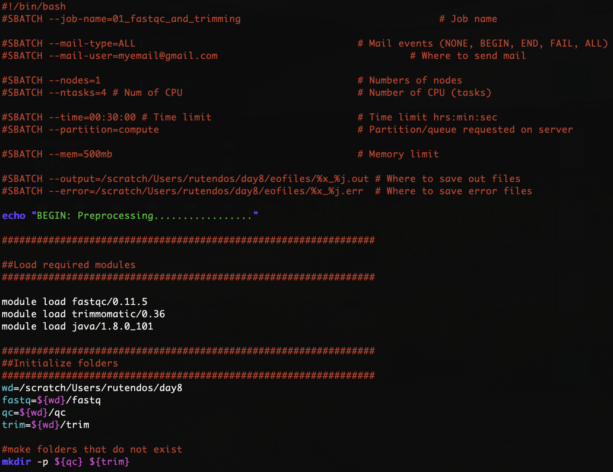

# Short Read Day 8 Worksheet | Preprocessing ChIP-Seq Data

- Authors: Rutendo F. Sigauke 2024, Jessica Huynh-Westfall 2023

## Introduction

As we discussed last week, ensuring your data's quality is an important step before you move forward with your data analysis.

This worksheet goes over how to preprocess ChIP-seq data prior to peak calling. ChIP-seq is an assay genome-wide binding of protein to DNA, so the coverage profile is different from RNA-seq,
and as such the data needs to be preprocessed differently. 
We will go over assessing the quality of ChIP-seq data and mapping the reads to the genome. The tools we will use are the same for other genome sequencing data (RNA-seq, ATAC-seq), BUT the flags used will be different. 

### QC tools
[fastqc](https://www.bioinformatics.babraham.ac.uk/projects/fastqc/) : Assess the read quality in samples.

[trimmomatic](http://www.usadellab.org/cms/?page=trimmomatic) : Trim fastq files (similar to what was covered in week one).

[preseq](https://preseq.readthedocs.io/en/latest/) : Get read complexity (asses how reads are distributed in the genome after mapping). This is run after mapping with HISAT2.

[multiqc](https://multiqc.info/) : Summarizing all the QC metrics in a single document.

### Mapping reads:
[HISAT2](https://daehwankimlab.github.io/hisat2/) : Mapping reads to the genome with ChIP-seq friendly commands. 

NB: The directory and username used in the screenshot will be for my working directory and username and will be different than yours. Here we will be working on the server and editing the script in *vim*.


## Part 1: Make working directories

After you Log into the AWS, you will make a directory for day 8 in your scratch directory. Make the subdirectories including one for day8, stdout and stderr, scripts, and fastq (which will be our input data). 

Create a working directory for day8 in scratch using the *mkdir* command.

```
[<username>@<hostname> ~]$ cd /scratch/Users/<YourUsername>
[<username>@<hostname> ~]$ mkdir day8
[<username>@<hostname> ~]$ cd day8
[<username>@<hostname> ~]$ mkdir scripts eofiles fastq 
```


## Part 2: Copy scripts to scratch

```
[<username>@<hostname> ~]$ cp <path/to/srworkshop git repo scripts> /scratch/Users/<YourUsername>/day8/scripts.
```

Copy the following scripts from the github repository folder into your scripts directory

   a. 01_fastqc_and_trimming.sbatch

   b. 02_map_with_hisat2.sbatch

   c. 03_mapqc_and_multiqc.sbatch

   d. 04_peak_call_with_macs2.sbatch

   e. 05_find_motifs_with_meme.sbatch


## Part 3: Get raw fastq files to your scratch folder

Copy the fastq files over from the scratch directory to your fastq directory. We will only be using HCT116 samples (SRR4090089, SRR4090090, SRR4090091) in class. The MCF7 samples (SRR4090092, SRR4090093, SRR4090094) is another dataset you can practice with in the homework.

```
[<username>@<hostname> ~]$ cp <path/to/srworkshop git repo fastq files> /scratch/Users/<YourUsername>/day8/fastq.
```


## Part 3: Edit and run the preprocessing scripts

Edit the sbatch script by using *vim <script>* to open a text editor on your sbatch script. Type *i* to toggle into edit/insert mode. 

Similar to the previous exercises you will need to change the job name, user email, and the standard output and error log directories. Change the *–job-name=<JOB ID>* to a name related to the job you will be running, for example, ‘01_fastqc_and_trimming’. Additionally, you will want to change the *mail-user=<YOUR_EMAIL>* to your email, as well as the path to your eofiles directory for the standard output (*--output*) and error log (*--error*). The *%x* will be replaced by your *-job-name* and the *%j* will be replaced by the job id that will be assigned by the job manager when you run your sbatch script.



### Step 1: QC and preprocess samples

1. *cd* into your scripts directory. 

2. Edit and run `01_fastqc_and_trimming.sbatch` script. 

- The preprocessing will run *TRIMMOMATIC* and *fastQC* on the fastq file.

### Step 2: Map trimmed reads to reference genome

1 Edit and run the `02_map_with_hisat2.sbatch` script.

- In this script we will align reads to the reference genome using *HISAT2*. The main difference between mapping ChIP-seq reads to the genome is that we do not have to use the splice alignment. This feature is turned off using *--no-spliced-alignment* flag. The alignment output is bam files and alignment summary (reported if *--new-summary* flag is used). 

- Note: The map statistics are being outputted into the QC folder (*${QC}/hisat_mapstats*), while the bam files go into the BAM folder.

### Step 3: Map quality and summary of QC

1. Edit and run the `03_mapqc_and_multiqc.sbatch` script.

2. Once the alignment is complete, we can assess mapped read distribution on the genome using *preseq*. Preseq estimates a library's complexity and how many additional unique reads are sequenced with an increasing total read count.

- Note: The output is going into the QC folder as well (*${QC}/preseq*).

3. Lastly, we can summarize all the QC output using *multiqc*. This tool summarizes all the QC metrics within a specified folder and shows all the samples summarized side by side. As shown below, the command for running multiqc only requires the folder that the program will summarize over (i.e. the *${QC}* folder). 

### Step 4: MACS to call peaks

To study DNA enrichment assays such as ChIP-seq and ATAC-seq, we are introducing the analysis method, Model-based Analysis of ChIP-Seq (MACS). This method enables us to identify transcription factor binding sites and significant DNA read coverage through a combination of gene orientation and sequencing tag position.

1. Edit and run the d9_macs.sbatch. This script has multiple section that is detail out in the worksheet Day8_macs_worksheet.pdf. In addition to calling peaks with and without controls, the script also includes intersecting with blacklist regions. 

2. Pull the output peak files from the run into IGV to see the difference between all the different called regions from the run. For more information on what you should consider for parameters see the worksheet Day8_macs_worksheet.pdf. Use the homework for some thoughts to consider when looking at peak-centric data.

## Part 3: Bedtools
Annotation files are critical for downstream sequencing analysis, and text file manipulation and Bedtools are both very useful ways to work with them.

Follow the Day8_Bedtools_worksheet.docx now.
