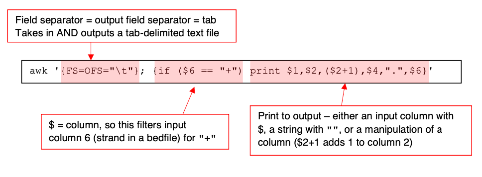

Day9: Using bedtools to identify overlaps
================
Meaghan Courvan (2024) from Lynn Sanford (2023)

### Annotation

An annotation file is any file that describes regions of the genome. At
its most basic, it just needs a chromosome id, a start coordinate, and a
stop coordinate. 

You can get some annotation files online. NCBI, UCSC, and Ensembl all
curate different lists of gene annotations that are similar in a lot of
ways but also have distinct differences. You can read more about these
here: <https://genome.ucsc.edu/FAQ/FAQgenes.html#ensRefseq>.

Another types of annotation that you can get online are TF binding sites
for a wide range of TFs from the ENCODE project:
<https://www.encodeproject.org/>.

You can also make annotation files yourself. If you want to look at read
coverage over a specific subset of genes or over specific genomic
elements, you can either subset or create annotation files. In this
worksheet we’ll go over an example of how to manipulate annotation files
and create your own in order to do interesting comparisons.

### Annotation file types

While you can make very simple annotation files, and in some cases you
may want to do so, there are several standardized formats for files that
contain different types of metadata, and certain software packages are
designed to work with certain annotation file types. The best resource
for understanding annotation files is the [UCSC Data File Formats
page](https://genome.ucsc.edu/FAQ/FAQformat.html). If you ever have any
questions about annotation files and what each column means in a certain
format, this is the best place to go.  

**NOTE:** Almost all bioinformatics standardized file types are
tab-separated.  

The most common file types that you’ll see for annotation are either BED
files or GTF files, which contain much of the same information in
different columns.  

- Take a moment to look at the information for these two file types from the UCSC link above, then use head to look at the gene annotation bedfile located at */scratch/Shares/public/sread2024/cookingShow/day9b/annotation/hg38_refseq_cleaned.sorted.bed*. Can you identify all the columns?
- Now look at the .narrowPeak file that you generated with MACS for p53 binding in HCT116 cells treated with DMSO. Does this file follow the standardized bed12 format?

You may note that the .narrowPeak file isn’t a standard bed12 file. It
has 10 columns, and the last 4 columns are metrics generated by MACS to
describe various stats about the peaks. More information about those
metrics can be found in the MACS documentation.  

HOWEVER! Even though this file isn’t a standard bed file, the first six
columns do follow the standard bed6 format. Bedtools will automatically
recognize this as a bed file based on those six columns and ignore the
rest.

### Annotation files – basic manipulation

You can do annotation file manipulations with text editors (not recommended – most are quite large), command line commands, or other software such as Bedtools.  

- Make a directory for this worksheet at
  **/scratch/Users/\<username\>/day9/bedtools/**
- How many genes are in the annotation file?
- How many peaks are in your MACS peak file?

### Bedtools intersect

Now we’ll use a series of tools packaged in the Bedtools suite. Bedtools is incredibly useful at manipulating bedfiles, and as a bonus it has amazing documentation that very clearly articulates what each of its tools does: <https://bedtools.readthedocs.io/en/latest/>  

Today, we'll use bedtools on the AWS. It's also fairly easy to install on your personal computer, and usually annotation files are tractable to work with there (though not always).

- Transfer the day9_bedtools.sbatch script from the github repo to your /scratch/Users/\<username\>/day9/scripts/ directory.
- Input the paths to the gene annotation file and your MACS peak file
- We will now fill the script section with bedtools commands.

**NOTE:** *Please try to write the commands by yourself.* But if you need help there is an example of a final script at *\<github_repo\>/day09/scripts/.bedtools_answers.sbatch*

We have a list of genes, and we have a list of peaks called from a p53 ChIP experiment, identifying putative p53 binding locations in control (DMSO treated) HCT116 cells. What if we want to find out how many of those p53 binding sites overlap with genes, rather than being in intergenic regions?

- Look at the documentation for bedtools intersect. A useful list of all
  bedtools commands is here:
  <https://bedtools.readthedocs.io/en/latest/content/bedtools-suite.html>.
- There are many flags that can define exactly how you want to define “overlap.” What makes the most sense for overlapping ChIP peaks with genes?
- Write a command in the day9_bedtools.sbatch script for doing a basic intersection to figure out which peaks have any overlap with genes, then run your script. It should run basically instantaneously.
- **HINT:** By default bedtools results go to stdout, which within a slurm job will go to your .out file. Pipe the results into a different file that is better labeled and give it the .bed extension
- Write a command for finding the peaks that are *completely* within a gene. Write this new one underneath the previous one so that you have a list of all of these commands at the end to reference later. Every command should pipe results into a different new file with a descriptive filename. Run the script again.
- Write a command for finding the peaks that are in intergenic regions (i.e. have no overlap with genes). Run it again.
- Write a command for finding the genes that have any overlap with a p53 peak and run the script again.
- How many peaks/genes were in each of these outputs compared to the original files?

Now we’ll actually look at these annotation files to make sure that they make sense.

- Pull the annotation file, you MACS bedfile, and your four intersection results bedfiles to your home computer
- Import them into IGV or the IGV Web App. Where are the intergenic p53 peaks? Where are the ones that completely overlapped genes?
  - HINT: In the desktop version of IGV, highlight a track and use Ctrl-F/Ctrl-B to skip to the next/previous feature.

### Annotation files – more complicated questions

What if we want to find out how many of the p53 peaks that overlap with genes are located in promoter regions? These might be of more interest than those that are located in intronic regions. To do this, we need to use the gene annotation file to make a gene promoter annotation file.

**NOTE:** The definition of a “promoter” is variable, even within our lab. Different people create this type of annotation file differently. If you make your own annotation files, you should keep detailed documentation on how you made them. Right now, we’ll define a promoter as everything <u>between 1kb upstream of the annotated transcription start site (TSS) and 100 bp downstream of the TSS</u>. To make this promoter file, we first need a file that contains just the TSS of genes.

- Think about how you’d make this from the gene annotation bedfile.
- *What columns need to change?
- Does that column differ depending on
  what gene it is?*

In order to define only a TSS, we need a 1-base region that is at the start of each gene. So what is the starting coordinate of each gene?

You might think the answer is just column 2 of the gene annotation bedfile, but it actually depends on the strand of the gene. All
coordinates are with respect to the (+)-strand of the genome, so for (-)-strand genes, the TSS of the gene is actually the end coordinate of the gene region. We therefore have to parse the file based on gene strand.

There’s a few ways that you can do this. You can read the annotation file into R or python and do column manipulation there, with conditionals. You can also do a looping strategy in bash that reads in a line, defines a few variables based on the contents of the line and prints out a new version of that line. If you want to try those, feel free! In this example, I’ll show you a powerful bash command line program called [awk](https://www.geeksforgeeks.org/awk-command-unixlinux-examples/). awk has a moderate learning curve and seems pretty obtuse when you first start with it, but it is an incredibly fast and powerful tool for manipulating files.

- Open your d9ay_bedtools.sbatch script again. Paste the following lines
  below everything else in the script area.

<!-- -->

    cat "$ANNOT" \
    | awk '{FS=OFS="\t"}; {if ($6 == "+") print $1,$2,($2+1),$4,".",$6}' \
    > "$results"/hg38_refseq_tss_pos.bed
    cat "$ANNOT" \
    | awk '{FS=OFS="\t"}; {if ($6 == "-") print $1,($3-1),$3,$4,".",$6}' \
    > "$results"/hg38_refseq_tss_neg.bed
    cat "$results"/hg38_refseq_tss_pos.bed \
    "$results"/hg38_refseq_tss_neg.bed \
    > "$results"/hg38_refseq_tss.bed

Each of the first two command strings pipes the bedfile to awk, which manipulates the files and pipes the output to a new bedfile. We run it twice, since we’re filtering (+)-strand genes in the first instance and (-)-strand genes in the second one. Then we concatenate the two into a full TSS bedfile.

If you want to learn more about awk, look up an awk tutorial, but below I’ve given a basic breakdown of the command: 

Once you’ve manipulated an annotation file like this, you always want to check that you did what you think you did.

- Run your sbatch script, then pull the results hg38_refseq_tss.bed file to your computer and look at it in IGV.
- Make sure that you only see a 1-base region at the beginning of each gene, and that it’s at the correct end of the gene depending on gene strand.

Now we’ll pad the TSS file to make a gene promoter file.

- Look up the documentation for bedtools slop. You’ll need the 2 required flags and 3 optional flags to add 1000bp upstream (left) of the TSS and 100bp downstream (right) of the TSS. What flags are these?
- Write the bedtools slop command in your sbatch script and pipe the results into a new promoter bedfile.
  - HINT: the –g <genome> file that bedtools slop takes in is actually just a list of chromosome sizes. There’s a variable in your script that already defines the path to this file on the AWS.
- Once you’ve run your sbatch script and obtained your promoter bedfile, sync it back to your machine and look at it in IGV.
- If it looks good, go back to your d9_bedtools.sbatch script and write a command to intersect your p53 peaks with your promoter file, then run it again.
- How many peaks are located in gene promoter regions? How does this compare to the number of peaks overlapping any part of a gene?

NOTE: Instead of using both bedtools slop and bedtools intersect, you could instead use bedtools window.

**More practice:** In this experiment, we have p53 ChIP data from
control and experimental conditions. Now that we’ve done these
calculations with the control (DMSO-treated) samples, create the same
files for the experimental (Nutlin-treated) samples.

### Enrichment and expectation

We have p53 peaks that overlap genes. You might be excited about this because it could provide you some target genes to look at more closely. But it’s always a good idea to think about your expectation. If p53 peaks were randomly distributed in the genome, how often would they overlap genes? Or, said another way, are p53 peaks enriched in genes compared to random expectation? Bedtools has useful functions to help you evaluate this question. One calculates a jaccard index for your data, which is a ratio of an intersection of a set to the union of the set (see more details in the documentation for bedtools jaccard).

It’s useful to calculate a jaccard index for your intersection of interest AND for a randomized dataset. If the two are similar, your intersection is probably not showing enrichment over random expectation. If the index for your intersection is much higher, than there is probably enrichment.

- Write a bedtools jaccard command to calculate the jaccard index for your p53 peaks intersecting with genes for the DMSO-treated samples. This outputs a simple text file, not a bed file, so when you pipe the output to a file, give it a .txt extension.
- Once you run the script again, look at this file. Use the bedtools jaccard documentation to understand the output.
- Now, do the same calculation using peaks called in the experimental (Nutlin-treated) samples.
- Write a bedtools shuffle command to randomize the locations of your p53 peaks in the experimental (Nutlin-treated) samples.
- Write another bedtools jaccard command to calculate the jaccard index between your shuffled peaks and genes.
  - HINT: The shuffled file needs to be sorted before it can be used. The bedtools jaccard documentation tells you the bash command you need to sort it
- Compare your three jaccard output files. Which intersection has a higher jaccard index? When you run the script again, the peaks are shuffled differently. How does that change the output?

This example calculates tiny jaccard indeces because the p53 peaks cover very few bases compared to all the genes. But you should see that your shuffled files give a lower jaccard index every time you run your script. Thus your p53 peaks overlap genes more than you would expect based on random chance – they’re **enriched** over genes.

### Bedtools review

There are many bedtools commands that do a wide variety of different things. Some only work with annotation files, some can count reads from BAM files in different ways. Exploring the different commands will make your downstream sequencing analysis much easier.
