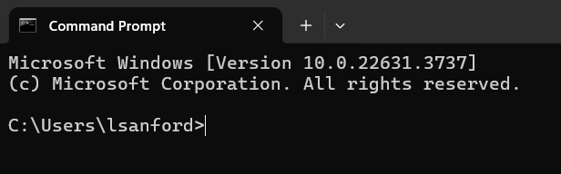
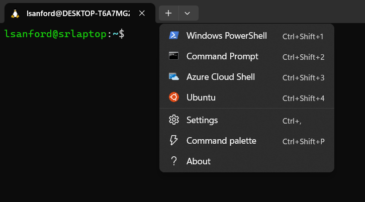
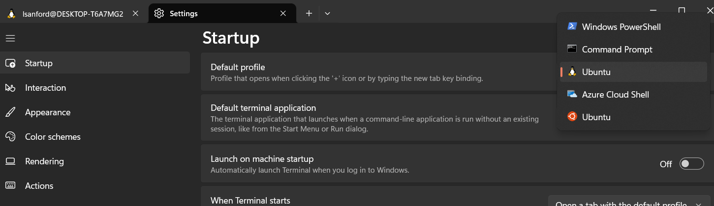

### Configuring the Windows 11 Terminal
Author: Lynn Sanford, 2024

To take this class, if you have a PC (Windows 11), you had to download WSL and Ubuntu to access a Linux terminal. When you open this terminal, it runs in the 'Windows Terminal' application, which needs a little bit configuration.

The main purpose of the Windows Terminal is to interface with the Windows operating system through the programming language C#. We're just coopting the Windows Terminal to interface with a Linux virtual machine that uses the language Bash. So, at least for this class, we need to change which type of terminal opens in Windows Terminal by default.

**If at any point you see a command prompt with a `C:` in it, you are speaking to the Windows OS and will not be able to run Bash commands. That would look something like this:**

To make sure you're always working in Ubuntu, follow the instructions below:

1. Open Ubuntu. This will open a Linux terminal within the Windows Terminal application.

2. Click on the down arrow in the tab bar and click on Settings.

3. Under the first setting, 'Default Profile', click on the drop-down and highlight Ubuntu. If you see two versions of Ubuntu, either one will work, though the color scheme is a little different between the two.

4. Click Save on the bottom right of the window.

Now every time you open this Terminal, and with every new tab you open, it will default to using the Ubuntu virtual machine.