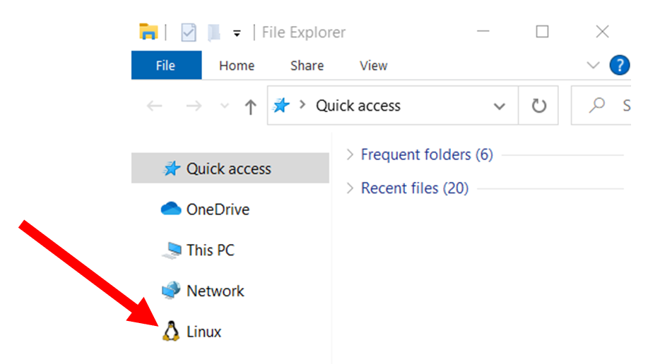
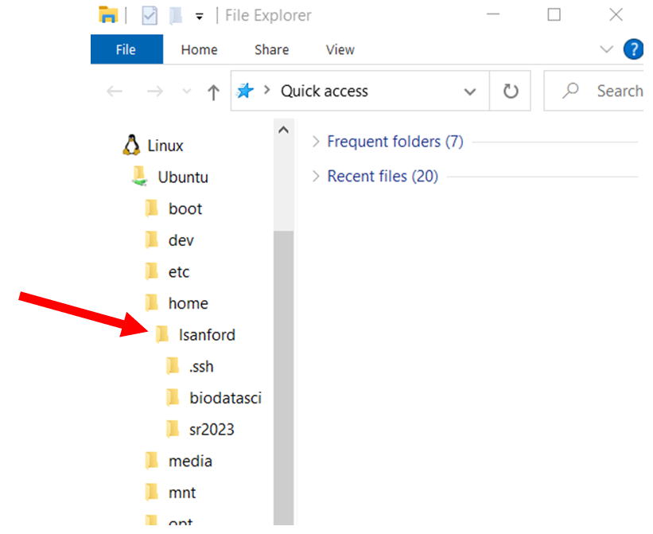
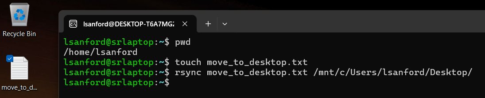

### Windows filesystems
Authors: Mary Allen, Lynn Sanford, 2021 (edited 2024)

To take this class, if you have a PC, you had to download WSL and Ubuntu to access a Linux terminal. This works great, but accessing files in it is a little obtuse outside of the terminal application. To get to files you download from the AWS you will know where stuff lives on your PC.

Ubuntu is a virtual machine app that runs on top of WSL (Windows Subsystem for Linux). When WSL was installed, at least in Windows 11, it should have integrated with File Explorer so that you can access your Ubuntu home directory from there:

The full path for your home directory is “> Linux > Ubuntu > home > username”

If there is no Linux penguin in your File Explorer (likely on Windows 10), accessing files gets a bit more complicated. The best way is to use the command line to move files to your desktop (or anywhere else you’d like on your C: drive), then look at them from there.

From your home directory on the command line, you can access your desktop by one of the following paths, depending on your version of Windows:

- `/mnt/c/Users/<computerusername>/Desktop`
- `/mnt/c/Users/<computerusername>/OneDrive/Desktop`

Once you sync files from your home directory to your desktop path, those files will pop up on your desktop.

