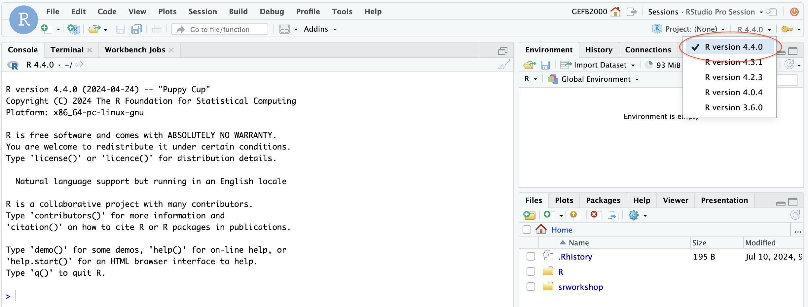

# Getting started with CellChat
### Author: Georgia Barone (2024)

Today, we will explore one way to analyze processed scRNA-seq data with the package CellChat. CellChat is a networks-based R package that infers the likelihood of two cell types communicating. This package quantifies the signaling communication probability between two cell types by assessing the expression of ligand-receptor pairs within a pre-labeled scRNA-seq Seurat object.

## 1. Log on to RStudio 
If you successfully installed Seurat & CellChat locally, pull up your local RStudio. If you could not get CellChat installed locally, log onto the RStudio on the AWS server. 

If you are on the AWS server, please select R version 4.4.0

## 2. Complete R scripts for today
Complete the scripts in the `/Users/<your-username>/srworkshop/projectA/day09/scripts/` directory.

Start with: `Cell-Chat-Part-1.R`

When you finish the first worksheet, complete: `Cell-Chat-Part-2.R`

**NOTE: If you are running CellChat locally, you will need to transfer the Seurat & CellChat R objects to your local computer to complete the workheets and analysis for today**

Download Seurat/CellChat objects from the Zenodo [here](https://zenodo.org/records/12725642)

